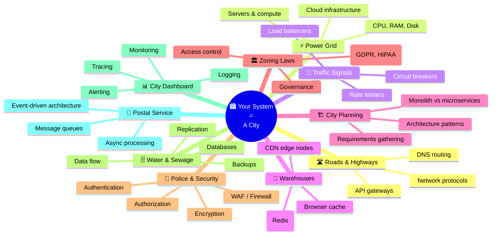
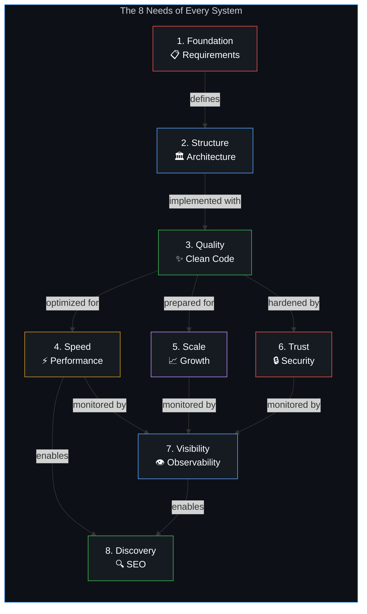
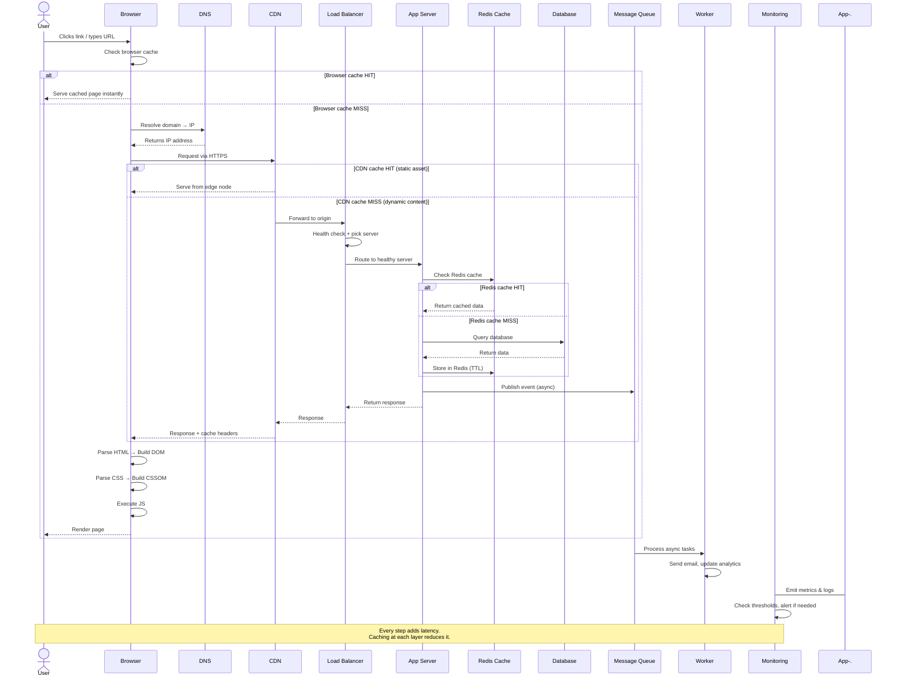

# 🏙️ System Design Overview — The Big Picture

> **Building software at scale is like building a city, not a house.**

A house just needs four walls and a roof. A city needs roads (network), water and electricity grids (data flow), zoning laws (governance), police and security, traffic signals (load balancing), warehouses near neighborhoods (caching/CDN), and a master plan that lets new districts be added without tearing down old ones.

---

## 🌆 The City Analogy — Every Concept Mapped

---

## 🧠 The 8 Fundamental Needs

Every architecture decision answers one of these needs. When someone asks "why did you choose X?", your answer should map to one of these:

---

## 📊 Concept → Need Mapping Table

| Concept | Need It Solves | Why It Matters |
|---------|---------------|----------------|
| Requirements gathering | 1. Foundation | Prevents building the wrong thing |
| Monolith / Microservices / Serverless | 2. Structure | Right structure for right scale |
| Clean code / Separation of concerns | 3. Quality | Enables all other needs |
| Caching (Browser, CDN, Redis, DB) | 4. Speed | Eliminates redundant work |
| CDN / Edge computing | 4. Speed + 5. Scale | Fast globally, offloads origin |
| Load balancers | 5. Scale | Distributes traffic, adds redundancy |
| Horizontal scaling | 5. Scale | Near-infinite capacity |
| Database replication | 5. Scale + 6. Trust | Read throughput + disaster recovery |
| Sharding | 5. Scale | Splits data across machines |
| Authentication / Authorization | 6. Trust | Controls who accesses what |
| Encryption (TLS, at-rest) | 6. Trust | Protects data in motion & storage |
| Input validation / Sanitization | 6. Trust | Prevents injection attacks |
| Governance / Compliance | 6. Trust | Legal & regulatory safety |
| Metrics / Dashboards | 7. Visibility | Know system health at a glance |
| Structured logging | 7. Visibility | Debug and audit capability |
| Distributed tracing | 7. Visibility | Find bottlenecks across services |
| Alerting | 7. Visibility | Know before users do |
| SEO / Semantic HTML | 8. Discovery | Users can find your product |
| Page speed / Core Web Vitals | 4. Speed + 8. Discovery | Google ranks fast sites higher |
| SSR / SSG | 4. Speed + 8. Discovery | Fast first paint + crawlable content |

---

## 🔄 How the Layers Interact — The Flow of a Request

This diagram shows how a single user request flows through every layer of a well-designed system:

---

## 🎓 Who This Is For

### Frontend Developer
You'll learn what happens **before** your React/Vue/Angular code even starts running — DNS, CDN, TLS handshakes, server processing. And you'll understand **why** your framework choices (SSR vs CSR, code splitting, lazy loading) directly impact user experience and SEO.

### Backend Developer
You'll understand not just how to write APIs, but how to design them to be **scalable** (horizontal scaling, load balancing), **safe** (authentication, rate limiting, encryption), and **observable** (metrics, logging, tracing). Plus how your API response is ultimately rendered by the browser.

### Fullstack Developer
You get the complete picture — you'll be able to trace a single user click from the browser through DNS, CDN, load balancer, app server, cache, database, message queue, worker, back through all layers to the rendered pixel on screen. This is the superpower of a fullstack engineer.

---

## 📖 Next Steps

Start with your role's reading path from the [README](../README.md#-reading-paths-by-role), or begin sequentially with [Chapter 1: Requirements](../Part-1-Architecture-Scalability-Operations/01-requirements.md).

---

*Every concept in this knowledge base is a brick. The flow diagrams are the mortar. Together they build the city.*
