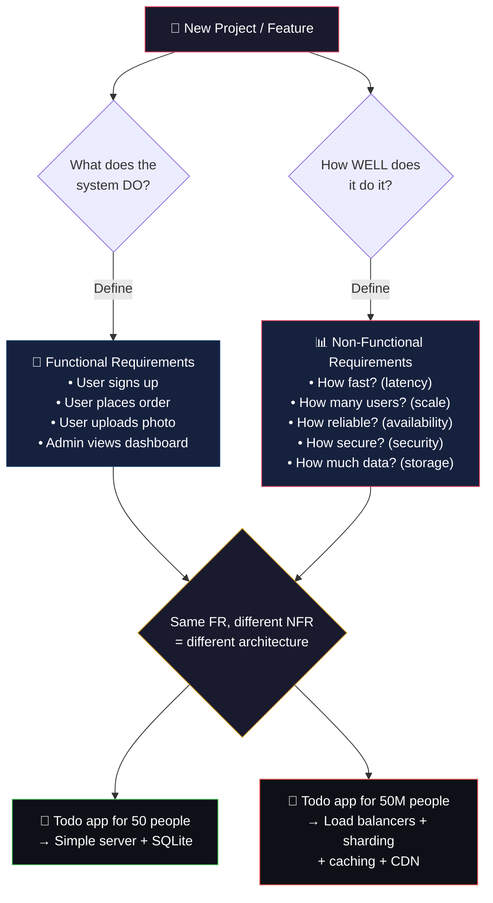
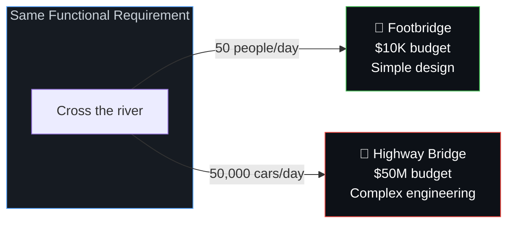
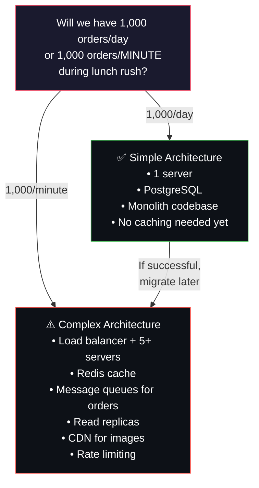

# 📋 1. Requirements — The Blueprint Before the Building

> **You wouldn't build a bridge without knowing how many cars will cross it. Don't build software without knowing how many users will use it.**

---

## 🔄 The Requirements Flow



---

## 🎯 What Are Requirements?

Before writing a single line of code, separate requirements into **two buckets**:

### Functional Requirements (FR)
**What the system *does*** — the features and behaviors users interact with.

| Question | Example Answer |
|----------|---------------|
| What can users do? | Sign up, log in, search products, place orders |
| What does the system output? | Order confirmation, search results, notifications |
| What business rules apply? | Discount codes can't be stacked, max 5 items per order |
| What roles exist? | Customer, Admin, Support Agent |

### Non-Functional Requirements (NFR)
**How *well* the system does it** — the quality attributes that determine architecture.

| NFR | Question to Ask | Impact on Architecture |
|-----|----------------|----------------------|
| **Users / Traffic** | How many concurrent users? Day 1? Month 6? Year 2? | Single server vs. horizontal scaling |
| **Read:Write Ratio** | Is the app read-heavy or write-heavy? | Caching strategy, read replicas |
| **Latency** | What's the acceptable response time? | CDN, caching, async processing |
| **Availability** | How much downtime is acceptable? | Redundancy, failover, multi-region |
| **Data Volume** | How much data stored? Growth rate? | DB choice, sharding, archival |
| **Data Sensitivity** | Personal data? Payments? Health records? | Encryption, compliance, audit logs |
| **Budget** | Cloud spend limits? Team size? | Monolith vs. microservices decision |
| **Consistency** | Must reads always see latest write? | Strong vs. eventual consistency |

---

## 📐 NFR Decision Tree

```mermaid
flowchart TD
    A["How many users?"] -->|"< 10K"| B["Single server<br/>Vertical scaling"]
    A -->|"10K - 1M"| C["Multiple servers<br/>Load balancer<br/>Read replicas"]
    A -->|"> 1M"| D["Horizontal scaling<br/>Sharding<br/>CDN + Edge<br/>Message queues"]

    E["What's the read:write ratio?"] -->|"Read-heavy<br/>(80:20)"| F["Heavy caching<br/>Read replicas<br/>CDN for content"]
    E -->|"Write-heavy<br/>(20:80)"| G["Write-optimized DB<br/>Queues for async writes<br/>Event sourcing"]
    E -->|"Balanced<br/>(50:50)"| H["Balanced approach<br/>Cache writes-through<br/>Standard replication"]

    I["Availability target?"] -->|"99.9%<br/>(8.7 hrs/year down)"| J["Redundant servers<br/>Health checks<br/>Auto-failover"]
    I -->|"99.99%<br/>(52 min/year down)"| K["Multi-region<br/>Active-active<br/>Zero-downtime deploys"]
    I -->|"99.999%<br/>(5 min/year down)"| L["Extreme redundancy<br/>Chaos engineering<br/>Dedicated SRE team"]

    style A fill:#161b22,stroke:#58a6ff,color:#fff
    style E fill:#161b22,stroke:#3fb950,color:#fff
    style I fill:#161b22,stroke:#d29922,color:#fff
    style B fill:#0d1117,stroke:#3fb950,color:#c9d1d9
    style C fill:#0d1117,stroke:#d29922,color:#c9d1d9
    style D fill:#0d1117,stroke:#f85149,color:#c9d1d9
    style F fill:#0d1117,stroke:#3fb950,color:#c9d1d9
    style G fill:#0d1117,stroke:#d29922,color:#c9d1d9
    style H fill:#0d1117,stroke:#58a6ff,color:#c9d1d9
    style J fill:#0d1117,stroke:#3fb950,color:#c9d1d9
    style K fill:#0d1117,stroke:#d29922,color:#c9d1d9
    style L fill:#0d1117,stroke:#f85149,color:#c9d1d9
```



---

## 🌉 Analogy — The Bridge

It's like deciding whether to build a **footbridge** or a **highway bridge**:

- Both "let people cross a river" (same functional requirement)
- But if you guess wrong about traffic volume, the footbridge collapses (under-engineered) or the highway bridge wastes millions of concrete (over-engineered)



---

## 🍔 Real-World Example — Food Delivery App

A startup building a food delivery app should ask:



---

## 📝 Requirements Template

Use this template at the start of every project:

```markdown
## Project: [Name]

### Functional Requirements
1. User can [action]
2. System should [behavior]
3. Admin can [action]

### Non-Functional Requirements
| Metric              | Day 1 Target | 6-Month Target | 1-Year Target |
|---------------------|-------------|----------------|---------------|
| Concurrent users    |             |                |               |
| Requests/second     |             |                |               |
| Response time (p95) |             |                |               |
| Availability        |             |                |               |
| Data volume         |             |                |               |
| Read:Write ratio    |             |                |               |

### Constraints
- Budget: 
- Team size:
- Timeline:
- Compliance: (GDPR / HIPAA / PCI-DSS / None)
```

---

## ⚠️ Edge Cases & Gotchas

1. **"We'll just scale later"** — Retrofitting scalability into a system designed for 100 users is 10x harder than designing for it upfront. You don't need to *build* for millions on day 1, but you should *design* so you can get there.

2. **Ignoring write vs. read ratio** — A system that's 95% reads (like a blog) and a system that's 95% writes (like an IoT sensor collector) need completely different architectures, even with the same number of users.

3. **Not accounting for spikes** — Average traffic of 100 req/sec means nothing if your Black Friday spike hits 10,000 req/sec and the system falls over.

4. **Confusing availability with durability** — Availability = "can users access the system?" Durability = "is data safe even if systems fail?" You can have high availability but lose data if you don't have proper backups.

5. **Forgetting the team constraint** — A 3-person team operating 20 microservices will spend all their time on operations, not features. Architecture must match team capacity.

---

## 🔗 Connected Topics

| Topic | Connection |
|-------|-----------|
| [Architecture Patterns](02-architecture-patterns.md) | Requirements drive the choice of monolith vs. microservices |
| [Scalability](03-scalability.md) | NFRs define when to scale vertically vs. horizontally |
| [Database Design](07-database-design.md) | Data volume and consistency needs determine DB choice |
| [Security](09-security.md) | Data sensitivity determines encryption and compliance needs |
| [Latency](08-latency.md) | Latency targets drive caching and CDN decisions |

---

**Next →** [2. Architecture Patterns](02-architecture-patterns.md)
