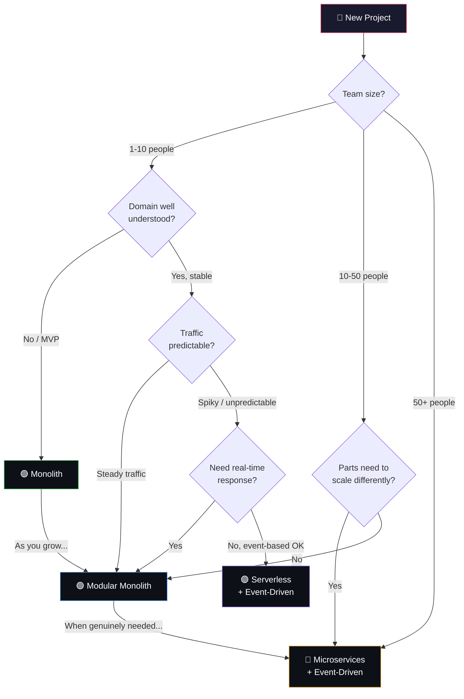
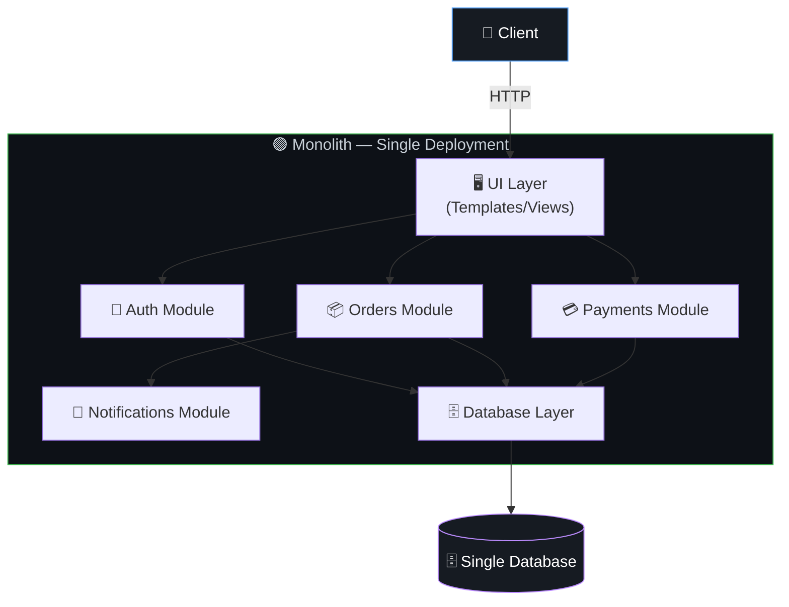
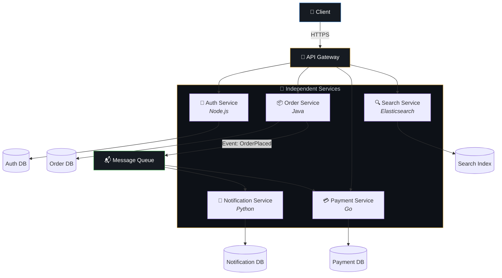
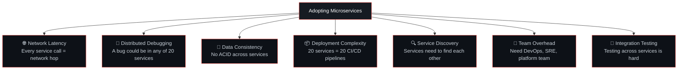
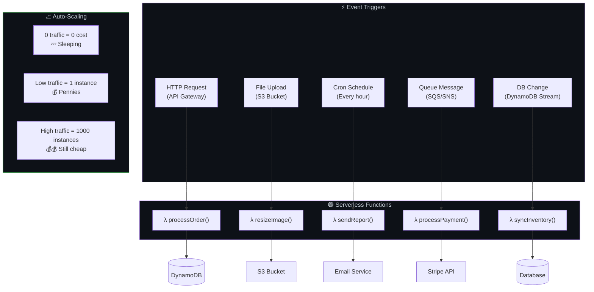
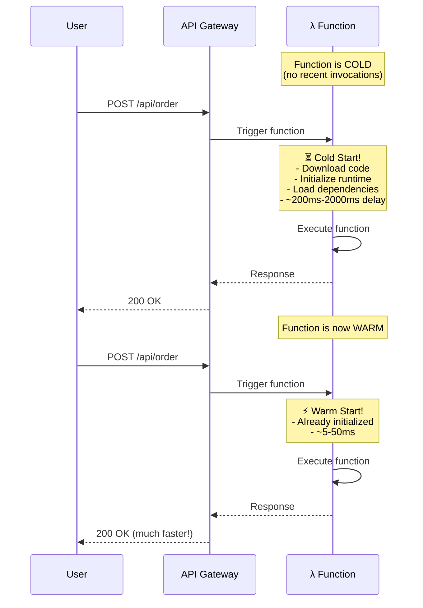
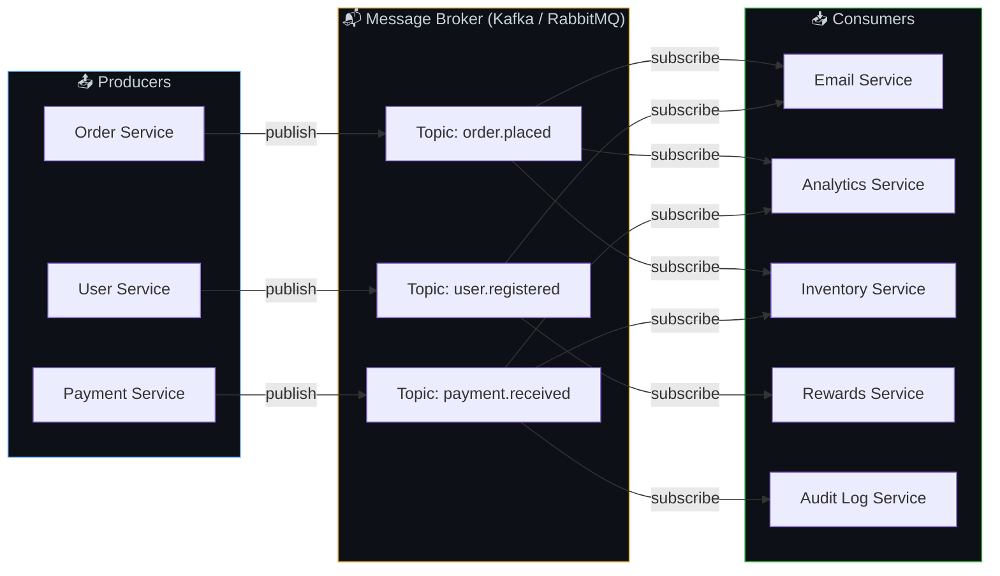
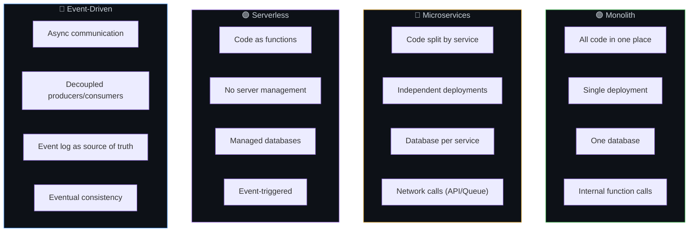
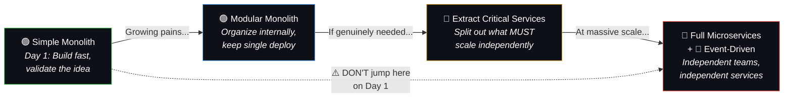

# 🏛️ 2. Architecture Patterns — Choosing Your System's Structure

> **The wrong architecture is like wearing a spacesuit to go grocery shopping — technically it works, but it's massively over-engineered for the job.**

---

## 🔄 Architecture Decision Flow

---

## 🟢 2.1 Monolith — The Food Truck

### What
One single codebase and deployable unit containing UI, business logic, and database access — everything runs as one application.

### How It Works

### When to Use
- Startups, MVPs, small-to-medium teams
- Domain not yet well understood (you'll refactor as you learn)
- Speed of development matters more than independent scaling
- Most successful companies started here (even Shopify runs a monolith serving millions)

### Analogy
A monolith is like a **food truck** — one team, one kitchen, everything in one place. Fast to set up, easy to manage, great when you're small.

### ✅ Pros & ❌ Cons

| ✅ Pros | ❌ Cons |
|---------|---------|
| Simple to develop, test, deploy | One bug can crash everything |
| No network calls between modules | Harder to scale individual parts |
| Easy to debug (one process) | Can become a "big ball of mud" if not organized |
| Fast internal communication | Deployments are all-or-nothing |
| Easy to refactor early on | Technology lock-in (one language/framework) |

---

## 🔶 2.2 Microservices — The Food Court

### What
The application is split into multiple independent services, each with its own codebase, database, and deployment pipeline, communicating over the network.

### How It Works

### When to Use
- Large team (one team per service — "two-pizza teams")
- Domain is well understood and stable
- Different parts genuinely need to scale differently
- You need independent deployments (change payments without redeploying search)
- You can afford the operational complexity

### Analogy
A **food court** — each stall (pizza, sushi, burgers) operates independently with its own staff and supplies. If the sushi stall has a long line, it doesn't slow down the burger stall.

### ⚠️ The Hidden Costs

### ✅ Pros & ❌ Cons

| ✅ Pros | ❌ Cons |
|---------|---------|
| Independent scaling per service | Huge operational complexity |
| Independent deployments | Network latency between services |
| Technology diversity (use best tool per service) | Distributed debugging is hard |
| Fault isolation (one service crash ≠ total crash) | Data consistency across services is complex |
| Teams can work independently | Need robust monitoring, tracing, service mesh |

---

## 🟣 2.3 Serverless — The Uber of Computing

### What
You write functions, the cloud provider runs them on-demand, scales automatically, and you pay only for execution time.

### How It Works

### When to Use
- Event-driven tasks (image processing, email sending, webhooks)
- Unpredictable or spiky traffic
- Want to avoid managing servers entirely
- APIs with low-to-moderate, irregular traffic
- Scheduled jobs (cron)

### Analogy
Calling an **Uber** instead of owning a car — you don't maintain the vehicle, you just pay per ride. As many "cars" as needed appear when demand spikes.

### ⚠️ Watch Out: Cold Starts

---

## 📢 2.4 Event-Driven Architecture — The Notice Board

### What
Components communicate by producing and consuming **events** through a message broker, rather than calling each other directly.

### How It Works

### Key Event-Driven Patterns

```mermaid
graph TD
    subgraph PATTERN1["Pattern: Fire and Forget"]
        P1_Prod["Producer"] -->|"Publish event"| P1_Queue["Queue"]
        P1_Queue -->|"Consume"| P1_Con["Consumer"]
        P1_Prod -.->|"Doesn't wait<br/>for response"| P1_Note["✅ Producer<br/>responds immediately"]
    end

    subgraph PATTERN2["Pattern: Event Sourcing"]
        P2_Cmd["Command"] -->|"Append"| P2_Log["Event Log<br/>(immutable)"]
        P2_Log -->|"Replay"| P2_State["Current State"]
        P2_Log -->|"Audit"| P2_History["Complete History"]
    end

    subgraph PATTERN3["Pattern: Saga (Distributed Transaction)"]
        P3_Start["Order Placed"] --> P3_Pay["Payment"]
        P3_Pay -->|"Success"| P3_Inv["Update Inventory"]
        P3_Inv -->|"Success"| P3_Ship["Schedule Shipping"]
        P3_Pay -->|"Failure"| P3_Comp1["❌ Cancel Order<br/>(Compensating Action)"]
        P3_Inv -->|"Failure"| P3_Comp2["❌ Refund Payment<br/>(Compensating Action)"]
    end

    style PATTERN1 fill:#0d1117,stroke:#58a6ff,color:#c9d1d9
    style PATTERN2 fill:#0d1117,stroke:#3fb950,color:#c9d1d9
    style PATTERN3 fill:#0d1117,stroke:#d29922,color:#c9d1d9
```

### When to Use
- Workflows with multiple steps that don't need instant response
- Order processing, notifications, analytics
- When you want to decouple services (add new consumers without changing producers)
- When resilience matters (if email service is down, events wait in queue)

### Analogy
A **notice board** in an office — when HR posts "New employee starting Monday," IT, Facilities, and the Team Lead all see it and act independently. HR doesn't have to call each department individually.

---

## 🔀 Side-by-Side Comparison

| Aspect | Monolith | Microservices | Serverless | Event-Driven |
|--------|----------|---------------|------------|-------------|
| **Complexity** | Low | Very High | Medium | High |
| **Scaling** | Scale entire app | Scale per service | Auto per function | Scale consumers independently |
| **Team size** | 1-15 devs | 15+ devs | Any | Any (complements others) |
| **Latency** | Lowest (in-process) | Higher (network) | Variable (cold starts) | Eventual (async) |
| **Cost at low traffic** | Fixed server cost | High (many services) | Near zero | Medium |
| **Debugging** | Easy | Hard | Medium | Hard (async flows) |
| **Best for** | MVPs, small teams | Large orgs, complex domains | Spiky/event workloads | Decoupled workflows |

---

## 🏗️ The Evolution Path

Most successful systems follow this journey:

---

## ⚠️ Edge Cases & Gotchas

1. **"Netflix uses microservices, so should we"** — Netflix has 10,000+ engineers. They didn't start with microservices. Don't copy the destination without considering your starting point.

2. **The distributed monolith trap** — If your "microservices" all share one database and must be deployed together, you've built a distributed monolith — all the complexity of microservices with none of the benefits.

3. **Service boundary mistakes** — Splitting services along the wrong boundaries (e.g., by technical layer instead of business domain) creates chatty services that constantly call each other.

4. **Ignoring the network** — In a monolith, a function call takes nanoseconds. In microservices, a network call takes milliseconds + can fail, timeout, or return garbage. Every internal boundary is now a potential failure point.

5. **Not having an API Gateway** — Without a gateway, clients need to know about every service's URL, handle auth for each, and deal with cross-cutting concerns separately.

---

## 🔗 Connected Topics

| Topic | Connection |
|-------|-----------|
| [Requirements](01-requirements.md) | NFRs (team size, scale, traffic pattern) determine the architecture choice |
| [Scalability](03-scalability.md) | Architecture determines how you can scale |
| [Load Balancers](04-load-balancers.md) | Essential once you have multiple instances (any pattern) |
| [Latency](08-latency.md) | Microservices add network latency; event-driven adds processing delay |
| [Monitoring](13-monitoring-observability.md) | More services = more critical observability becomes |

---

**← Previous:** [1. Requirements](01-requirements.md) | **Next →** [3. Scalability](03-scalability.md)
