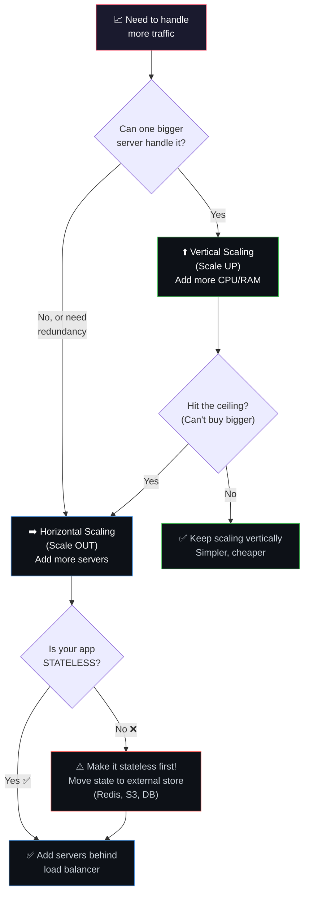
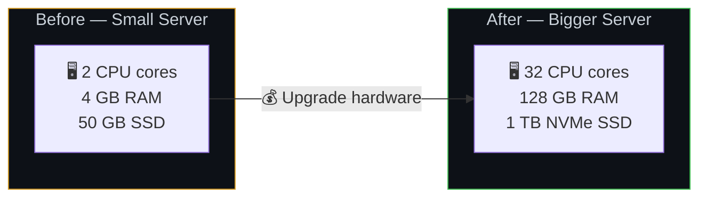
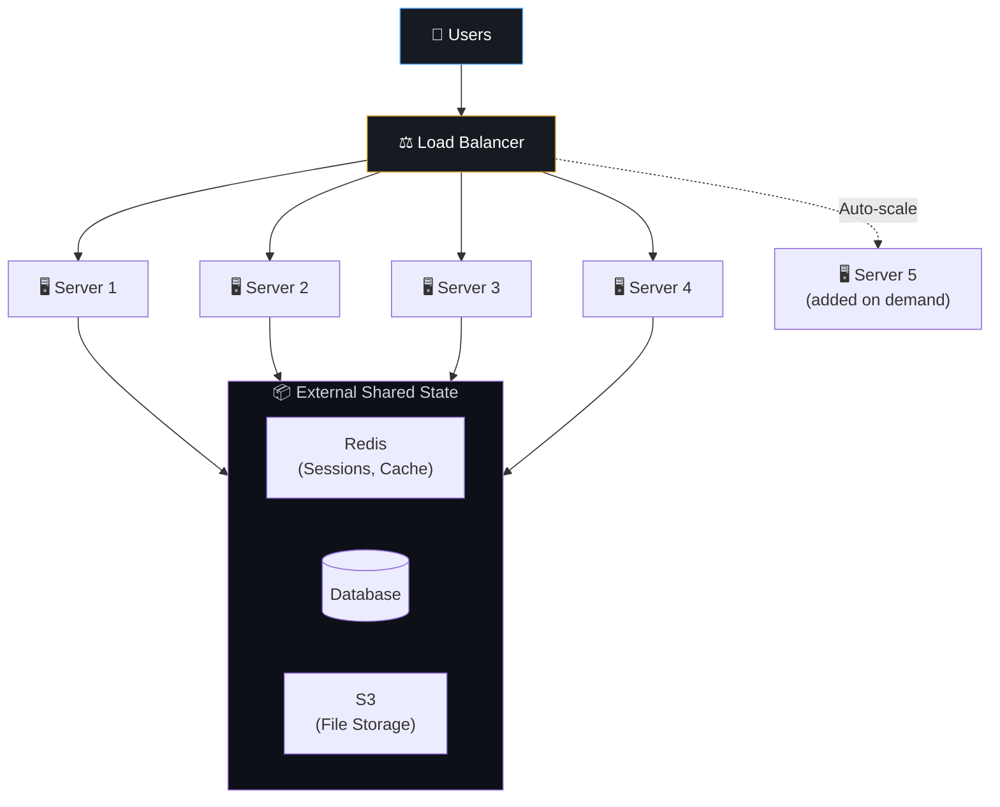
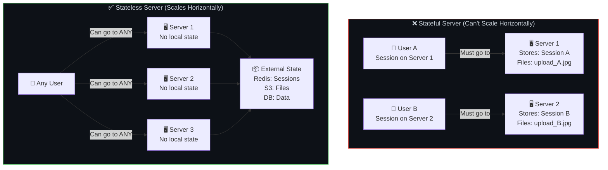
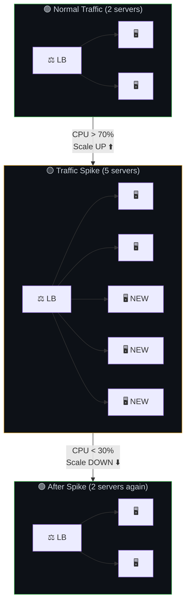
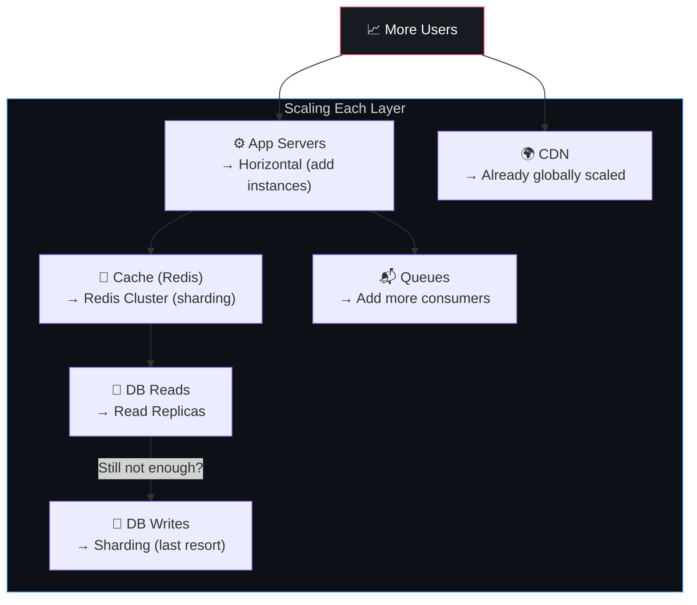

# 📈 3. Scalability — Handling Growth Without Breaking

> **Vertical scaling is hiring a stronger worker. Horizontal scaling is hiring more workers. One super-strong worker is great until they get sick — ten average workers means the job continues even if one takes a break.**

---

## 🔄 The Scalability Decision Flow



---

## ⬆️ Vertical Scaling (Scale Up)

### What
Add more power (CPU, RAM, faster disk) to your **existing server**.

### How It Works



| ✅ Pros | ❌ Cons |
|---------|---------|
| Simple — no code changes needed | Hard ceiling (biggest machine has limits) |
| No distributed system complexity | **Single point of failure** — server dies = everything dies |
| Lower operational cost | Increasingly expensive (doubling RAM costs more than 2x) |
| Easy to manage | Downtime during upgrades |

### When to Use
- Early stage projects (< 10K users)
- Quick fix while planning horizontal migration
- Database servers (harder to horizontally scale than app servers)
- When simplicity matters more than redundancy

---

## ➡️ Horizontal Scaling (Scale Out)

### What
Add **more servers** running the same application, distributing traffic across them.

### How It Works



| ✅ Pros | ❌ Cons |
|---------|---------|
| Near-infinite capacity | Requires stateless app design |
| Built-in redundancy (servers can fail) | Need load balancer |
| Cost-efficient (add cheap machines) | Shared state management complexity |
| Zero-downtime scaling | More operational overhead |
| Auto-scaling possible | Data consistency across instances |

---

## 🔑 The Key: Stateless vs Stateful

**This is the most important concept for horizontal scaling.** Your app servers must be **stateless** — meaning any server can handle any request.



### What Makes a Server Stateful? (Move These Out!)

| Stateful Thing | Where to Move It |
|----------------|-----------------|
| User sessions stored in server memory | → Redis or database |
| File uploads saved to server disk | → S3, GCS, or object storage |
| In-memory cache | → Redis / Memcached |
| Scheduled jobs tracking | → Database or job queue |
| WebSocket connections | → Redis pub/sub for coordination |

---

## 📊 Auto-Scaling — Scale Based on Demand



### Auto-Scaling Triggers

| Metric | Scale Up When | Scale Down When |
|--------|--------------|-----------------|
| CPU usage | > 70% for 3 min | < 30% for 10 min |
| Memory usage | > 80% | < 40% |
| Request queue depth | > 100 pending | < 10 pending |
| Response latency (p95) | > 500ms | < 100ms |
| Custom metric | Business-specific | Business-specific |

---

## 🔄 Scaling Everything — Not Just App Servers



---

## 🍔 Real-World Example

```mermaid
timeline
    title Blog Growing From 0 to 10M Users
    section Phase 1 : 0-1K users
        Single Server : One $5/month VPS
        : App + DB on same machine
        : No caching needed
    section Phase 2 : 1K-100K users
        Separate DB : App server + dedicated DB
        : Add Redis for caching
        : Vertical scale (bigger server)
    section Phase 3 : 100K-1M users
        Horizontal Scale : 3 app servers + Load Balancer
        : DB read replicas
        : CDN for static assets
    section Phase 4 : 1M-10M users
        Full Scale : Auto-scaling app tier
        : Redis Cluster
        : DB sharding
        : Multiple CDN regions
        : Message queues for async
```

---

## ⚠️ Edge Cases & Gotchas

1. **Scaling the database is harder than scaling app servers** — App servers are stateless (easy to add). Databases are stateful (data must be consistent). Always optimize DB queries and add caching before throwing more hardware at it.

2. **Auto-scaling is not instant** — Spinning up new VMs takes 30-90 seconds. Containers (Docker) are faster (~5s). For sudden spikes, pre-warm instances or use serverless for the spike handler.

3. **Scaling creates new bottlenecks** — You add 10 app servers, now the database becomes the bottleneck. You add read replicas, now Redis becomes the bottleneck. Always profile to find the actual bottleneck.

4. **Don't scale before you optimize** — A poorly-written SQL query hitting the DB 100 times per request won't get better with more servers — it'll get 100x worse. Fix the query first.

5. **Cost can spiral** — Auto-scaling without cost limits can lead to surprise bills. Always set maximum instance counts and budget alerts.

---

## 🔗 Connected Topics

| Topic | Connection |
|-------|-----------|
| [Load Balancers](04-load-balancers.md) | Required for distributing traffic across horizontally-scaled servers |
| [Caching](05-caching.md) | Reduces load on databases, enabling fewer replicas/shards |
| [Database Design](07-database-design.md) | Replication and sharding are database-level scaling |
| [Architecture Patterns](02-architecture-patterns.md) | Microservices enable independent scaling per service |
| [Performance](12-performance-optimization.md) | Optimize before scaling — fix bottlenecks first |

---

**← Previous:** [2. Architecture Patterns](02-architecture-patterns.md) | **Next →** [4. Load Balancers](04-load-balancers.md)
