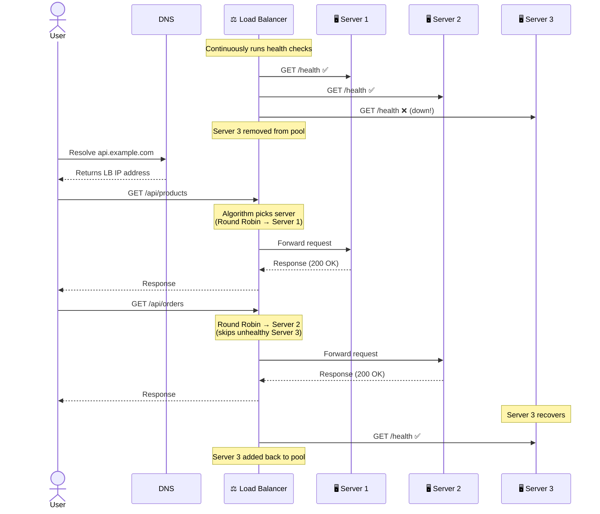
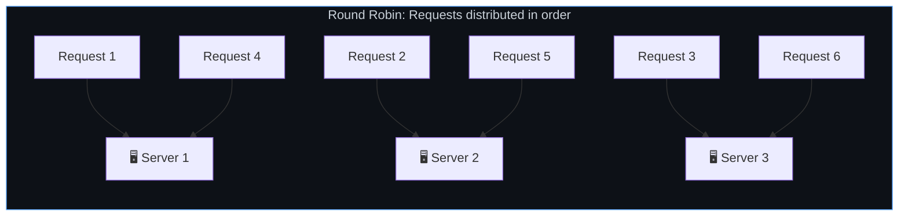
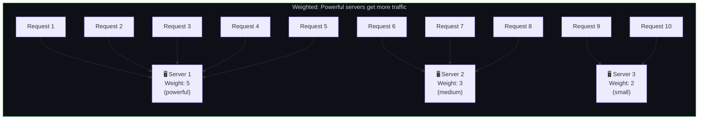
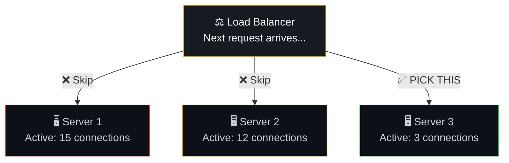
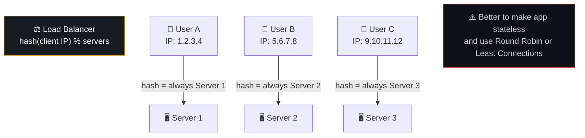
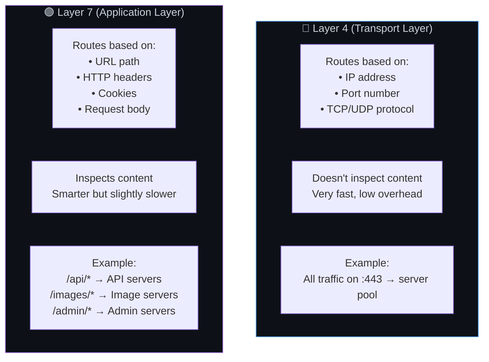
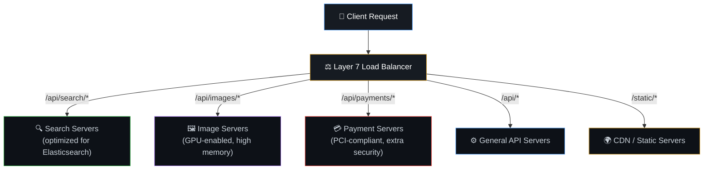
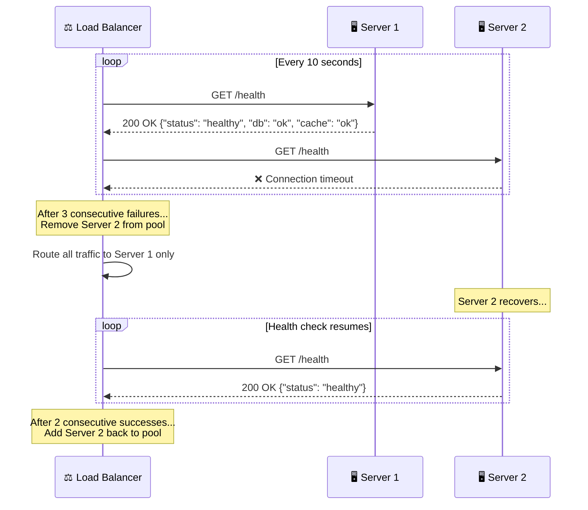
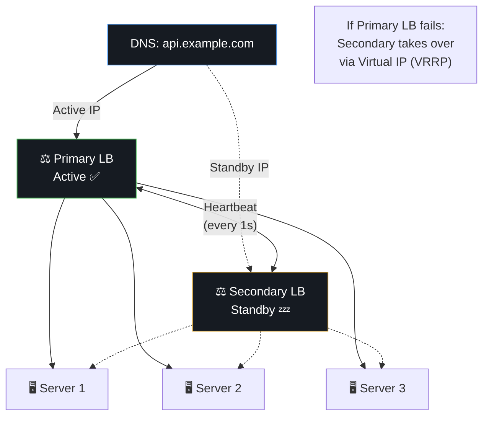
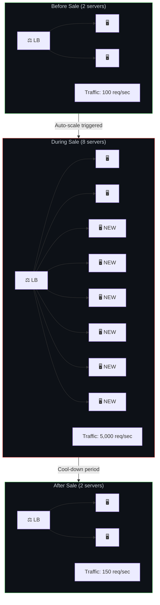

# ⚖️ 4. Load Balancers — The Traffic Director

> **A load balancer is like a restaurant host. Customers arrive at the door; the host looks at which tables are free and seats people accordingly. Without a host, everyone crowds around one table while others sit empty.**

---

## 🔄 How Load Balancing Works — The Complete Flow



---

## 🎯 Load Balancing Algorithms

### 1. Round Robin — Take Turns



| Best When | Not Ideal When |
|-----------|---------------|
| Servers are identical | Servers have different capacities |
| Requests are similar in cost | Some requests are much heavier than others |
| Simple setup needed | Need to account for current load |

### 2. Weighted Round Robin — Proportional Distribution



### 3. Least Connections — Send to the Least Busy



| Best When | Not Ideal When |
|-----------|---------------|
| Request processing times vary a lot | All requests are quick and similar |
| Long-lived connections (WebSocket) | Simple stateless APIs |
| Mixed workloads (heavy + light) | When simplicity matters most |

### 4. IP Hash / Sticky Sessions



### Algorithm Comparison at a Glance

| Algorithm | Complexity | Best For | Weakness |
|-----------|-----------|----------|----------|
| Round Robin | Simple | Equal servers, similar requests | Ignores server load |
| Weighted Round Robin | Simple | Mixed server capacities | Static weights need tuning |
| Least Connections | Medium | Variable request costs | Slightly more overhead |
| IP Hash | Simple | Sticky sessions needed | Uneven if IP distribution is skewed |
| Least Response Time | Complex | Latency-sensitive apps | Needs continuous monitoring |
| Random | Simplest | Statistically large pool | Can be uneven with few servers |

---

## 🏗️ Layer 4 vs Layer 7 Load Balancing



### Layer 7 Content-Based Routing Example



---

## ❤️ Health Checks — Detecting Unhealthy Servers



### Health Check Endpoint Example (Node.js)

```javascript
// GET /health
app.get('/health', async (req, res) => {
  try {
    // Check database connection
    await db.query('SELECT 1');

    // Check Redis connection
    await redis.ping();

    // Check disk space
    const diskFree = await checkDiskSpace();

    res.status(200).json({
      status: 'healthy',
      uptime: process.uptime(),
      database: 'connected',
      cache: 'connected',
      diskFree: diskFree,
      timestamp: new Date().toISOString()
    });
  } catch (error) {
    res.status(503).json({
      status: 'unhealthy',
      error: error.message
    });
  }
});
```

---

## 🔄 Load Balancer High Availability

The load balancer itself shouldn't be a single point of failure:



---

## 🏪 Real-World Example — E-Commerce Flash Sale



---

## ⚠️ Edge Cases & Gotchas

1. **The load balancer IS the single point of failure** — unless you have LB redundancy (active-passive or active-active pair). Cloud providers (AWS ALB, GCP LB) handle this for you.

2. **Health checks can lie** — A server can respond to `/health` while its actual endpoints are broken. Make health checks test real dependencies (DB, cache, disk).

3. **Connection draining** — When removing a server, don't kill active connections immediately. Let existing requests finish ("drain") before removing the server from the pool.

4. **WebSocket and long connections** — Round Robin doesn't work well for WebSocket connections since they're long-lived. Use Least Connections or a sticky approach.

5. **SSL/TLS termination** — The LB can handle HTTPS decryption ("TLS termination"), so app servers only deal with HTTP internally. This simplifies cert management and offloads crypto work.

---

## 🔗 Connected Topics

| Topic | Connection |
|-------|-----------|
| [Scalability](03-scalability.md) | Load balancers enable horizontal scaling |
| [Caching](05-caching.md) | LB can route to cache layer before app servers |
| [Latency](08-latency.md) | LB adds a small hop but prevents overloaded servers (much worse latency) |
| [Security](09-security.md) | LB can terminate TLS, act as first line of defense |
| [Monitoring](13-monitoring-observability.md) | LB provides metrics: request rate, error rate, latency |

---

**← Previous:** [3. Scalability](03-scalability.md) | **Next →** [5. Caching](05-caching.md)
