# 💾 5. Caching — Don't Repeat Expensive Work

> **Caching is like keeping frequently-used spices on your kitchen counter instead of walking to the pantry (database) every time you cook. The pantry itself is closer than the supermarket (external API). Each layer you move data closer to where it's needed reduces time.**

---

## 🏗️ The Cache Hierarchy — Four Layers

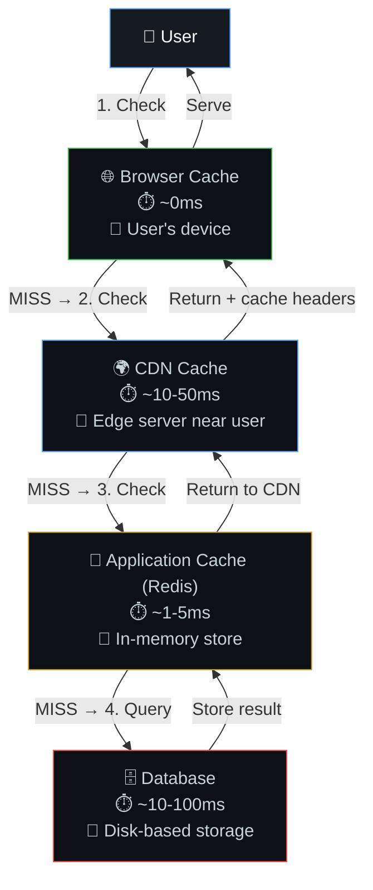

### Speed Comparison

| Layer | Latency | Analogy |
|-------|---------|---------|
| Browser Cache | ~0ms | Spice on your kitchen counter |
| CDN Cache | ~10-50ms | Neighborhood store |
| Redis/Memcached | ~1-5ms | Pantry in your house |
| Database | ~10-100ms | Supermarket across town |
| External API | ~100-2000ms | Factory in another country |

---

## 🌐 Layer 1: Browser Cache

### How HTTP Caching Works

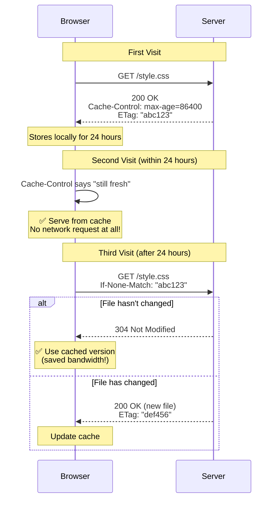

### Key HTTP Cache Headers

| Header | Purpose | Example |
|--------|---------|---------|
| `Cache-Control: max-age=86400` | Cache for 24 hours | Static assets (CSS, JS, images) |
| `Cache-Control: no-cache` | Always revalidate with server | Dynamic pages |
| `Cache-Control: no-store` | Never cache at all | Sensitive data (bank pages) |
| `ETag: "abc123"` | Fingerprint for change detection | Any cached resource |
| `Cache-Control: immutable` | Never revalidate (use with hashed filenames) | `app.a1b2c3.js` |

### Cache Busting with Hashed Filenames

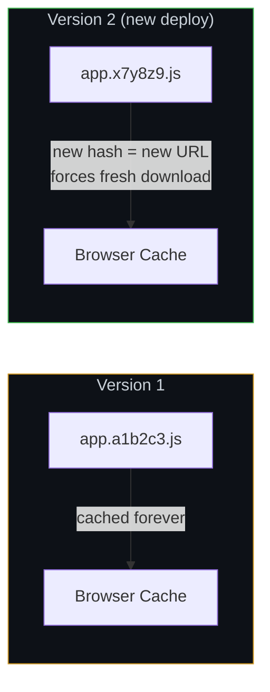

---

## 🌍 Layer 2: CDN Cache

See [Chapter 6 — CDN, Page Speed & SEO](06-cdn-pagespeed-seo.md) for full details. Quick summary:

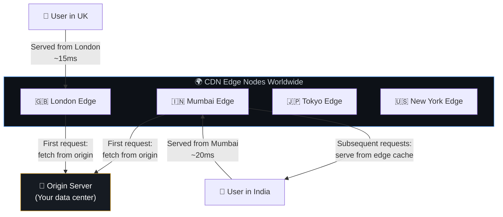

---

## 💾 Layer 3: Application Cache (Redis / Memcached)

### Cache-Aside Pattern (Most Common)

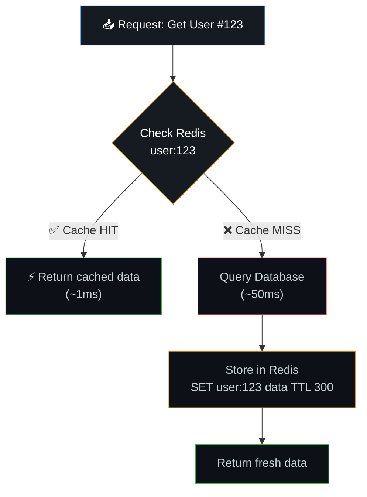

### Code Example (Node.js)

```javascript
async function getUser(userId) {
  const cacheKey = `user:${userId}`;

  // 1. Check cache first
  const cached = await redis.get(cacheKey);
  if (cached) {
    return JSON.parse(cached); // ⚡ Cache HIT (~1ms)
  }

  // 2. Cache MISS → query database
  const user = await db.query('SELECT * FROM users WHERE id = $1', [userId]);

  // 3. Store in cache for next time (TTL: 5 minutes)
  await redis.set(cacheKey, JSON.stringify(user), 'EX', 300);

  return user;
}
```

### Write-Through Pattern

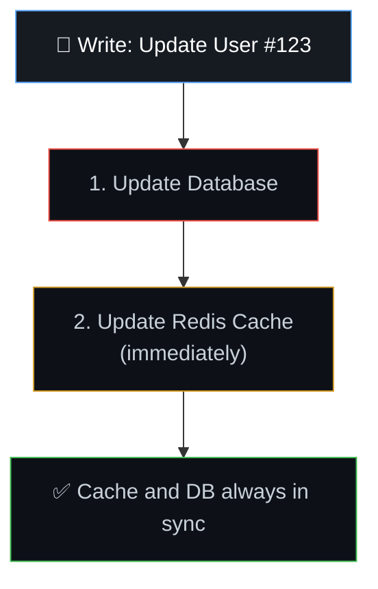

### Write-Behind (Write-Back) Pattern

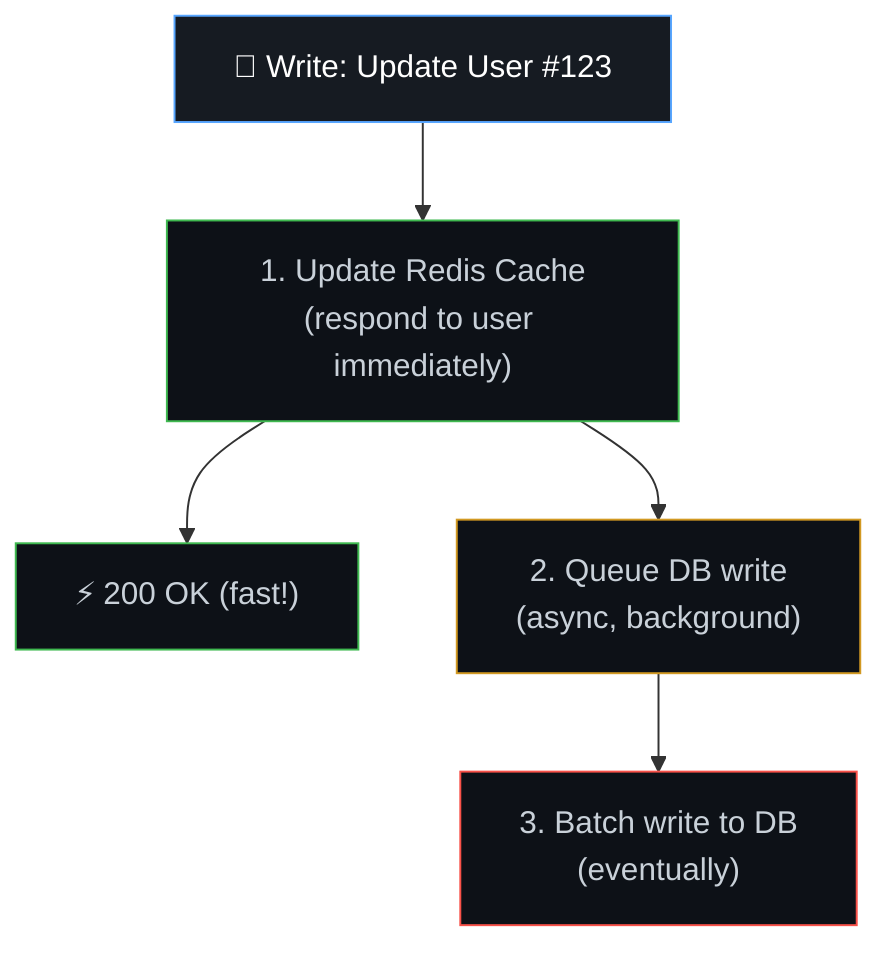

---

## 🧠 Cache Invalidation — The Hard Problem

> "There are only two hard things in Computer Science: cache invalidation and naming things." — Phil Karlton

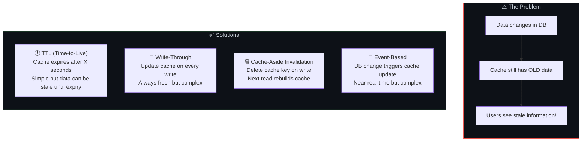

### Invalidation Strategy Comparison

| Strategy | Freshness | Complexity | Best For |
|----------|-----------|-----------|----------|
| **TTL only** | Stale for up to TTL | Very Low | Content that's OK being slightly stale (news, catalog) |
| **Write-through** | Always fresh | Medium | Critical data (user profile, balance) |
| **Delete on write** | Fresh after first read | Low | Most general-purpose use cases |
| **Event-based** | Near real-time | High | Multi-service systems with shared data |

### Cache Invalidation Code Example

```javascript
// Strategy: Delete on write (Cache-Aside Invalidation)
async function updateUser(userId, newData) {
  // 1. Update the database (source of truth)
  await db.query('UPDATE users SET name = $1 WHERE id = $2', [newData.name, userId]);

  // 2. Delete the cached version (forces next read to rebuild)
  await redis.del(`user:${userId}`);

  // Also invalidate related caches!
  await redis.del(`user-profile:${userId}`);
  await redis.del(`user-orders:${userId}`);
}
```

---

## 🗄️ Layer 4: Database Query Cache

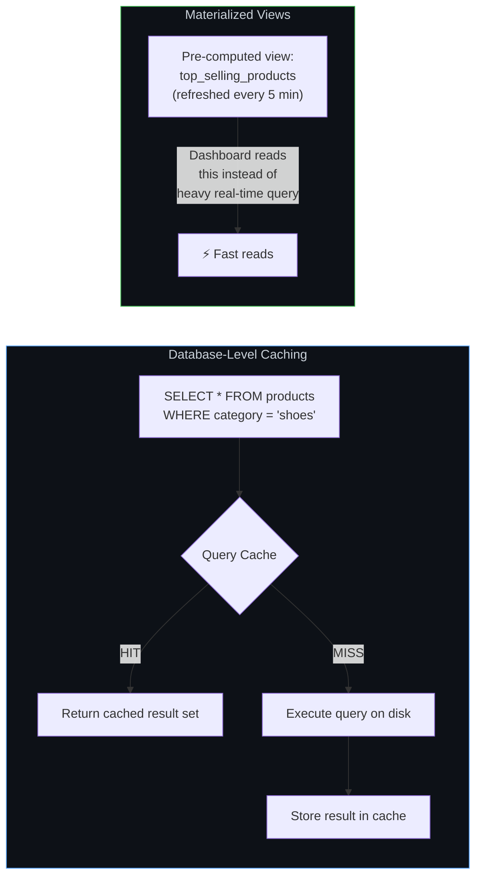

---

## 📊 Cache Hit Rate — The Key Metric

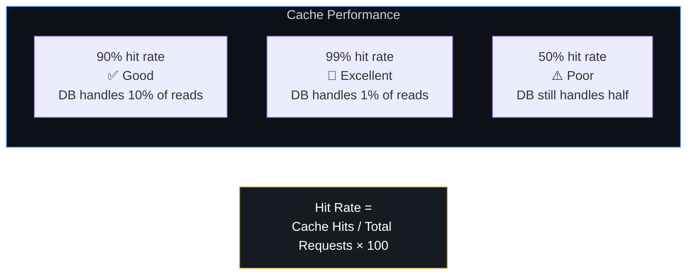

### What Affects Hit Rate?

| Factor | Impact |
|--------|--------|
| TTL too short | Items expire before being reused → more misses |
| TTL too long | Stale data but higher hit rate |
| Cache size too small | Items evicted to make room → "cache thrashing" |
| Data too unique | Each user sees different data → hard to cache |
| Insufficient warming | Empty cache after restart → thundering herd |

---

## ⚡ The Thundering Herd Problem

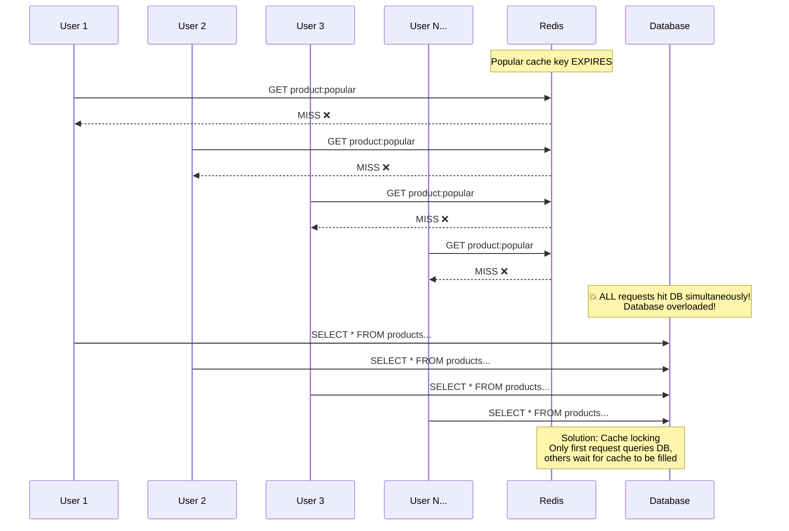

### Solution: Cache Locking

```javascript
async function getWithLock(key) {
  // 1. Try cache
  let data = await redis.get(key);
  if (data) return JSON.parse(data);

  // 2. Try to acquire lock
  const lockKey = `lock:${key}`;
  const acquired = await redis.set(lockKey, '1', 'NX', 'EX', 10); // NX = only if not exists

  if (acquired) {
    // 3. I got the lock → query DB and fill cache
    data = await db.query(/* ... */);
    await redis.set(key, JSON.stringify(data), 'EX', 300);
    await redis.del(lockKey);
    return data;
  } else {
    // 4. Someone else has the lock → wait and retry
    await sleep(100);
    return getWithLock(key); // retry
  }
}
```

---

## 🍔 Real-World Example — News Website

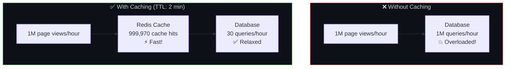

The "Top 10 trending articles" is recalculated every 2 minutes. Instead of running a heavy ranking query per page load:
- **Without cache**: 1M heavy queries/hour → DB collapses
- **With 2-min TTL**: 30 queries/hour (once per 2 minutes) → 99.997% reduction

---

## ⚠️ Edge Cases & Gotchas

1. **Cache poisoning** — If bad data gets into cache, it's served to everyone for the TTL duration. Always validate data before caching.

2. **Cache stampede on restart** — When Redis restarts, all cached data is gone. Thousands of requests simultaneously hit the DB. Solution: warm the cache before routing traffic.

3. **Serialization overhead** — Storing complex objects in Redis requires serialization (JSON.stringify). For very hot paths, this overhead matters.

4. **Cache memory limits** — Redis has finite memory. Use eviction policies (LRU = Least Recently Used) so old/unused items are evicted when memory is full.

5. **Different cache TTLs for different data** — User sessions: 30 min. Product catalog: 5 min. Static config: 1 hour. Don't use one TTL for everything.

---

## 🔗 Connected Topics

| Topic | Connection |
|-------|-----------|
| [CDN](06-cdn-pagespeed-seo.md) | CDN is a geographic cache layer for static + dynamic content |
| [Database Design](07-database-design.md) | Caching reduces database load; materialized views are DB-level caches |
| [Latency](08-latency.md) | Each cache layer eliminates a slower lookup |
| [Scalability](03-scalability.md) | Caching is the cheapest way to scale reads |
| [Performance](12-performance-optimization.md) | Cache hit rate is a critical performance metric |

---

**← Previous:** [4. Load Balancers](04-load-balancers.md) | **Next →** [6. CDN, Page Speed & SEO](06-cdn-pagespeed-seo.md)
