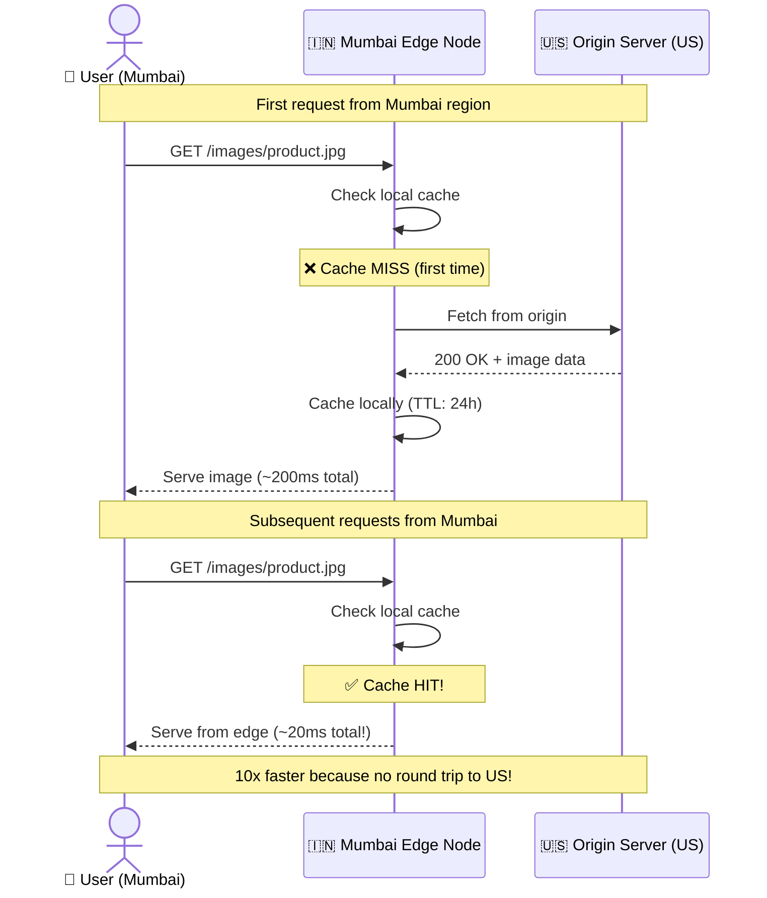
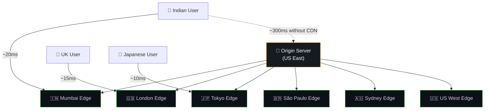
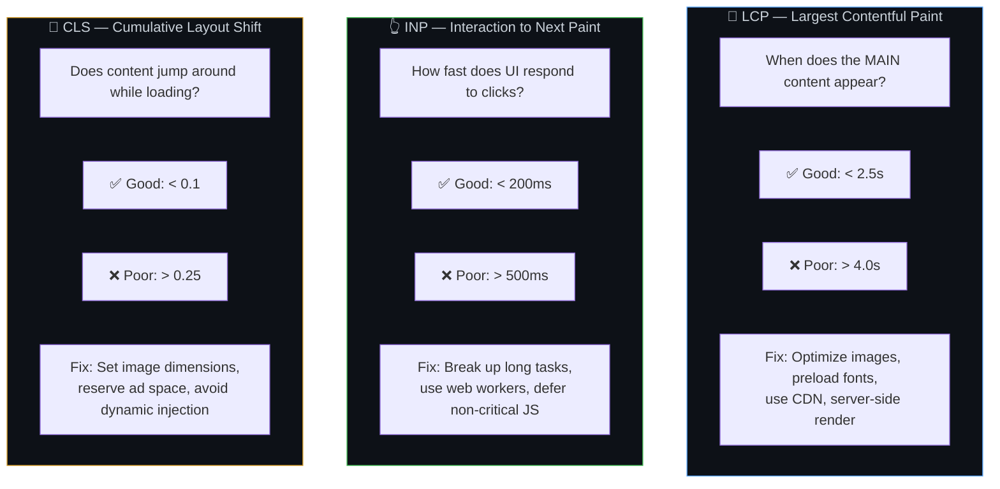
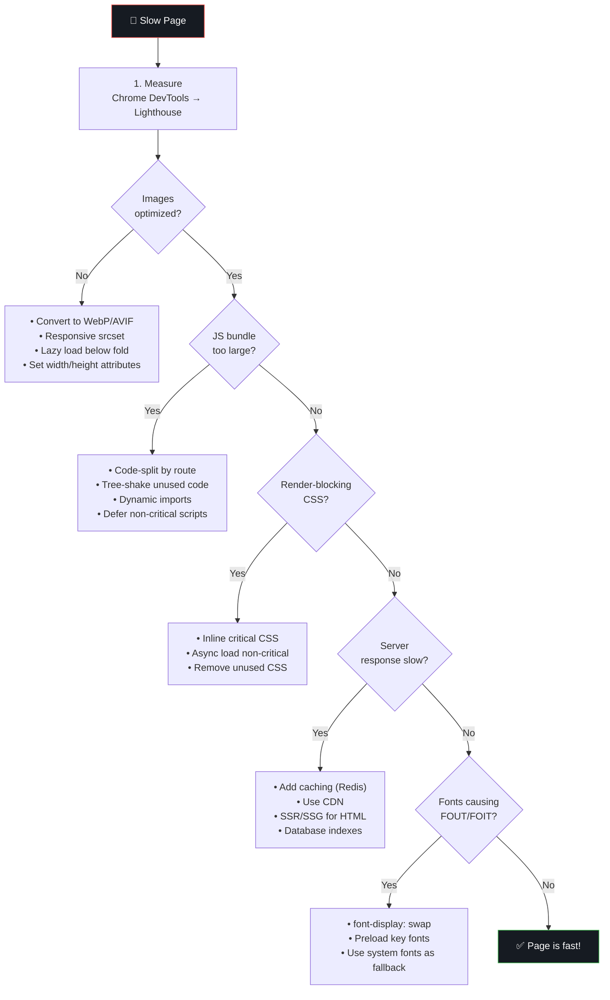
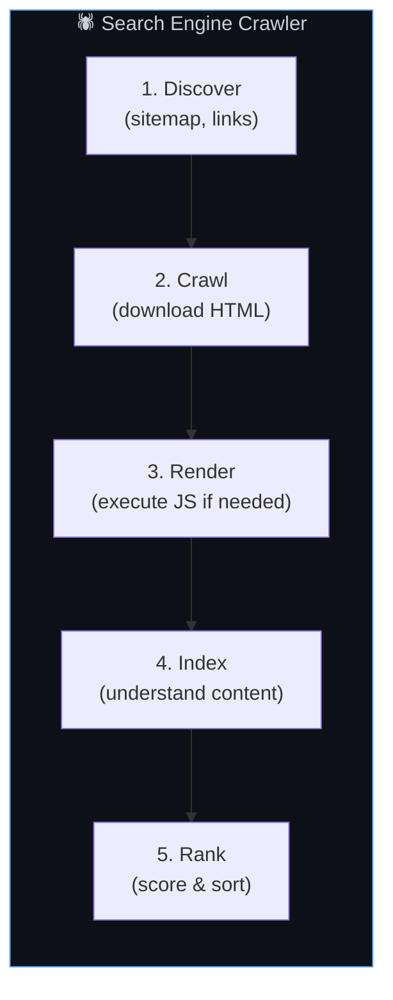
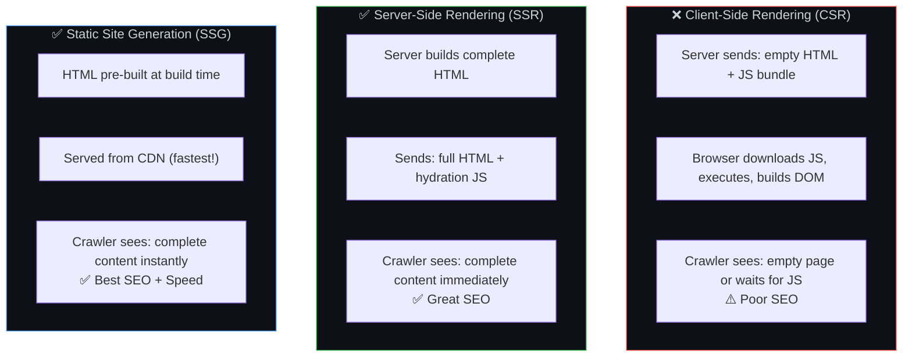
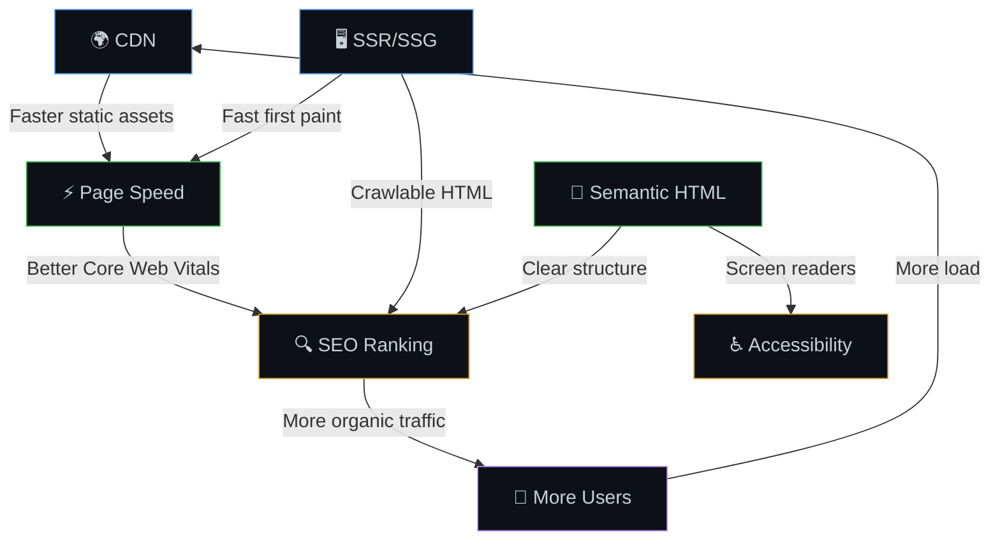

# 🌍 6. CDN, Page Speed & SEO — Fast, Discoverable, Global

> **A slow page is like a restaurant where the menu takes 10 minutes to arrive — most customers leave before ordering. Optimizing page speed is like having the menu, water, and bread ready the moment someone sits down.**

---

## 🌐 CDN — Content Delivery Network

### How a CDN Works



### CDN Global Distribution



### What CDNs Cache

| Content Type | Cache Strategy | TTL |
|-------------|---------------|-----|
| Images, videos | Cache aggressively | 1-30 days |
| CSS, JS (with hash) | Cache immutably | 1 year |
| Fonts | Cache aggressively | 30 days |
| HTML pages | Short cache or revalidate | 0-5 min |
| API responses | Varies by endpoint | 0-60 sec |
| User-specific data | Do NOT cache at CDN | N/A |

---

## ⚡ Page Speed — Core Web Vitals

### The Loading Timeline

```mermaid
gantt
    title Page Load Timeline — What the User Sees
    dateFormat X
    axisFormat %L ms

    section Network
    DNS Lookup          :dns, 0, 50
    TCP + TLS           :tcp, 50, 150
    Server Processing   :server, 150, 350
    Download HTML       :html, 350, 450

    section Rendering
    Parse HTML + DOM    :dom, 450, 550
    Download CSS        :css, 450, 600
    Parse CSS + CSSOM   :cssom, 600, 650
    FCP (First Paint)   :milestone, fcp, 650, 650
    Download Images     :img, 650, 1200
    Download JS         :js, 550, 900
    Execute JS          :exec, 900, 1400
    LCP (Main Content)  :milestone, lcp, 1200, 1200
    TTI (Interactive)   :milestone, tti, 1400, 1400
```



### Core Web Vitals Explained



### Page Speed Optimization Checklist



---

## 🔍 SEO — Search Engine Optimization

### How Search Engines See Your Page



### SEO vs Rendering Strategy



### SEO Technical Checklist

```mermaid
graph TD
    SEO["🔍 SEO Essentials"] --> Structure["📄 Structure"]
    SEO --> Content["📝 Content"]
    SEO --> Technical["⚙️ Technical"]
    SEO --> Performance["⚡ Performance"]

    Structure --> S1["Semantic HTML (h1, nav, article, section)"]
    Structure --> S2["One h1 per page"]
    Structure --> S3["Clean URLs (/products/blue-shoes)"]
    Structure --> S4["Proper heading hierarchy (h1 > h2 > h3)"]

    Content --> C1["Unique title tag per page"]
    Content --> C2["Meta description (150-160 chars)"]
    Content --> C3["Open Graph tags (social sharing)"]
    Content --> C4["Structured data (Schema.org)"]

    Technical --> T1["sitemap.xml (list of pages)"]
    Technical --> T2["robots.txt (crawl rules)"]
    Technical --> T3["Canonical URLs (avoid duplicates)"]
    Technical --> T4["Mobile responsive (mobile-first indexing)"]

    Performance --> P1["LCP < 2.5s"]
    Performance --> P2["TLS/HTTPS (ranking signal)"]
    Performance --> P3["No broken links (404s)"]
    Performance --> P4["Fast server response (TTFB < 600ms)"]

    style SEO fill:#161b22,stroke:#58a6ff,color:#fff
```



### Semantic HTML vs Div Soup

```html
<!-- ❌ BAD: Div soup — search engines can't understand structure -->
<div class="header">
  <div class="logo">My Site</div>
  <div class="menu">
    <div class="menu-item">Home</div>
    <div class="menu-item">About</div>
  </div>
</div>
<div class="content">
  <div class="title">Welcome</div>
  <div class="text">This is my page</div>
</div>

<!-- ✅ GOOD: Semantic HTML — clear meaning for crawlers & screen readers -->
<header>
  <h1>My Site</h1>
  <nav>
    <a href="/">Home</a>
    <a href="/about">About</a>
  </nav>
</header>
<main>
  <article>
    <h2>Welcome</h2>
    <p>This is my page</p>
  </article>
</main>
```

---

## 🔗 CDN + Page Speed + SEO — How They Connect



---

## 📚 Analogy — The Library

SEO is like **organizing a library**:
- A well-labeled library (clear sections, a catalog, signs) lets visitors and librarians (search engines) quickly find and recommend the right book
- A library with books piled randomly in one room — even if it has the best books — will be ignored because no one can find anything

---

## ⚠️ Edge Cases & Gotchas

1. **CDN cache invalidation** — When you deploy changes, old cached versions may persist at edge nodes. Use versioned URLs or purge the CDN cache on deploy.

2. **Dynamic content at CDN** — Be careful caching user-specific data at CDN level. `Cache-Control: private` ensures CDN doesn't cache personal data.

3. **Over-relying on Lighthouse scores** — A perfect 100 score in development doesn't mean real users experience it that way. Use Real User Monitoring (RUM) data.

4. **SPA SEO trap** — Single Page Apps (React/Vue CSR) render HTML client-side. Many search engines struggle with this. Use SSR/SSG for content that needs to be indexed.

5. **Image CDN transforms** — Modern CDNs (Cloudinary, imgix, Cloudflare Images) can resize and convert images on-the-fly. Serve WebP to Chrome, AVIF to newer browsers, JPEG to old ones — all from one source.

---

## 🔗 Connected Topics

| Topic | Connection |
|-------|-----------|
| [Caching](05-caching.md) | CDN is layer 2 of the cache hierarchy |
| [Latency](08-latency.md) | CDN reduces network distance = reduced latency |
| [Browser Internals](../Part-2-Network-Hardware-Browser-Frameworks/19-browser-internals.md) | Page speed depends on how the browser renders |
| [Frontend Frameworks](../Part-2-Network-Hardware-Browser-Frameworks/20-frontend-frameworks.md) | SSR/SSG/CSR choice impacts both speed and SEO |
| [Monitoring](13-monitoring-observability.md) | Track Core Web Vitals as metrics |

---

**← Previous:** [5. Caching](05-caching.md) | **Next →** [7. Database Design](07-database-design.md)
