# 🗄️ 7. Database Design & Data Safety

> **SQL is a well-organized filing cabinet — every drawer has labeled folders in a fixed structure. NoSQL is more like sticky notes on a wall — flexible, fast to add, great for rapidly-changing information.**

---

## 🔄 Database Selection Decision Flow

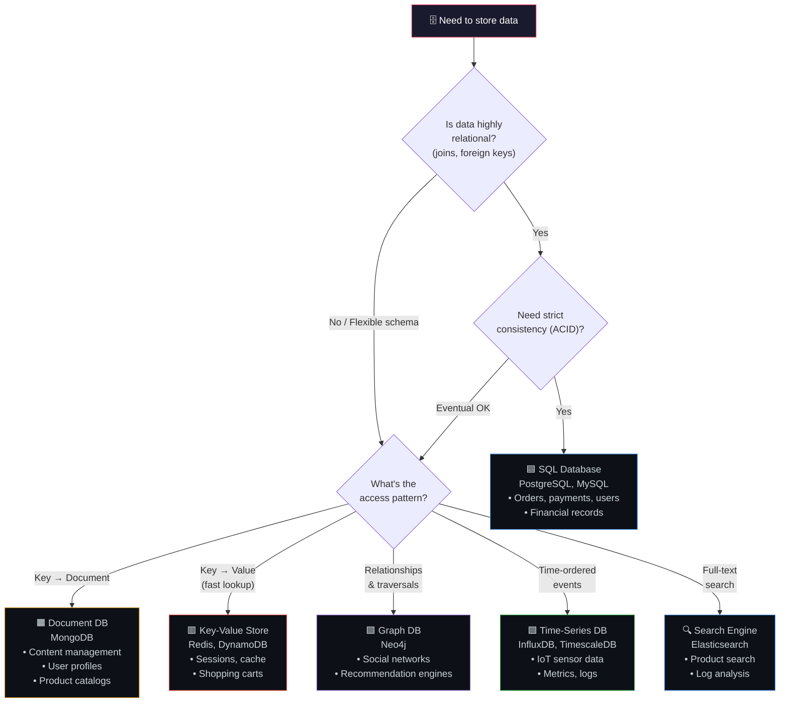

---

## 🟦 SQL vs NoSQL — Side by Side

| Aspect | SQL (PostgreSQL, MySQL) | NoSQL (MongoDB, Redis, Cassandra) |
|--------|------------------------|----------------------------------|
| **Schema** | Fixed, predefined | Flexible, schema-less |
| **Relationships** | Built-in (JOINs, foreign keys) | Manual or embedded |
| **Consistency** | Strong (ACID) | Eventually consistent (BASE) |
| **Scaling writes** | Vertical (hard to shard) | Horizontal (designed for it) |
| **Query language** | SQL (standardized) | Varies per database |
| **Best for** | Complex queries, transactions | High volume, flexible data |
| **Analogy** | Filing cabinet (structured) | Sticky notes (flexible) |

### ACID vs BASE

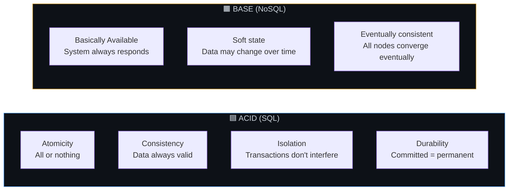

---

## 📊 Indexing — The Textbook Index

### How an Index Works

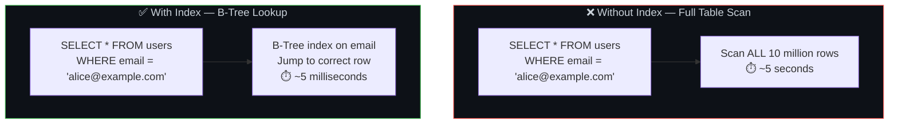

### B-Tree Index Visualization

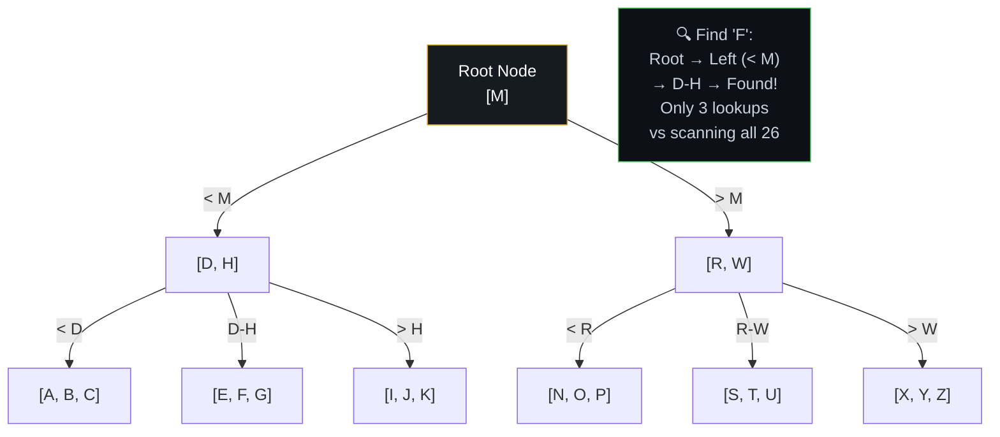

### Index Types & When to Use

| Index Type | Best For | Example |
|-----------|---------|---------|
| **B-Tree** (default) | Equality & range queries | `WHERE age > 25` |
| **Hash** | Exact equality only | `WHERE id = 123` |
| **GIN** (Generalized Inverted) | Full-text search, arrays, JSONB | `WHERE tags @> '{react}'` |
| **Composite** | Multi-column queries | `WHERE city = 'Mumbai' AND age > 25` |
| **Partial** | Subset of rows | `WHERE status = 'active'` (index only active rows) |

### Index Trade-off

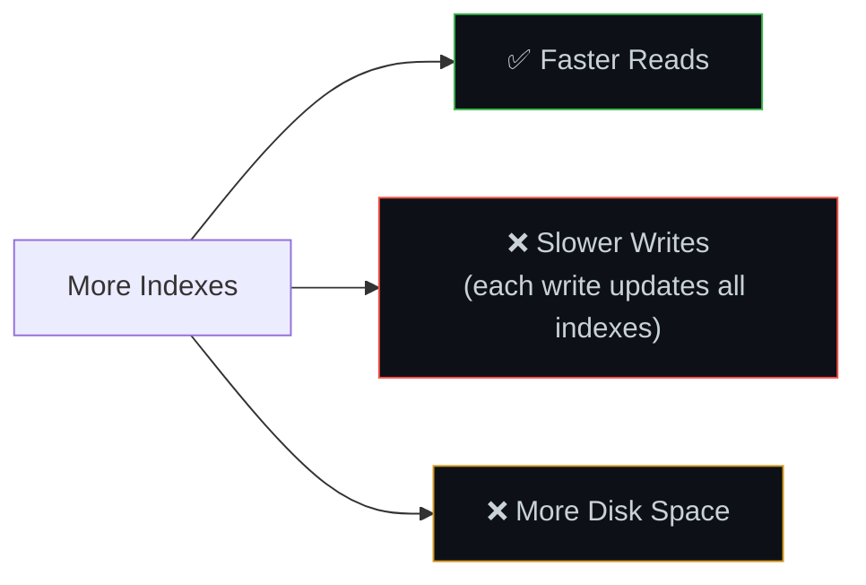

---

## 🔄 Replication — Copies for Safety & Speed

### Primary-Replica Architecture

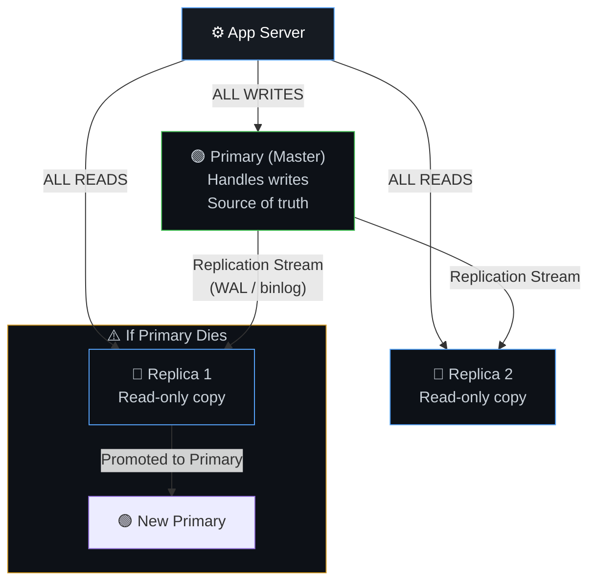

### Replication Lag — The Gotcha

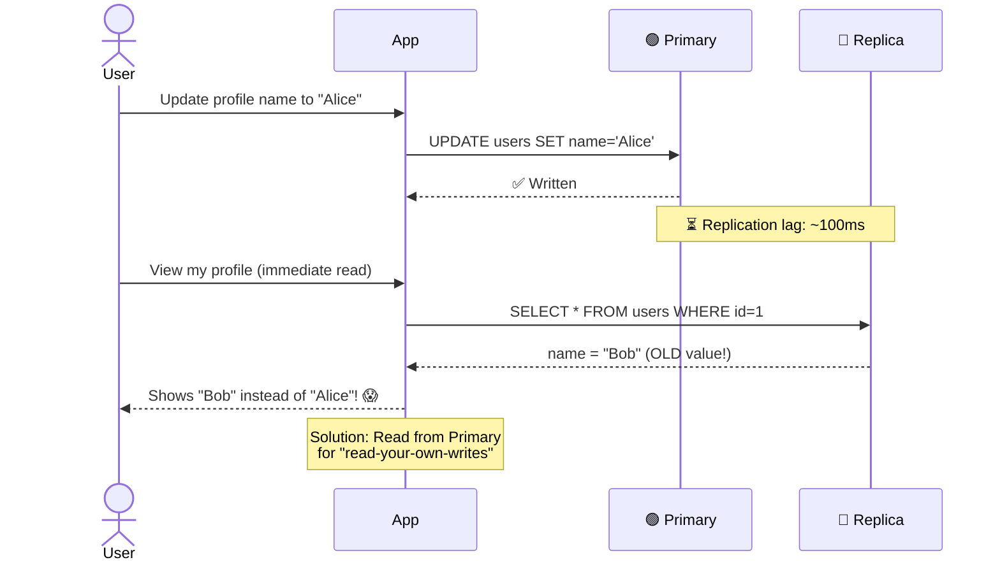

### Solutions for Replication Lag

| Pattern | How It Works | Use When |
|---------|-------------|----------|
| **Read-your-own-writes** | After a write, read from primary for that user | User updates their own profile |
| **Monotonic reads** | Same user always reads from same replica | Avoid "going back in time" |
| **Synchronous replication** | Primary waits for replicas to confirm | Need strict consistency (rare) |

---

## 🔀 Sharding — Splitting Data Across Machines

### How Sharding Works

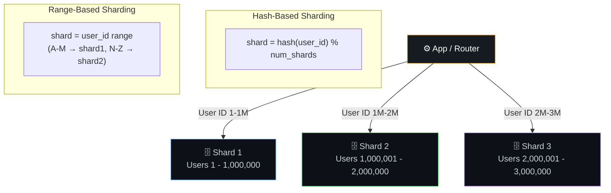

### Sharding Challenges

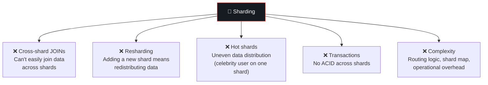

### When to Shard (Last Resort!)

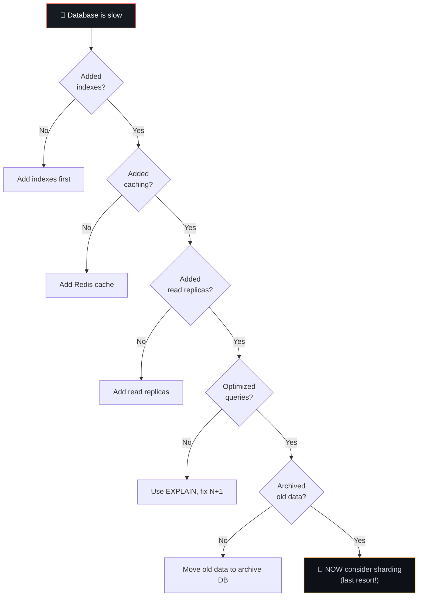

---

## 💾 Backups & Disaster Recovery

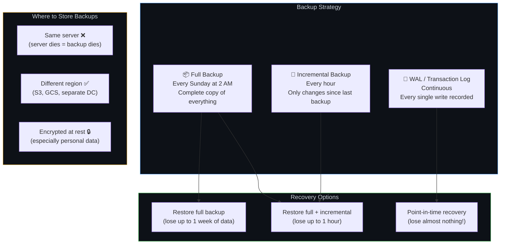

### The Backup Golden Rule

```
A backup you've never restored is a backup you don't have.
```

> **Test your restores regularly.** Many companies discover their backups were broken only during an actual emergency.

### Backup Schedule Template

| Backup Type | Frequency | Retention | Storage |
|------------|-----------|-----------|---------|
| Full | Weekly | 4 weeks | Remote (different region) |
| Incremental | Hourly | 7 days | Remote |
| Transaction log (WAL) | Continuous | 3 days | Remote |
| Monthly archive | Monthly | 1 year | Cold storage (S3 Glacier) |

---

## 🔄 Database Migration Safety

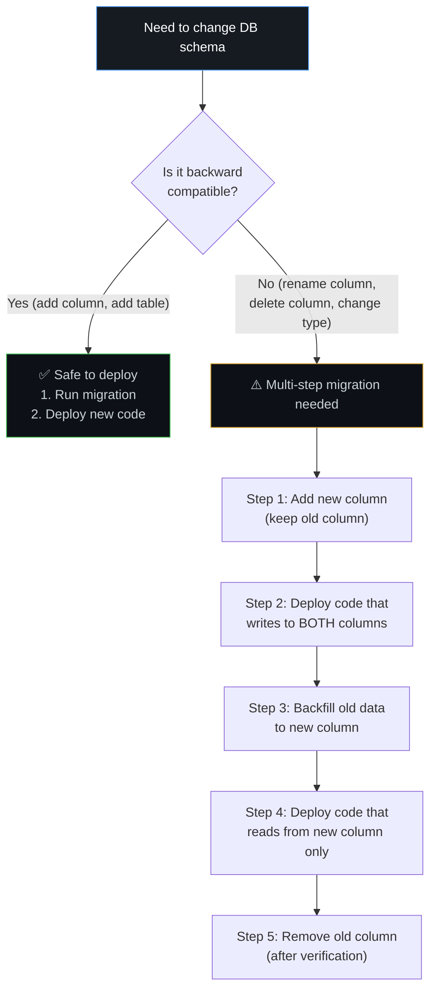

---

## ⚠️ Edge Cases & Gotchas

1. **The N+1 query problem** — Fetching a list of 100 orders, then for each order making a separate query for the customer = 101 queries. One query with a JOIN gets the same data.

2. **Missing database connection pooling** — Creating a new DB connection for every request is expensive (~50ms per connection). Use a pool that reuses connections.

3. **Unbounded queries** — `SELECT * FROM logs` on a table with 500 million rows will crash your DB. Always use LIMIT/pagination.

4. **Not using transactions for multi-step writes** — Transferring money: debit account A and credit account B should be atomic. If the process crashes after debiting but before crediting, money disappears.

5. **Choosing NoSQL because "it's faster"** — NoSQL isn't inherently faster. A well-indexed PostgreSQL query is as fast as MongoDB for most use cases. Choose based on data model, not speed myths.

---

## 🔗 Connected Topics

| Topic | Connection |
|-------|-----------|
| [Caching](05-caching.md) | Redis cache sits in front of DB to reduce load |
| [Scalability](03-scalability.md) | Replication and sharding are DB-level scaling |
| [Security](09-security.md) | Encryption at rest, access control, audit logging |
| [Performance](12-performance-optimization.md) | Query optimization, indexing, N+1 prevention |
| [Latency](08-latency.md) | DB queries are a major latency source |

---

**← Previous:** [6. CDN, Page Speed & SEO](06-cdn-pagespeed-seo.md) | **Next →** [8. Latency](08-latency.md)
