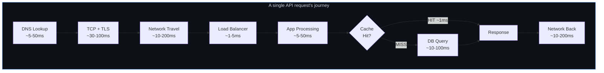
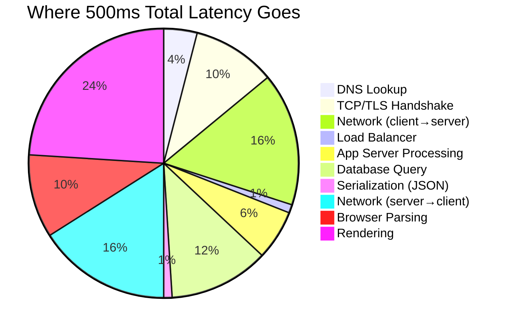
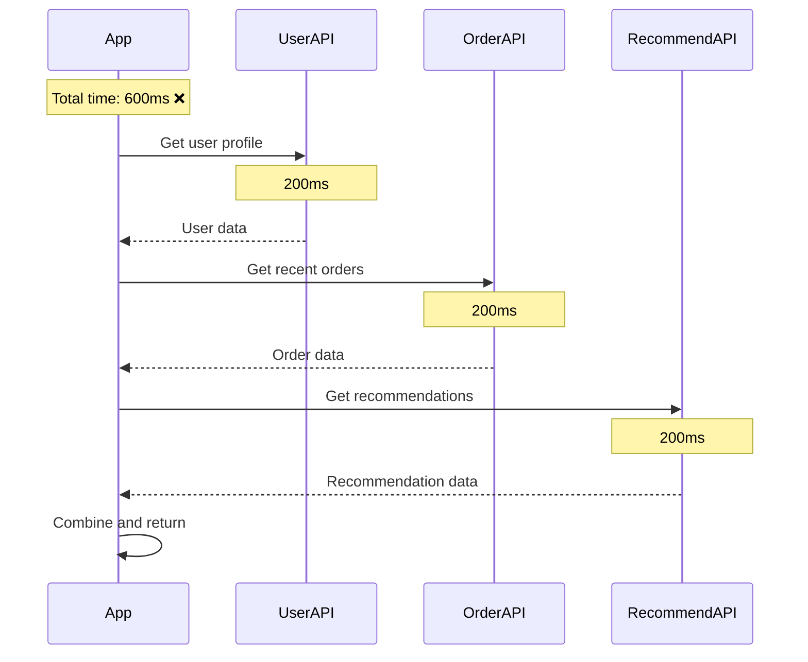
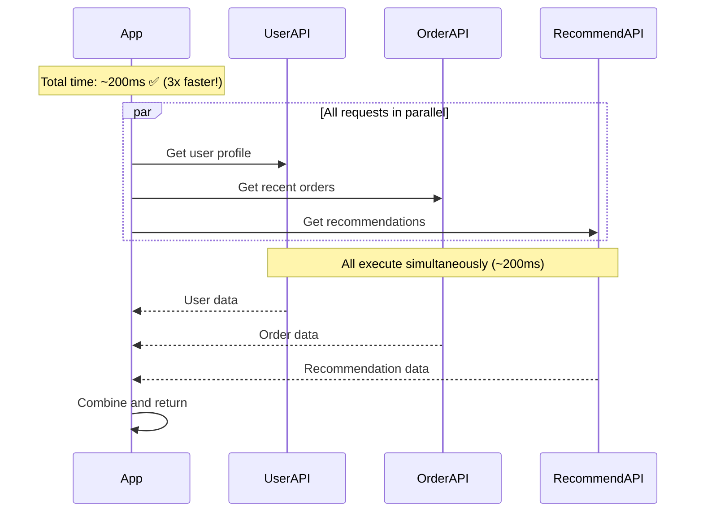
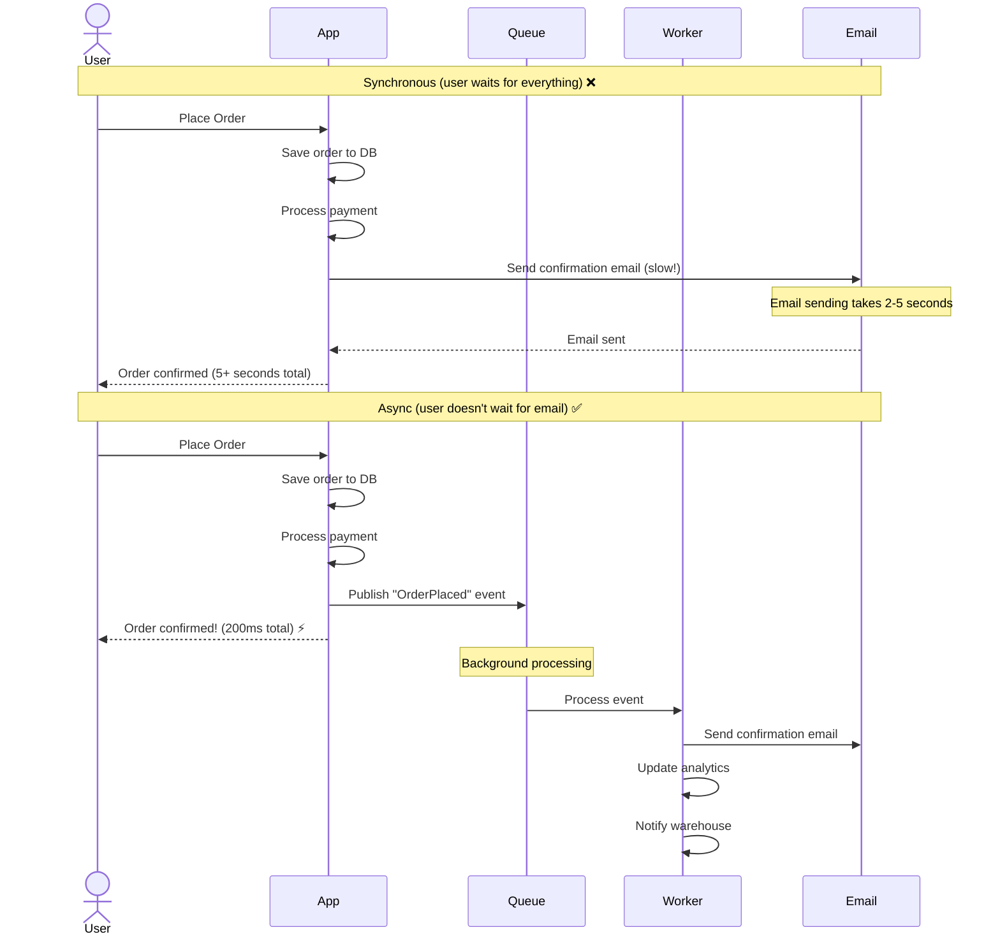
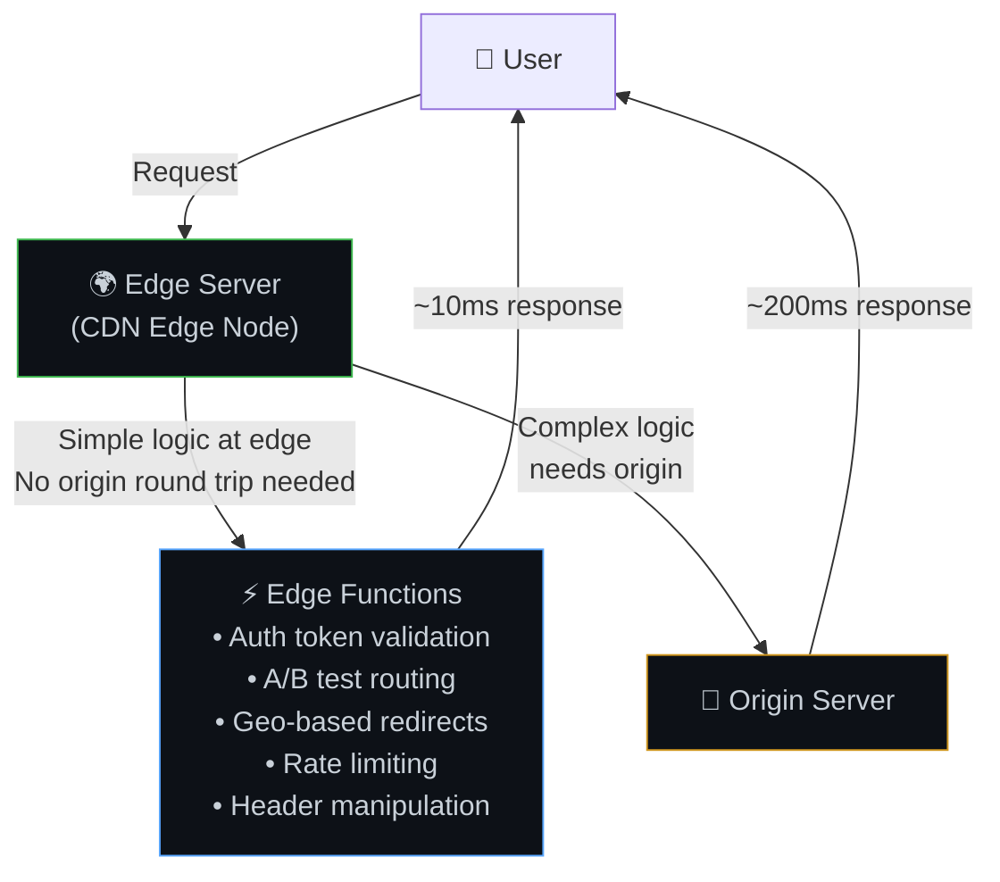
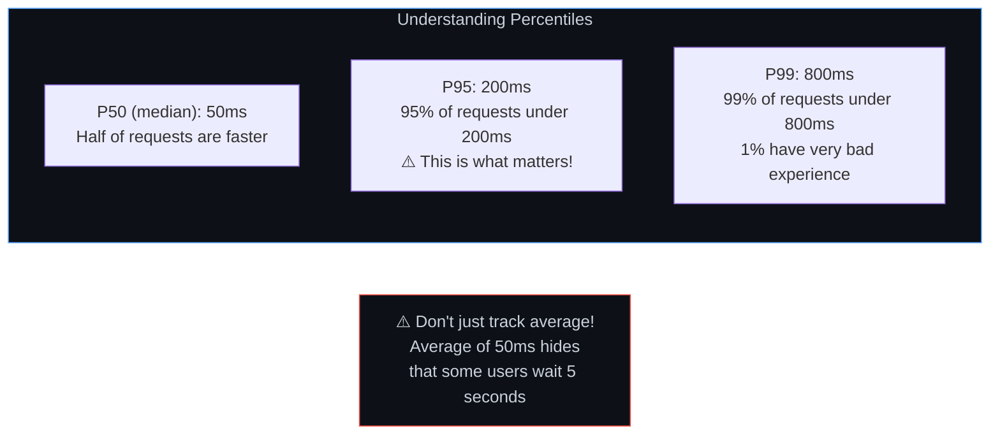
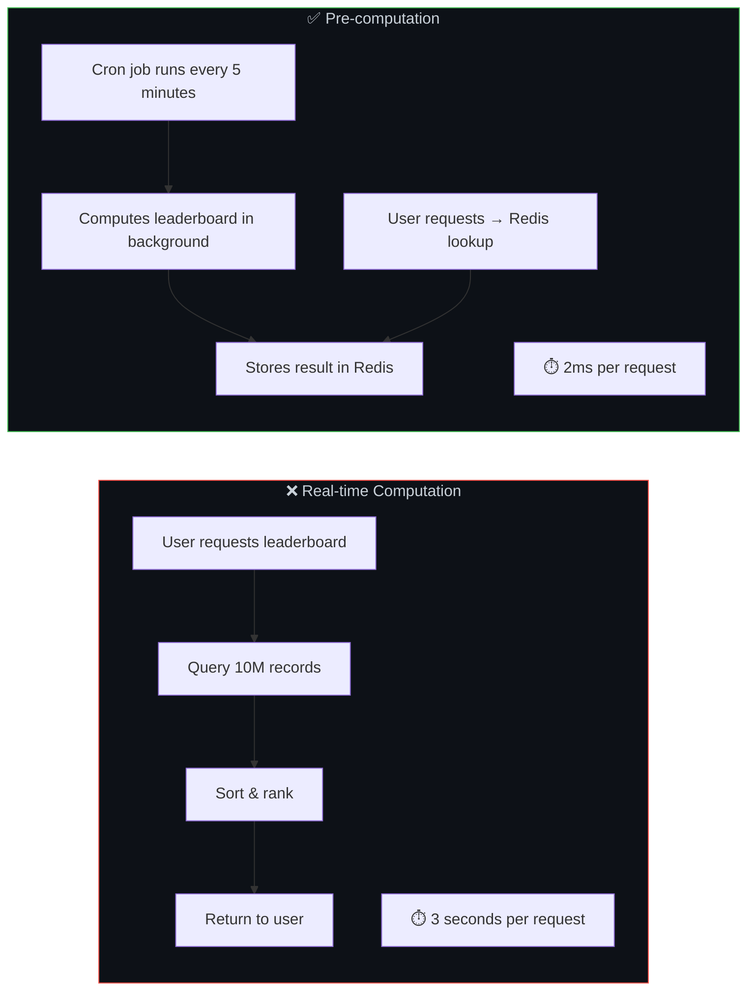

# ⏱️ 8. Latency — The Enemy of Good User Experience

> **Latency is the sum of every "wait" in a journey — walking to the car, traffic lights, parking, walking into the building. You can't eliminate every wait, but you can remove unnecessary stops, take faster routes, and do things in parallel.**

---

## 🔄 Where Latency Comes From — The Full Waterfall



### Latency Budget Breakdown



---

## 📊 Latency Sources & Solutions

```mermaid
graph TD
    subgraph SOURCE1["🌐 Network Distance"]
        S1_Problem["User in Mumbai → Server in US<br/>~300ms round trip"]
        S1_Fix["✅ CDN / Edge servers<br/>✅ Deploy in user's region<br/>✅ HTTP/2 or HTTP/3"]
    end

    subgraph SOURCE2["🗄️ Database Queries"]
        S2_Problem["Unindexed queries<br/>Full table scans<br/>N+1 queries"]
        S2_Fix["✅ Add proper indexes<br/>✅ Use EXPLAIN to analyze<br/>✅ Cache frequent queries in Redis"]
    end

    subgraph SOURCE3["⛓️ Sequential Chains"]
        S3_Problem["A waits for B waits for C<br/>200ms + 200ms + 200ms = 600ms"]
        S3_Fix["✅ Run A, B, C in parallel<br/>✅ Total: ~200ms instead of 600ms"]
    end

    subgraph SOURCE4["❄️ Cold Starts"]
        S4_Problem["Serverless function waking up<br/>~200-2000ms first request"]
        S4_Fix["✅ Keep functions warm<br/>✅ Use provisioned concurrency<br/>✅ Use containers instead"]
    end

    subgraph SOURCE5["📦 Large Payloads"]
        S5_Problem["Sending 5MB JSON response<br/>Huge images over slow connections"]
        S5_Fix["✅ Pagination (20 items/page)<br/>✅ Compression (gzip/brotli)<br/>✅ GraphQL (select fields)"]
    end

    subgraph SOURCE6["🔌 Connection Setup"]
        S6_Problem["New TCP/TLS handshake per request<br/>Re-introduce yourself every time"]
        S6_Fix["✅ Connection pooling<br/>✅ HTTP/2 multiplexing<br/>✅ Keep-alive connections"]
    end

    style SOURCE1 fill:#0d1117,stroke:#58a6ff,color:#c9d1d9
    style SOURCE2 fill:#0d1117,stroke:#3fb950,color:#c9d1d9
    style SOURCE3 fill:#0d1117,stroke:#d29922,color:#c9d1d9
    style SOURCE4 fill:#0d1117,stroke:#bc8cff,color:#c9d1d9
    style SOURCE5 fill:#0d1117,stroke:#f85149,color:#c9d1d9
    style SOURCE6 fill:#0d1117,stroke:#58a6ff,color:#c9d1d9
```



---

## ⛓️ Sequential vs Parallel — The Biggest Win

### Before: Sequential (Slow)



### After: Parallel (Fast!)



### Code Example (Node.js)

```javascript
// ❌ Sequential — 600ms total
const user = await getUserProfile(userId);       // 200ms
const orders = await getRecentOrders(userId);    // 200ms
const recs = await getRecommendations(userId);   // 200ms

// ✅ Parallel — ~200ms total (3x faster!)
const [user, orders, recs] = await Promise.all([
  getUserProfile(userId),
  getRecentOrders(userId),
  getRecommendations(userId),
]);
```

---

## 📬 Async Processing — Don't Make Users Wait



### When to Use Sync vs Async

| Sync (User Waits) | Async (Background) |
|-------------------|--------------------|
| Payment processing | Sending emails/SMS |
| Login/authentication | Generating reports |
| Data validation | Image/video processing |
| Reading data user asked for | Analytics tracking |
| Cart operations | Notifications |
| Search queries | Data sync between services |

---

## 🌐 Edge Computing — Logic at the Edge



---

## 📐 Latency Percentiles — P50, P95, P99



### Why Averages Lie

| Requests | Latency | Average | P95 |
|----------|---------|---------|-----|
| 95 requests | 50ms each | | |
| 5 requests | 2000ms each | | |
| **Total 100** | | **147ms** (looks fine!) | **2000ms** (5% of users suffer!) |

---

## 🔧 Pre-computation — Pay the Cost Upfront



---

## ⚠️ Edge Cases & Gotchas

1. **Tail latency amplification** — In microservices, a request touching 10 services means the total latency is limited by the slowest service. If each service has a P99 of 100ms, the combined P99 is much worse.

2. **Premature optimization** — Don't optimize a 5ms function to 2ms when there's a 500ms DB query. Always measure first, then optimize the bottleneck.

3. **Timeout cascades** — Service A calls B (timeout 5s), B calls C (timeout 5s). If C is slow, A waits 5s for B which waits 5s for C = user waits 10s. Set cascading timeouts: A→B: 3s, B→C: 2s.

4. **Keep-alive connections not configured** — Without keep-alive, every HTTP request pays the TCP+TLS handshake cost (~50-100ms). Most clients/servers support it; just make sure it's enabled.

5. **JSON serialization overhead** — For very high-throughput APIs, JSON parsing/stringification can become a bottleneck. Consider Protocol Buffers (protobuf) for internal service-to-service communication.

---

## 🔗 Connected Topics

| Topic | Connection |
|-------|-----------|
| [Caching](05-caching.md) | Each cache layer eliminates a slower lookup |
| [CDN](06-cdn-pagespeed-seo.md) | Reduces network distance to content |
| [Database](07-database-design.md) | DB queries are a major latency contributor |
| [Load Balancers](04-load-balancers.md) | Prevent server overload (overloaded = slow) |
| [Performance](12-performance-optimization.md) | Latency reduction is performance optimization |
| [Monitoring](13-monitoring-observability.md) | Track p50/p95/p99 latency metrics |

---

**← Previous:** [7. Database Design](07-database-design.md) | **Next →** [9. Security](09-security.md)
