# 🔒 9. Security & Data Safety — Defense in Depth

> **Security is like a castle, not a single locked door. There's a moat (firewall), walls (authentication), guards checking IDs at each gate (authorization), sealed vaults for treasure (encryption), and a logbook of who entered which room and when (audit logs).**

---

## 🏰 The Castle Model — Layered Security

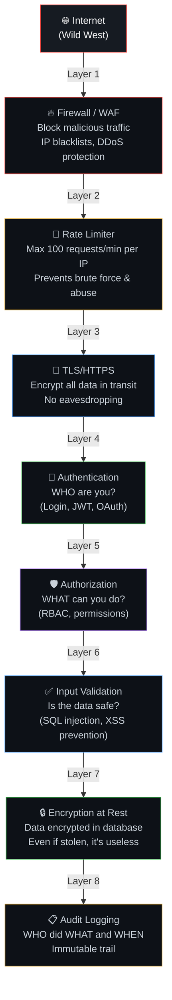

---

---

## 🔥 Layer 1: Firewall & DDoS Mitigation — Defense at the Edge

> **Defense starts at the boundary. DDoS attacks attempt to overwhelm you; a firewall blocks bad actors, and DDoS scrubbers filter malicious traffic before it reaches your compute servers.**

### What it is
*   **WAF (Web Application Firewall)**: Filters, monitors, and blocks HTTP/HTTPS traffic to and from a web application (e.g., blocking SQLi, XSS, bots).
*   **DDoS (Distributed Denial of Service) Mitigation**: The process of successfully protecting a targeted server or network from a distributed denial-of-service attack.

### How it works
1.  **Anycast DNS & CDN**: Incoming traffic is routed to the closest edge server globally. This disperses the volume of a DDoS attack across hundreds of locations.
2.  **Traffic Scrubbing**: Special traffic scrubbing centers analyze traffic signatures. Malicious requests (e.g., SYN floods, NTP amplification, bot requests) are dropped, and clean traffic is passed through.
3.  **WAF Rules**: WAF inspects HTTP headers, payloads, query parameters, and patterns (like OWASP Top 10) to block attacks.

### When to use
*   **Always** place a DDoS shielding layer (like Cloudflare, AWS Shield, or Akamai) in front of public-facing endpoints.

---

## 🚦 Layer 2: Rate Limiting — Traffic Flow Control

> **A rate limiter restricts the number of requests a user or IP can make in a given timeframe to prevent abuse, brute-force logins, and server exhaustion.**

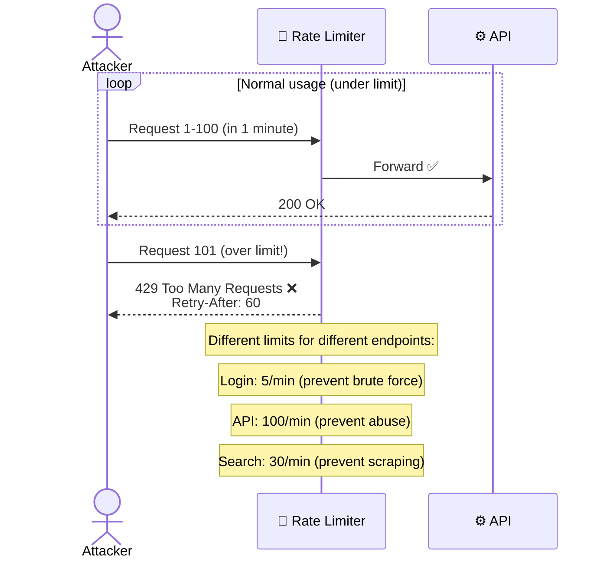

---

## 🔐 Layer 3: TLS/HTTPS — Encryption in Transit

> **HTTPS ensures that all communication between the client's browser and the server is encrypted, protecting data from eavesdropping and tampering.**

### How it works
*   During the **TLS handshake**, the server presents a certificate to prove its identity, and a secure session key is negotiated using asymmetric encryption. Subsequent traffic is encrypted using faster symmetric encryption.
*   **HSTS (HTTP Strict Transport Security)**: A response header that instructs browsers to *only* access the site via HTTPS, transforming any `http://` links to `https://` client-side.

---

## 🔑 Layer 4: Authentication — WHO Are You?

### Authentication Flow (JWT + OAuth)

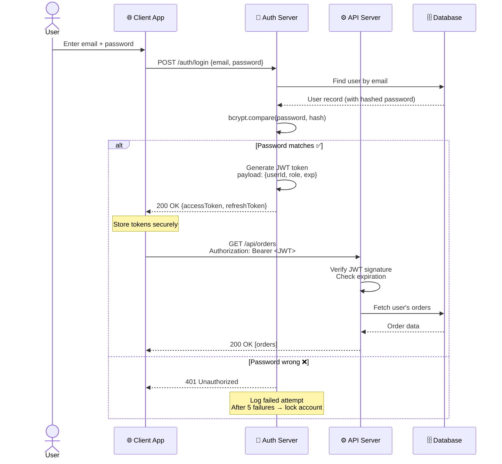

### Password Storage — NEVER Plain Text

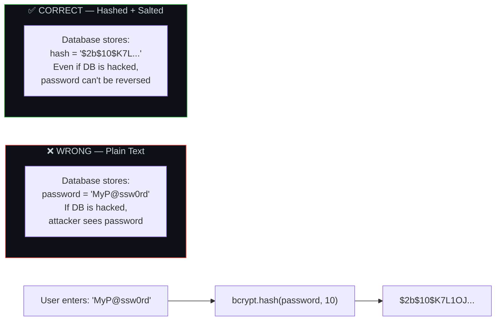

### JWT Token Structure

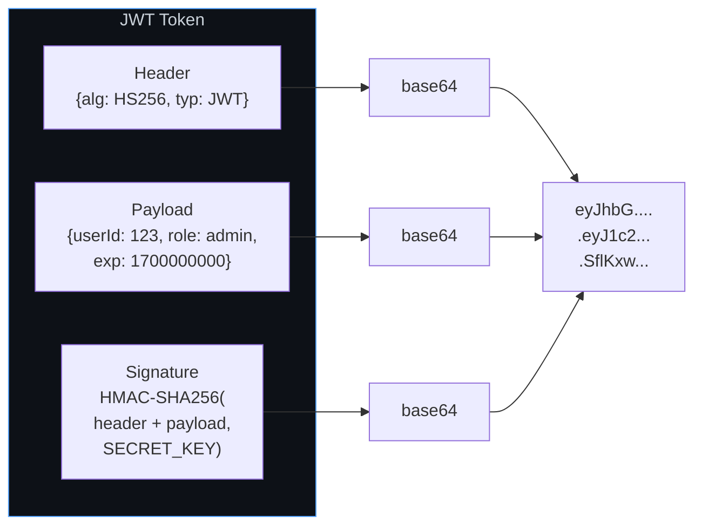

---

## 🛡️ Layer 5: Authorization — WHAT Can You Do?

### RBAC (Role-Based Access Control)

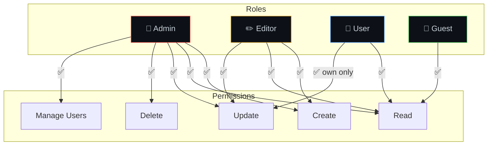

### Authorization Middleware Example

```javascript
// Middleware: Check if user has required role
function authorize(...allowedRoles) {
  return (req, res, next) => {
    const userRole = req.user.role; // from JWT

    if (!allowedRoles.includes(userRole)) {
      return res.status(403).json({ error: 'Forbidden: insufficient permissions' });
    }
    next();
  };
}

// Usage
app.delete('/api/users/:id', authorize('admin'), deleteUser);
app.put('/api/posts/:id', authorize('admin', 'editor'), updatePost);
app.get('/api/posts', authorize('admin', 'editor', 'user', 'guest'), getPosts);
```

---

## 🛡️ Layer 6: Input Validation & Sanitization — Payload Filtering

> **Input Validation verifies that the data fits expected formats, types, and lengths. Input Sanitization cleanses the data by stripping out executable scripts or database commands before they are executed or stored.**

### Common Attacks & Defenses

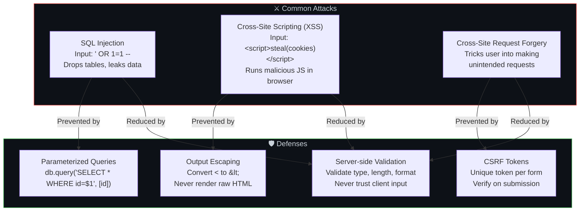

### 🔄 Input Validation vs. Sanitization
*   **Input Validation**: Checks format, type, and bounds (e.g., checking if `age` is a number > 0 and < 120).
    *   *Solution*: Use libraries like **Zod**, **Joi**, or standard validator libraries.
    *   *When*: On **every single API entry point**. Reject inputs that fail validation with a `400 Bad Request`.
*   **Input Sanitization**: Modifies and cleans the incoming data, stripping dangerous characters, scripts, or unwanted HTML tags.
    *   *Solution*: Use sanitization engines like **DOMPurify** (for rich text/HTML) or specialized escaping logic.
    *   *When*: Before storing input into a database if that data will ever be rendered to other users (especially rich HTML comments, bios, markdown).

### ⚔️ Cross-Site Scripting (XSS) Deep Dive
*   **Stored XSS (Persistent)**: Malicious script is saved in the database (e.g., comment section) and executes in the browser of every visiting user.
    *   *Solution*: Sanitize content before saving, escape outputs when rendering, and use modern frameworks like React/Angular which auto-escape variables by default.
*   **Reflected XSS (Non-Persistent)**: Script is sent as part of a request parameter (e.g., search query) and reflected back in the HTML response.
    *   *Solution*: Escape query parameters rendered on screen.
*   **DOM-based XSS**: Client-side JS reads inputs directly from window/DOM (e.g., URL hash) and writes it unsafely into the page (`element.innerHTML`).
    *   *Solution*: Avoid `innerHTML` or `eval()`. Use `textContent` or use sanitizer libraries like DOMPurify.

### 🛡️ Global XSS Protections
1.  **HttpOnly Cookies**: Setting `HttpOnly` on session/JWT cookies makes them inaccessible via JavaScript (`document.cookie`), preventing session hijacking even if XSS is present.
2.  **CSP (Content Security Policy)**: A response header that instructs the browser which scripts/domains are allowed to load. E.g., `Content-Security-Policy: default-src 'self'`.

### ⚔️ SQL Injection Example
```javascript
// ❌ VULNERABLE — string concatenation
const query = `SELECT * FROM users WHERE email = '${userInput}'`;
// If userInput = "' OR 1=1 --"
// Query becomes: SELECT * FROM users WHERE email = '' OR 1=1 --'
// Returns ALL users!

// ✅ SAFE — parameterized query
const query = 'SELECT * FROM users WHERE email = $1';
const result = await db.query(query, [userInput]);
// Input is always treated as DATA, never as SQL code
```

### ⚔️ CSRF (Cross-Site Request Forgery) Deep Dive
*   **What it is**: Tricking an authenticated user's browser into executing an unwanted action on a trusted site because cookies are automatically sent.
*   **Mitigation**:
    1.  **Anti-CSRF Tokens**: Include a unique token in forms/headers. The server verifies this token on incoming write requests.
    2.  **SameSite Cookie Attribute**: Set `SameSite=Lax` or `SameSite=Strict` on cookies to ensure they aren't sent on cross-site requests.

---

## 🔒 Layer 7: Encryption at Rest — Data Shielding

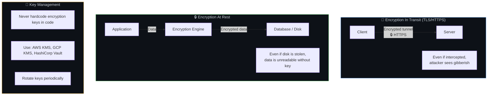

---

## 🔑 Layer 8: Secrets Management

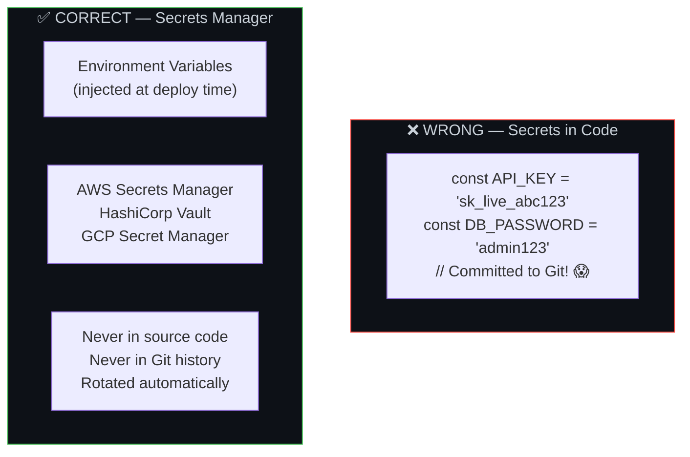

---

## 📋 Layer 9: Audit Logging — Tamper-Proof History


```javascript
// Log sensitive actions
const auditLog = {
  timestamp: new Date().toISOString(),
  userId: req.user.id,
  action: 'DELETE_USER',
  targetId: req.params.userId,
  ip: req.ip,
  userAgent: req.headers['user-agent'],
  result: 'SUCCESS',
};

// Store in append-only, tamper-proof log
await auditService.log(auditLog);
```

### What to Audit Log

| Action | Why |
|--------|-----|
| Login success/failure | Detect brute force, compromised accounts |
| Permission changes | Track who granted/revoked access |
| Data exports/downloads | Detect data exfiltration |
| Sensitive data access | Compliance (GDPR, HIPAA) |
| Configuration changes | Debug and accountability |
| Deletion of records | Detect accidental or malicious deletion |

---

## 🔄 The Complete Security Flow

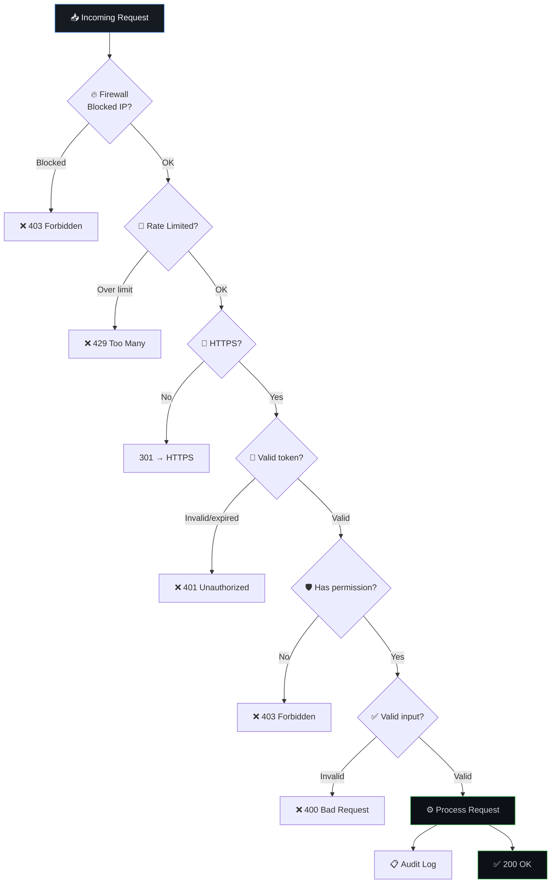

---

## ⚠️ Edge Cases & Gotchas

1. **Client-side validation is NOT security** — It's UX. Any validation in the browser can be bypassed. Always validate on the server.

2. **Don't roll your own auth** — Use established libraries (Passport.js, NextAuth, Firebase Auth). Writing your own login system is inviting vulnerabilities.

3. **JWT in localStorage is risky** — XSS can steal it. Consider httpOnly cookies for storing tokens (not accessible via JavaScript).

4. **API keys in frontend code** — Any key in client-side JavaScript is visible to anyone. Use server-side proxying for sensitive API calls.

5. **Dependency vulnerabilities** — 70%+ of code in most apps comes from npm/pip packages. Run `npm audit` regularly. One compromised dependency = your app is compromised.

6. **Forgot password flow** — Tokens should be single-use, short-lived (15-30 min), and invalidated after password change.

---

## 🛡️ OWASP Top 10 (2025) — The Latest Industry Standard

> **The OWASP Top 10 is updated periodically to reflect the latest data-driven security trends. The 2025 edition introduced significant reclassifications — notably elevating Supply Chain Failures to A03, and adding a brand-new category: Mishandling of Exceptional Conditions (A10).**

```mermaid
graph TB
    subgraph OWASP2025["🛡️ OWASP Top 10 — 2025 Edition"]
        A01["A01: Broken Access Control<br/>IDOR, missing function-level checks,<br/>CORS misconfig"]
        A02["A02: Security Misconfiguration<br/>Default creds, open cloud storage,<br/>verbose errors, missing headers"]
        A03["A03: Supply Chain Failures<br/>Malicious packages, dependency<br/>confusion, unpinned versions"]
        A04["A04: Cryptographic Failures<br/>Weak hashing (MD5/SHA1),<br/>hardcoded keys, missing TLS"]
        A05["A05: Injection<br/>SQLi, XSS, command injection,<br/>LDAP injection"]
        A06["A06: Insecure Design<br/>Missing threat models, no rate limits<br/>on business logic, failing open"]
        A07["A07: Authentication Failures<br/>Credential stuffing, weak passwords,<br/>broken session management"]
        A08["A08: Integrity Failures<br/>Unsigned updates, CI/CD pipeline<br/>compromise, deserialization"]
        A09["A09: Logging & Alerting Failures<br/>No audit trail, logging secrets,<br/>missing breach alerts"]
        A10["A10: Mishandling Exceptions<br/>Stack trace leaks, failing open,<br/>resource exhaustion, NULL deref"]
    end

    style OWASP2025 fill:#0d1117,stroke:#58a6ff,color:#c9d1d9
    style A01 fill:#161b22,stroke:#f85149,color:#c9d1d9
    style A02 fill:#161b22,stroke:#d29922,color:#c9d1d9
    style A03 fill:#161b22,stroke:#f85149,color:#c9d1d9
    style A04 fill:#161b22,stroke:#bc8cff,color:#c9d1d9
    style A05 fill:#161b22,stroke:#f85149,color:#c9d1d9
    style A06 fill:#161b22,stroke:#d29922,color:#c9d1d9
    style A07 fill:#161b22,stroke:#f85149,color:#c9d1d9
    style A08 fill:#161b22,stroke:#bc8cff,color:#c9d1d9
    style A09 fill:#161b22,stroke:#d29922,color:#c9d1d9
    style A10 fill:#161b22,stroke:#3fb950,color:#c9d1d9
```

### 🔴 A01:2025 — Broken Access Control

**What changed**: Remains #1 since 2021. Attackers exploit missing or misconfigured access checks to act beyond their intended permissions.

**Key CWEs**: CWE-200 (Exposure of Sensitive Information), CWE-284 (Improper Access Control), CWE-639 (IDOR).

```javascript
// ❌ VULNERABLE — No ownership check (IDOR)
app.get('/api/invoices/:id', authenticate, async (req, res) => {
  const invoice = await db.query('SELECT * FROM invoices WHERE id = $1', [req.params.id]);
  res.json(invoice); // Any logged-in user can see ANY invoice!
});

// ✅ SAFE — Ownership verification
app.get('/api/invoices/:id', authenticate, async (req, res) => {
  const invoice = await db.query(
    'SELECT * FROM invoices WHERE id = $1 AND user_id = $2',
    [req.params.id, req.user.id] // Only returns if the user owns it
  );
  if (!invoice) return res.status(404).json({ error: 'Not found' });
  res.json(invoice);
});
```

**System Design Prevention**: Default-deny access policies, server-side ownership checks on every request, disable directory listing, invalidate JWT on logout, enforce CORS allowlists.

---

### 🟡 A02:2025 — Security Misconfiguration

**What changed**: Moved up from A05 (2021). Encompasses default credentials, open cloud storage buckets, unnecessary features enabled, and missing security headers.

**Key CWEs**: CWE-16 (Configuration), CWE-611 (XXE).

```javascript
// ❌ VULNERABLE — Verbose error in production
app.use((err, req, res, next) => {
  res.status(500).json({
    error: err.message,
    stack: err.stack, // Leaks internal paths and framework versions!
    query: req.query
  });
});

// ✅ SAFE — Generic error response in production
app.use((err, req, res, next) => {
  console.error(err); // Log internally for debugging
  res.status(500).json({ error: 'An internal error occurred.' });
});
```

**System Design Prevention**: Automated hardening checklists in CI/CD, infrastructure-as-code with security defaults baked in, remove unused features/ports/accounts, enforce strict HTTP headers (CSP, HSTS, X-Content-Type-Options).

---

### 🔴 A03:2025 — Software Supply Chain Failures *(New category name)*

**What changed**: Previously "Vulnerable and Outdated Components" (A06 in 2021). Elevated to A03 and renamed to focus on the entire supply chain: malicious packages, dependency confusion attacks, compromised build pipelines, and unsigned artifacts.

**Key CWEs**: CWE-1104 (Unmaintained Third-Party Components), CWE-829 (Untrusted Functionality).

**System Design Prevention**:
*   Pin exact dependency versions in lockfiles (`pnpm-lock.yaml`, `package-lock.json`).
*   Run `npm audit` / `pnpm audit` and Snyk/Dependabot scans in CI on every PR.
*   Generate and verify Software Bills of Materials (SBOMs).
*   Use Subresource Integrity (SRI) hashes for CDN-loaded scripts.
*   Require signed commits and 2FA for package publishing.
*   Scan container images with Trivy before deployment.

---

### 🟣 A04:2025 — Cryptographic Failures

**What changed**: Previously A02 (2021), moved to A04. Focuses on broken or missing encryption: weak algorithms (MD5, SHA1 for passwords), hardcoded secrets, missing TLS, and improper key management.

**Key CWEs**: CWE-259 (Hardcoded Password), CWE-327 (Broken Crypto Algorithm), CWE-331 (Insufficient Entropy).

```javascript
// ❌ VULNERABLE — MD5 for password hashing (fast, rainbow-table crackable)
const hash = crypto.createHash('md5').update(password).digest('hex');

// ✅ SAFE — bcrypt with cost factor (slow, salted, resistant)
const hash = await bcrypt.hash(password, 12);
```

**System Design Prevention**: Use bcrypt/Argon2 for passwords, AES-256-GCM for data at rest, enforce TLS 1.2+ everywhere, derive keys with PBKDF2/scrypt (high iteration counts), rotate keys periodically, never store secrets in code or env files committed to Git.

---

### 🔴 A05:2025 — Injection

**What changed**: Previously A03 (2021), moved to A05. Still covers SQL injection, XSS, command injection, and LDAP injection — but the reclassification reflects improved industry adoption of parameterized APIs.

**Key CWEs**: CWE-79 (XSS), CWE-89 (SQLi), CWE-78 (OS Command Injection).

*(See the detailed XSS and SQL Injection sections above in Layer 6 for full code examples and mitigations.)*

**System Design Prevention**: Parameterized queries everywhere, output encoding/escaping, Content Security Policy headers, use ORM/query builders that enforce parameterization, avoid `eval()` and `innerHTML`, sanitize with DOMPurify for rich text.

---

### 🟡 A06:2025 — Insecure Design

**What changed**: Introduced in 2021, retained in 2025. This is about flawed architecture and missing security controls at the design level — problems that can't be fixed by better implementation alone.

**Key CWEs**: CWE-256 (Unprotected Credentials Storage), CWE-501 (Trust Boundary Violation).

**System Design Prevention**:
*   Conduct threat modeling during design phase (STRIDE, DREAD).
*   Define trust boundaries between components.
*   Implement rate limiting on business-critical flows (e.g., password reset, checkout).
*   Use "fail closed" defaults — deny access if validation is uncertain.
*   Design for abuse cases, not just use cases.

---

### 🔴 A07:2025 — Authentication Failures

**What changed**: Previously "Identification and Authentication Failures" (A07 in 2021). Renamed to emphasize authentication mechanisms specifically.

**Key CWEs**: CWE-287 (Improper Authentication), CWE-384 (Session Fixation), CWE-798 (Hardcoded Credentials).

**System Design Prevention**: Implement MFA, enforce strong password policies with breach-database checks, use PKCE for OAuth, store tokens in httpOnly cookies or in-memory (never localStorage), implement account lockout after repeated failures, use established auth libraries (never roll your own).

---

### 🟣 A08:2025 — Software or Data Integrity Failures

**What changed**: Retained from 2021. Focuses on CI/CD pipeline integrity, unsigned updates, and insecure deserialization.

**Key CWEs**: CWE-502 (Deserialization of Untrusted Data), CWE-494 (Download Without Integrity Check).

```javascript
// ❌ VULNERABLE — Loading scripts without integrity verification
<script src="https://cdn.example.com/lib.js"></script>

// ✅ SAFE — Subresource Integrity (SRI) hash verification
<script src="https://cdn.example.com/lib.js"
  integrity="sha384-oqVuAfXRKap7fdgcCY5uykM6+R9GqQ8K/..."
  crossorigin="anonymous"></script>
```

**System Design Prevention**: Verify digital signatures on all software updates, use SRI for CDN resources, sign git commits, implement code review gates in CI/CD, never deserialize untrusted data without schema validation.

---

### 🟡 A09:2025 — Security Logging and Alerting Failures

**What changed**: Previously "Security Logging and Monitoring Failures" (A09 in 2021). Renamed to emphasize **alerting** — passive logging without active alerts is insufficient.

**Key CWEs**: CWE-778 (Insufficient Logging), CWE-223 (Omission of Security-Relevant Information).

**System Design Prevention**:
*   Log all authentication events (success and failure), access control failures, and server-side input validation failures.
*   Never log secrets, tokens, or PII in plaintext — use regex redaction filters.
*   Implement real-time alerting (e.g., Grafana, PagerDuty) on anomalous patterns (login spikes, repeated 403s).
*   Ensure logs are append-only and tamper-proof (ship to a separate logging service).
*   Separate application logs from security audit logs.

---

### 🟢 A10:2025 — Mishandling of Exceptional Conditions *(Brand new category)*

**What changed**: Completely new in 2025, replacing SSRF (which was absorbed into other categories). Covers 24 CWEs focused on improper error handling, logic bugs, failing open, resource leaks on exceptions, and exposing sensitive data in error messages.

**Key CWEs**: CWE-209 (Sensitive Info in Error Messages), CWE-476 (NULL Pointer Dereference), CWE-636 (Failing Open), CWE-248 (Uncaught Exception), CWE-460 (Improper Cleanup on Exception).

```javascript
// ❌ VULNERABLE — Failing open on auth check error
async function isAuthorized(user, resource) {
  try {
    return await checkPermission(user, resource);
  } catch (error) {
    return true; // FAILING OPEN! If the check crashes, everyone gets access!
  }
}

// ✅ SAFE — Failing closed (deny on error)
async function isAuthorized(user, resource) {
  try {
    return await checkPermission(user, resource);
  } catch (error) {
    console.error('Authorization check failed:', error.message);
    return false; // FAILING CLOSED — deny access if uncertain
  }
}
```

```javascript
// ❌ VULNERABLE — Leaking stack trace to user
app.use((err, req, res, next) => {
  res.status(500).json({ error: err.stack }); // Reveals file paths, versions, internals
});

// ✅ SAFE — Centralized error handler with sanitized output
app.use((err, req, res, next) => {
  logger.error({ err, requestId: req.id }); // Full details logged internally
  res.status(500).json({ error: 'Something went wrong. Please try again.' });
});
```

**System Design Prevention**:
*   **Fail closed**: Always deny access or abort transactions on errors — never grant access by default.
*   **Centralized error handling**: One consistent handler across the entire application, not scattered try-catches with different behaviors.
*   **Resource cleanup**: Ensure file handles, DB connections, and memory are released in `finally` blocks or equivalent cleanup paths.
*   **Sanitized error responses**: Never expose stack traces, file paths, or internal state to end users.
*   **Global exception handlers**: Catch unhandled promise rejections and uncaught exceptions at the process level.
*   **Rate limiting**: Cap resource consumption (uploads, API calls, connections) to prevent exhaustion under exceptional load.
*   **Transaction rollback**: Multi-step operations must roll back completely on partial failure (fail closed), never attempt mid-recovery.

---

## 🔗 Connected Topics

| Topic | Connection |
|-------|-----------|
| [Governance](10-governance.md) | Security policies, compliance, access governance |
| [Latency](08-latency.md) | Security checks add latency (TLS handshake, token validation) |
| [Monitoring](13-monitoring-observability.md) | Monitor for suspicious activity, failed login spikes |
| [Load Balancers](04-load-balancers.md) | LB handles TLS termination, first line of defense |
| [Database](07-database-design.md) | Encryption at rest, backup encryption, access control |

---

**← Previous:** [8. Latency](08-latency.md) | **Next →** [10. Governance](10-governance.md)
