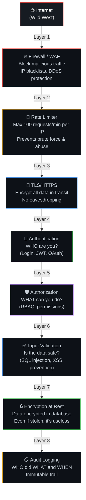
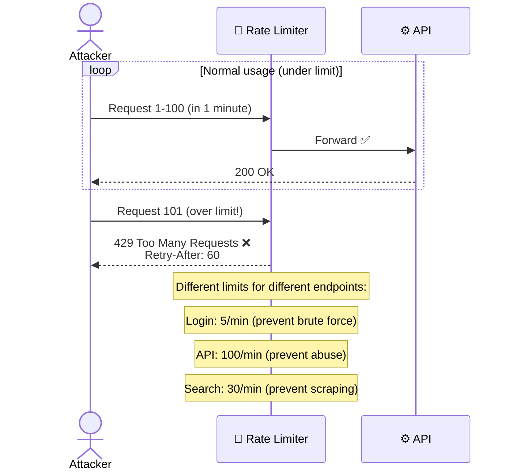
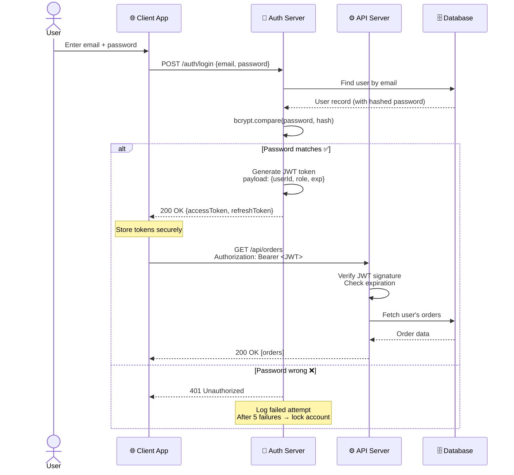
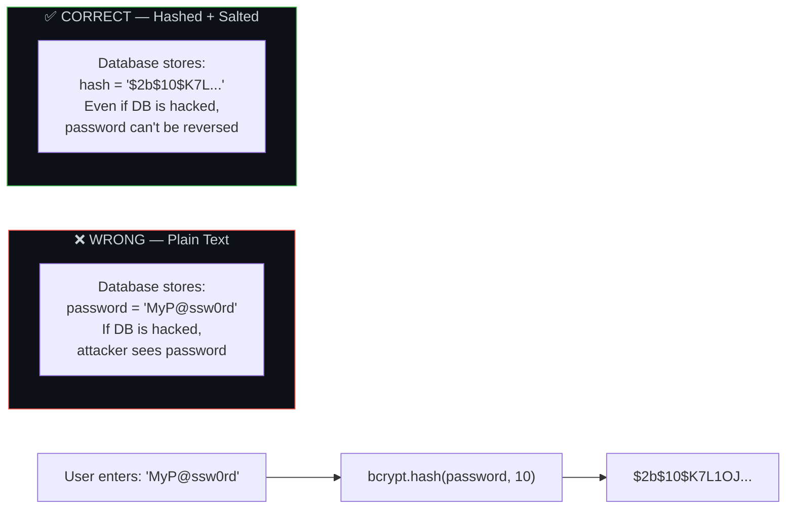
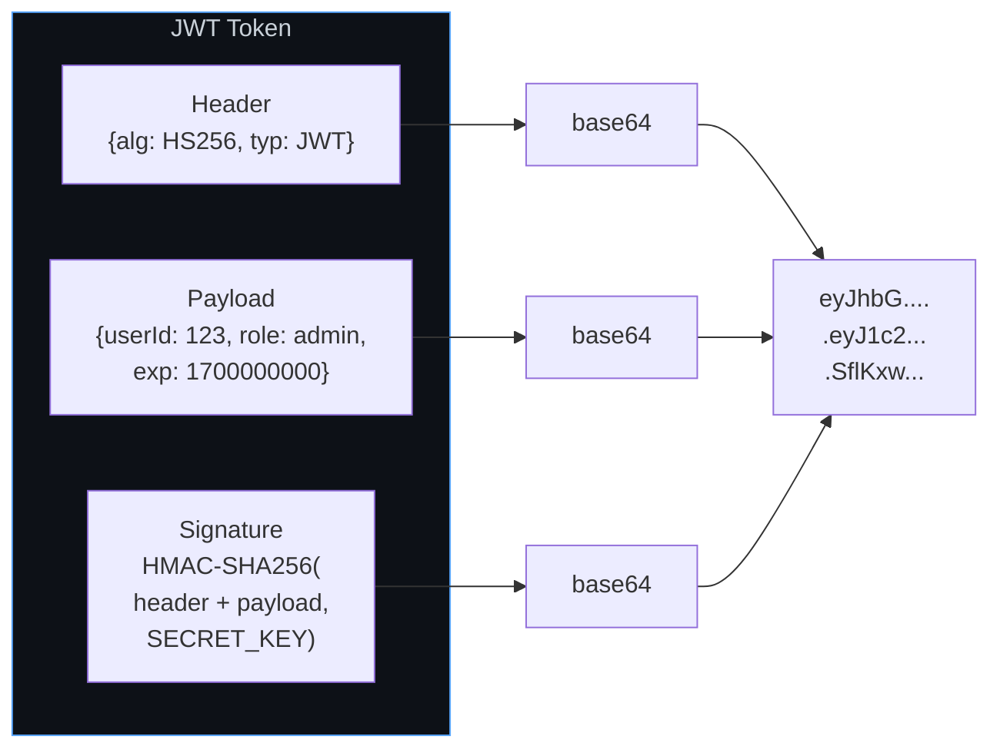
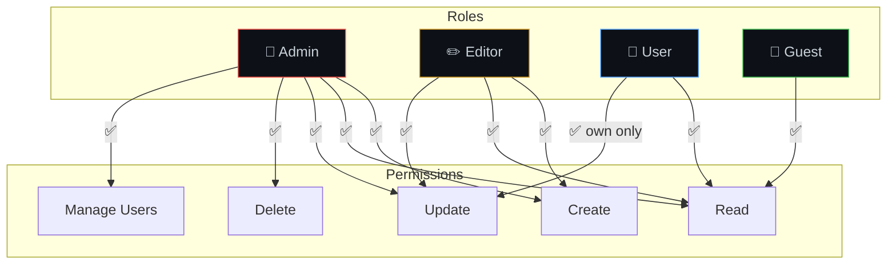
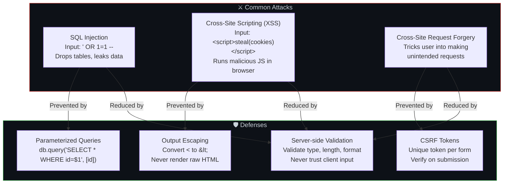
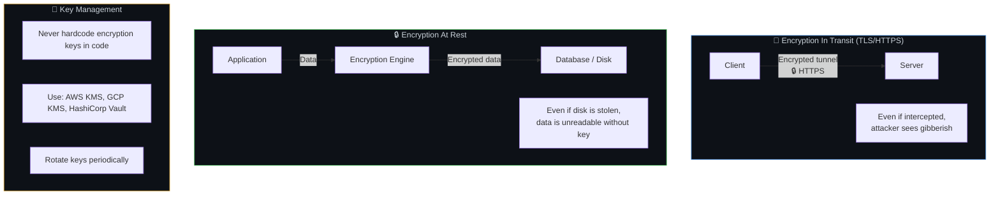
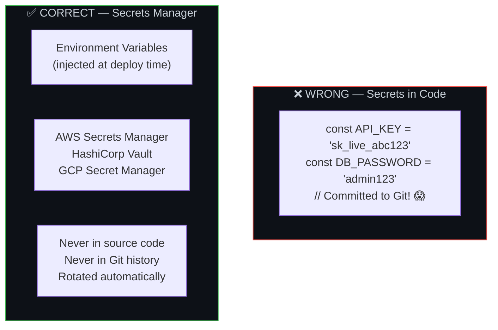
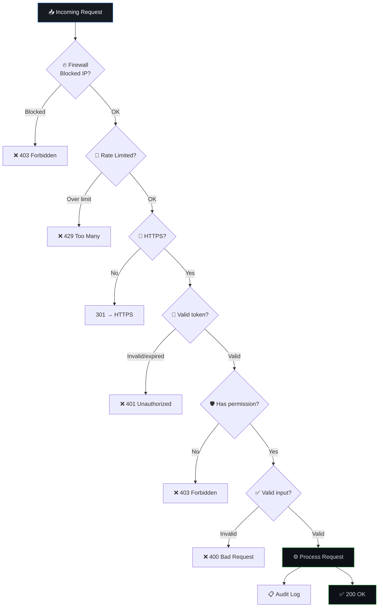

# 🔒 9. Security & Data Safety — Defense in Depth

> **Security is like a castle, not a single locked door. There's a moat (firewall), walls (authentication), guards checking IDs at each gate (authorization), sealed vaults for treasure (encryption), and a logbook of who entered which room and when (audit logs).**

---

## 🏰 The Castle Model — Layered Security



---

---

## 🔥 Layer 1: Firewall & DDoS Mitigation — Defense at the Edge

> **Defense starts at the boundary. DDoS attacks attempt to overwhelm you; a firewall blocks bad actors, and DDoS scrubbers filter malicious traffic before it reaches your compute servers.**

### What it is
*   **WAF (Web Application Firewall)**: Filters, monitors, and blocks HTTP/HTTPS traffic to and from a web application (e.g., blocking SQLi, XSS, bots).
*   **DDoS (Distributed Denial of Service) Mitigation**: The process of successfully protecting a targeted server or network from a distributed denial-of-service attack.

### How it works
1.  **Anycast DNS & CDN**: Incoming traffic is routed to the closest edge server globally. This disperses the volume of a DDoS attack across hundreds of locations.
2.  **Traffic Scrubbing**: Special traffic scrubbing centers analyze traffic signatures. Malicious requests (e.g., SYN floods, NTP amplification, bot requests) are dropped, and clean traffic is passed through.
3.  **WAF Rules**: WAF inspects HTTP headers, payloads, query parameters, and patterns (like OWASP Top 10) to block attacks.

### When to use
*   **Always** place a DDoS shielding layer (like Cloudflare, AWS Shield, or Akamai) in front of public-facing endpoints.

---

## 🚦 Layer 2: Rate Limiting — Traffic Flow Control

> **A rate limiter restricts the number of requests a user or IP can make in a given timeframe to prevent abuse, brute-force logins, and server exhaustion.**



---

## 🔐 Layer 3: TLS/HTTPS — Encryption in Transit

> **HTTPS ensures that all communication between the client's browser and the server is encrypted, protecting data from eavesdropping and tampering.**

### How it works
*   During the **TLS handshake**, the server presents a certificate to prove its identity, and a secure session key is negotiated using asymmetric encryption. Subsequent traffic is encrypted using faster symmetric encryption.
*   **HSTS (HTTP Strict Transport Security)**: A response header that instructs browsers to *only* access the site via HTTPS, transforming any `http://` links to `https://` client-side.

---

## 🔑 Layer 4: Authentication — WHO Are You?

### Authentication Flow (JWT + OAuth)



### Password Storage — NEVER Plain Text



### JWT Token Structure



---

## 🛡️ Layer 5: Authorization — WHAT Can You Do?

### RBAC (Role-Based Access Control)



### Authorization Middleware Example

```javascript
// Middleware: Check if user has required role
function authorize(...allowedRoles) {
  return (req, res, next) => {
    const userRole = req.user.role; // from JWT

    if (!allowedRoles.includes(userRole)) {
      return res.status(403).json({ error: 'Forbidden: insufficient permissions' });
    }
    next();
  };
}

// Usage
app.delete('/api/users/:id', authorize('admin'), deleteUser);
app.put('/api/posts/:id', authorize('admin', 'editor'), updatePost);
app.get('/api/posts', authorize('admin', 'editor', 'user', 'guest'), getPosts);
```

---

## 🛡️ Layer 6: Input Validation & Sanitization — Payload Filtering

> **Input Validation verifies that the data fits expected formats, types, and lengths. Input Sanitization cleanses the data by stripping out executable scripts or database commands before they are executed or stored.**

### Common Attacks & Defenses



### 🔄 Input Validation vs. Sanitization
*   **Input Validation**: Checks format, type, and bounds (e.g., checking if `age` is a number > 0 and < 120).
    *   *Solution*: Use libraries like **Zod**, **Joi**, or standard validator libraries.
    *   *When*: On **every single API entry point**. Reject inputs that fail validation with a `400 Bad Request`.
*   **Input Sanitization**: Modifies and cleans the incoming data, stripping dangerous characters, scripts, or unwanted HTML tags.
    *   *Solution*: Use sanitization engines like **DOMPurify** (for rich text/HTML) or specialized escaping logic.
    *   *When*: Before storing input into a database if that data will ever be rendered to other users (especially rich HTML comments, bios, markdown).

### ⚔️ Cross-Site Scripting (XSS) Deep Dive
*   **Stored XSS (Persistent)**: Malicious script is saved in the database (e.g., comment section) and executes in the browser of every visiting user.
    *   *Solution*: Sanitize content before saving, escape outputs when rendering, and use modern frameworks like React/Angular which auto-escape variables by default.
*   **Reflected XSS (Non-Persistent)**: Script is sent as part of a request parameter (e.g., search query) and reflected back in the HTML response.
    *   *Solution*: Escape query parameters rendered on screen.
*   **DOM-based XSS**: Client-side JS reads inputs directly from window/DOM (e.g., URL hash) and writes it unsafely into the page (`element.innerHTML`).
    *   *Solution*: Avoid `innerHTML` or `eval()`. Use `textContent` or use sanitizer libraries like DOMPurify.

### 🛡️ Global XSS Protections
1.  **HttpOnly Cookies**: Setting `HttpOnly` on session/JWT cookies makes them inaccessible via JavaScript (`document.cookie`), preventing session hijacking even if XSS is present.
2.  **CSP (Content Security Policy)**: A response header that instructs the browser which scripts/domains are allowed to load. E.g., `Content-Security-Policy: default-src 'self'`.

### ⚔️ SQL Injection Example
```javascript
// ❌ VULNERABLE — string concatenation
const query = `SELECT * FROM users WHERE email = '${userInput}'`;
// If userInput = "' OR 1=1 --"
// Query becomes: SELECT * FROM users WHERE email = '' OR 1=1 --'
// Returns ALL users!

// ✅ SAFE — parameterized query
const query = 'SELECT * FROM users WHERE email = $1';
const result = await db.query(query, [userInput]);
// Input is always treated as DATA, never as SQL code
```

### ⚔️ CSRF (Cross-Site Request Forgery) Deep Dive
*   **What it is**: Tricking an authenticated user's browser into executing an unwanted action on a trusted site because cookies are automatically sent.
*   **Mitigation**:
    1.  **Anti-CSRF Tokens**: Include a unique token in forms/headers. The server verifies this token on incoming write requests.
    2.  **SameSite Cookie Attribute**: Set `SameSite=Lax` or `SameSite=Strict` on cookies to ensure they aren't sent on cross-site requests.

---

## 🔒 Layer 7: Encryption at Rest — Data Shielding



---

## 🔑 Layer 8: Secrets Management



---

## 📋 Layer 9: Audit Logging — Tamper-Proof History


```javascript
// Log sensitive actions
const auditLog = {
  timestamp: new Date().toISOString(),
  userId: req.user.id,
  action: 'DELETE_USER',
  targetId: req.params.userId,
  ip: req.ip,
  userAgent: req.headers['user-agent'],
  result: 'SUCCESS',
};

// Store in append-only, tamper-proof log
await auditService.log(auditLog);
```

### What to Audit Log

| Action | Why |
|--------|-----|
| Login success/failure | Detect brute force, compromised accounts |
| Permission changes | Track who granted/revoked access |
| Data exports/downloads | Detect data exfiltration |
| Sensitive data access | Compliance (GDPR, HIPAA) |
| Configuration changes | Debug and accountability |
| Deletion of records | Detect accidental or malicious deletion |

---

## 🔄 The Complete Security Flow



---

## ⚠️ Edge Cases & Gotchas

1. **Client-side validation is NOT security** — It's UX. Any validation in the browser can be bypassed. Always validate on the server.

2. **Don't roll your own auth** — Use established libraries (Passport.js, NextAuth, Firebase Auth). Writing your own login system is inviting vulnerabilities.

3. **JWT in localStorage is risky** — XSS can steal it. Consider httpOnly cookies for storing tokens (not accessible via JavaScript).

4. **API keys in frontend code** — Any key in client-side JavaScript is visible to anyone. Use server-side proxying for sensitive API calls.

5. **Dependency vulnerabilities** — 70%+ of code in most apps comes from npm/pip packages. Run `npm audit` regularly. One compromised dependency = your app is compromised.

6. **Forgot password flow** — Tokens should be single-use, short-lived (15-30 min), and invalidated after password change.

---

## 🔗 Connected Topics

| Topic | Connection |
|-------|-----------|
| [Governance](10-governance.md) | Security policies, compliance, access governance |
| [Latency](08-latency.md) | Security checks add latency (TLS handshake, token validation) |
| [Monitoring](13-monitoring-observability.md) | Monitor for suspicious activity, failed login spikes |
| [Load Balancers](04-load-balancers.md) | LB handles TLS termination, first line of defense |
| [Database](07-database-design.md) | Encryption at rest, backup encryption, access control |

---

**← Previous:** [8. Latency](08-latency.md) | **Next →** [10. Governance](10-governance.md)
