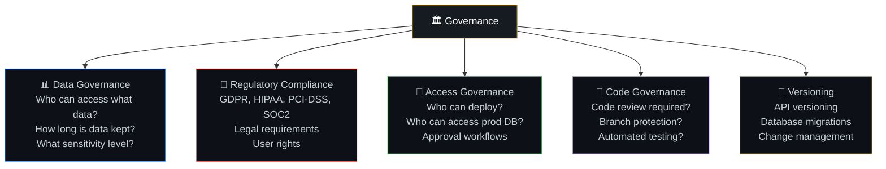
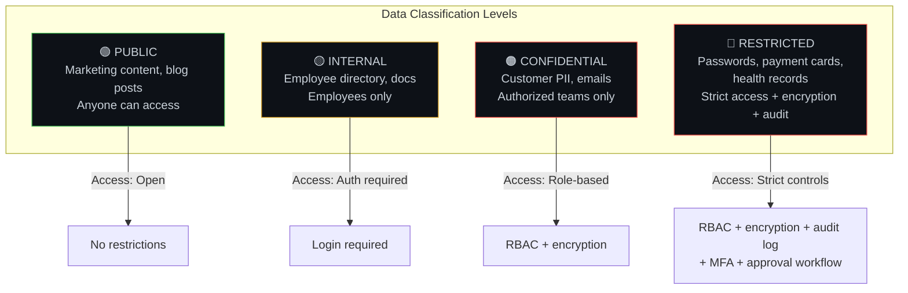
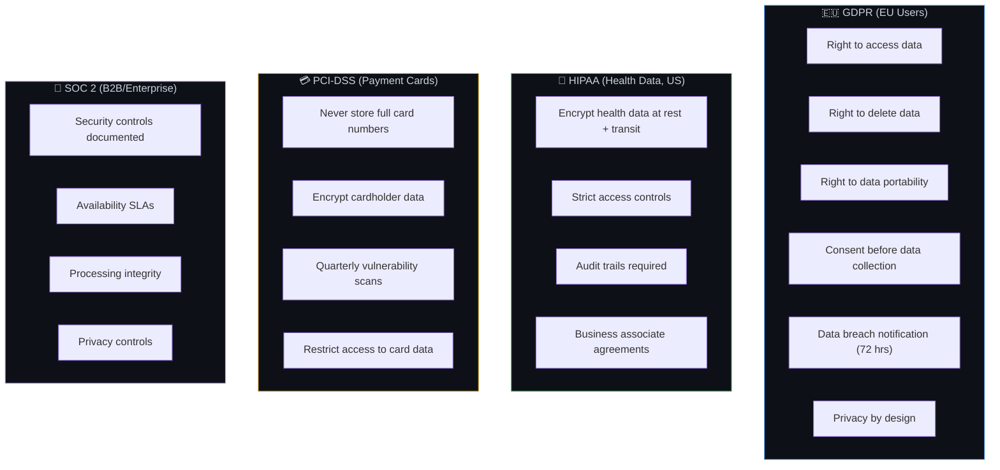
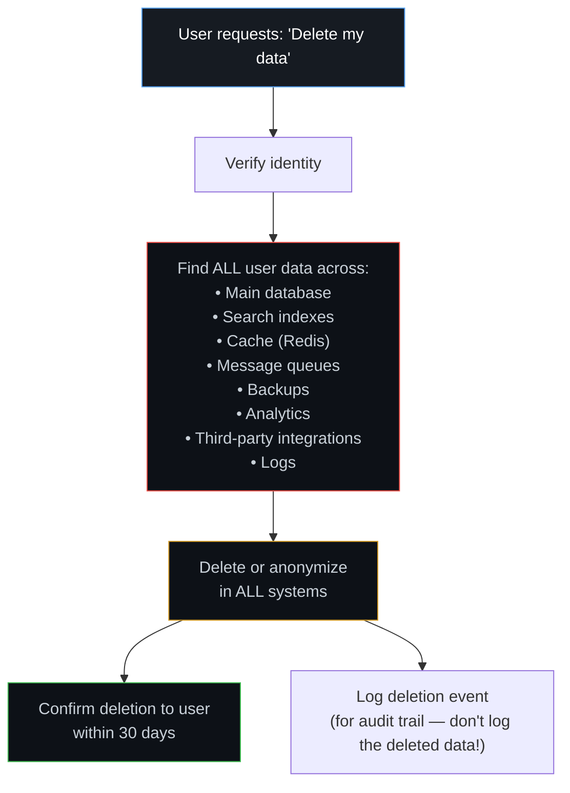
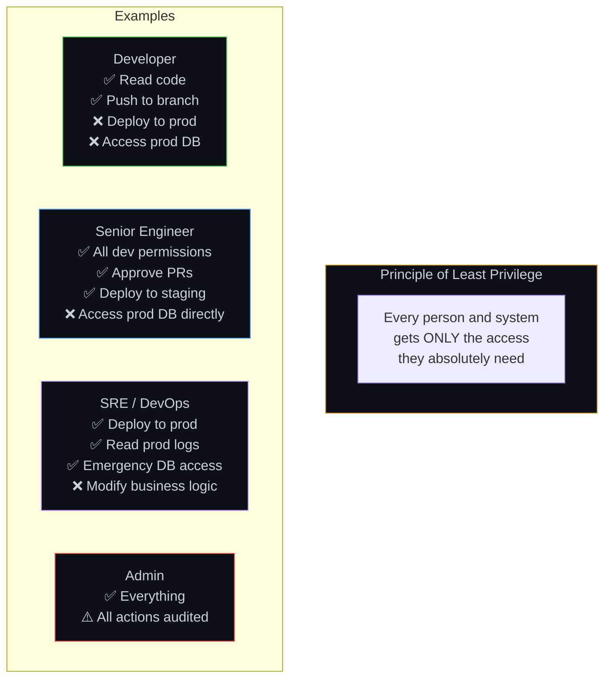
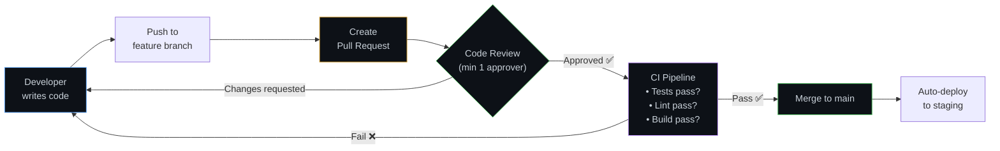
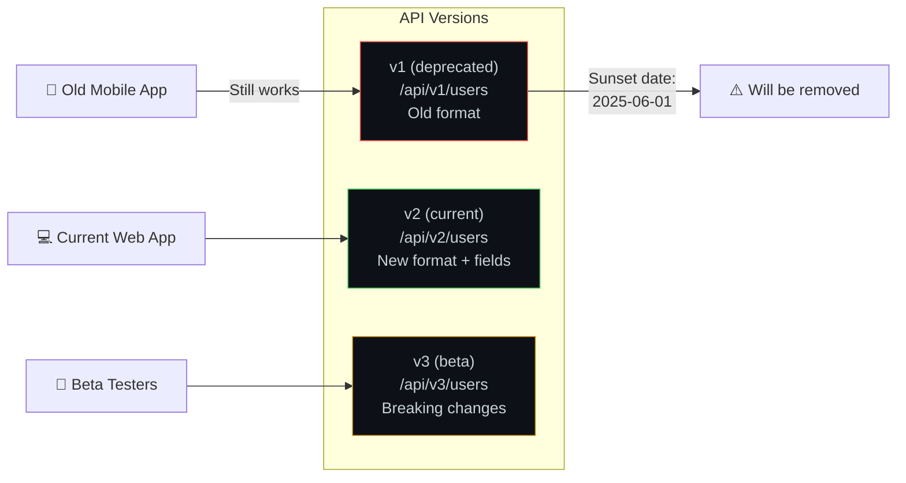

# 🏛️ 10. Governance — Rules, Compliance & Accountability

> **Governance is like a country's constitution. Without it, a company is just a group of people doing whatever they think is best — fine with 3 people, chaos with 300.**

---

## 🔄 Governance Areas — The Five Pillars

---

## 📊 Data Governance — Classification & Access

### Data Retention Policy

| Data Type | Retention | After Expiry | Why |
|-----------|----------|-------------|-----|
| Active user data | While active | Archive/delete | GDPR right to be forgotten |
| Transaction records | 7 years | Archive | Legal/tax requirements |
| Server logs | 90 days | Delete | Cost + security |
| Analytics | 2 years | Aggregate | Privacy + cost |
| Backups | 30 days | Delete | Storage cost |
| Audit logs | 3 years | Archive | Compliance |

---

## 📜 Regulatory Compliance

### GDPR "Right to Be Forgotten" — Technical Implementation

---

## 🔐 Access Governance — Who Can Do What

---

## 📝 Code Governance

---

## 🔄 API Versioning

---

## ⚠️ Edge Cases & Gotchas

1. **"Move fast and break things" vs governance** — Governance isn't about slowing down. It's about guardrails that let you move fast safely (like highway guardrails let cars go faster than country roads).

2. **Shadow IT** — Teams spinning up databases or services without going through proper channels. Creates security blind spots.

3. **Compliance != security** — You can be compliant with regulations and still be insecure. Compliance is the minimum bar, not the ceiling.

4. **Data residency** — Some regulations require data to stay in specific countries (EU data in EU servers). This affects cloud region selection.

5. **Third-party risk** — Your security is only as strong as your weakest vendor. If you share user data with a third-party service, their breach is your breach.

---

## 🔗 Connected Topics

| Topic | Connection |
|-------|-----------|
| [Security](09-security.md) | Governance defines the security policies |
| [Database](07-database-design.md) | Data classification, retention, and encryption |
| [CI/CD](../Part-2-Network-Hardware-Browser-Frameworks/22-cicd-pipeline.md) | Code governance enforced through CI/CD pipeline |
| [Clean Code](11-clean-modular-code.md) | Coding standards are part of code governance |
| [Monitoring](13-monitoring-observability.md) | Audit logging and compliance monitoring |

---

**← Previous:** [9. Security](09-security.md) | **Next →** [11. Clean & Modular Code](11-clean-modular-code.md)
