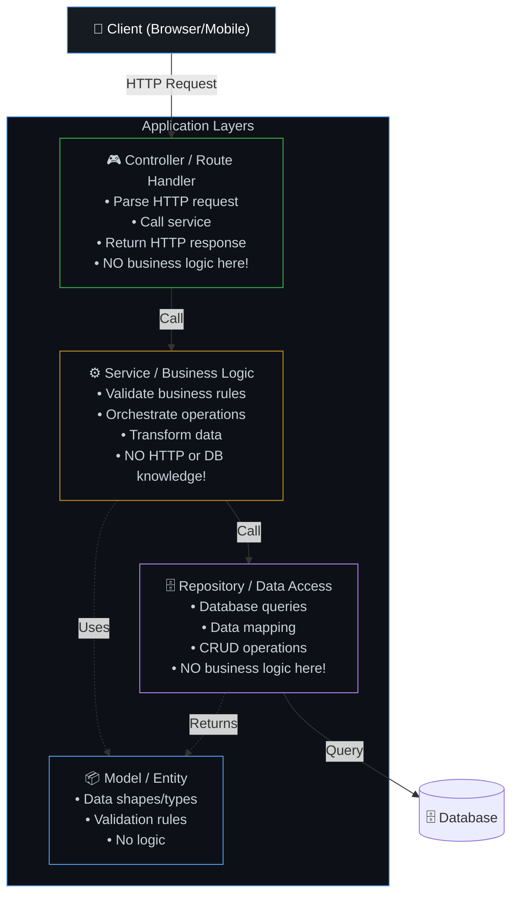
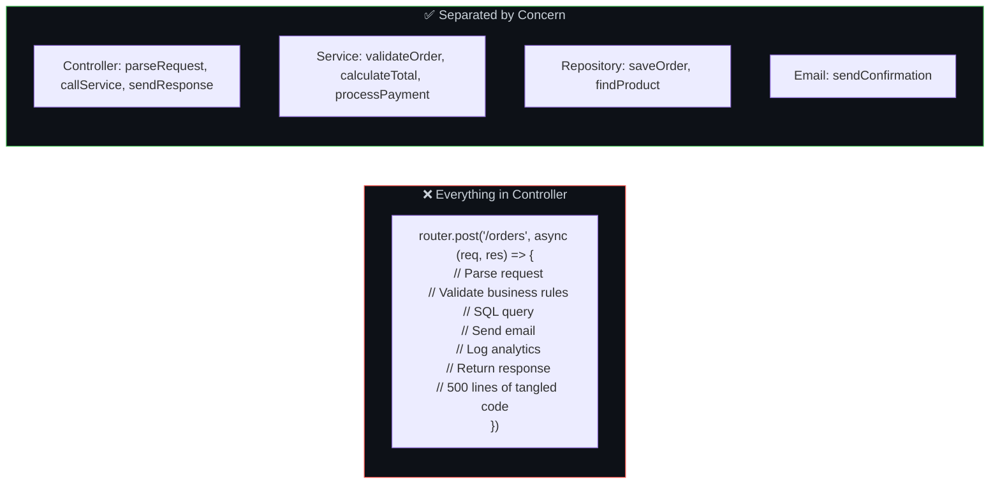
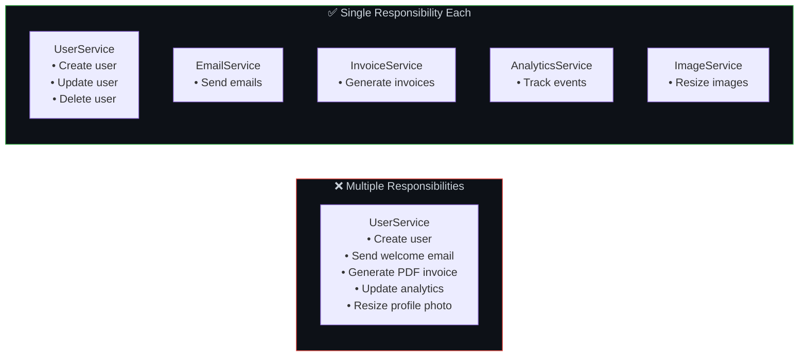
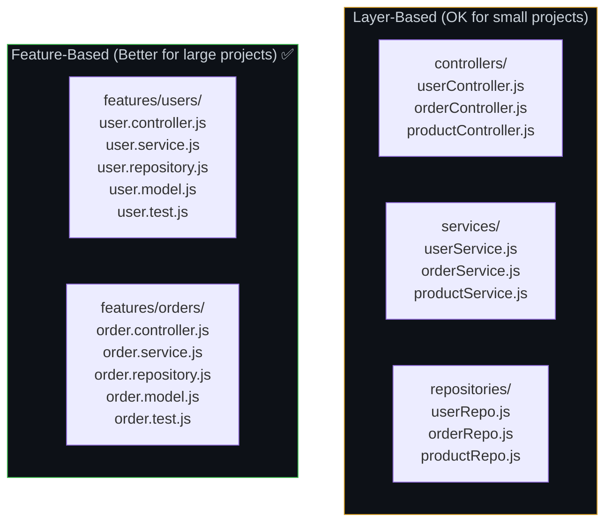
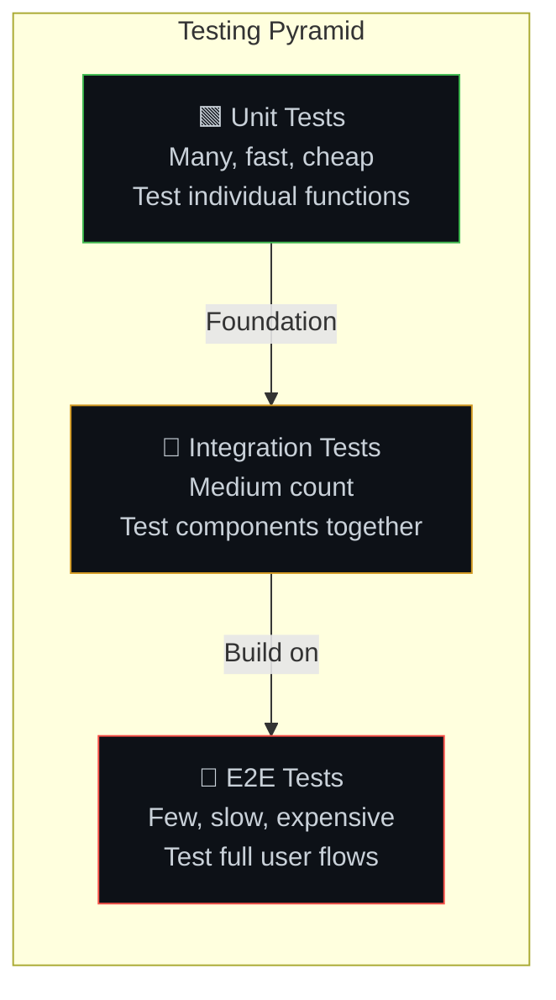
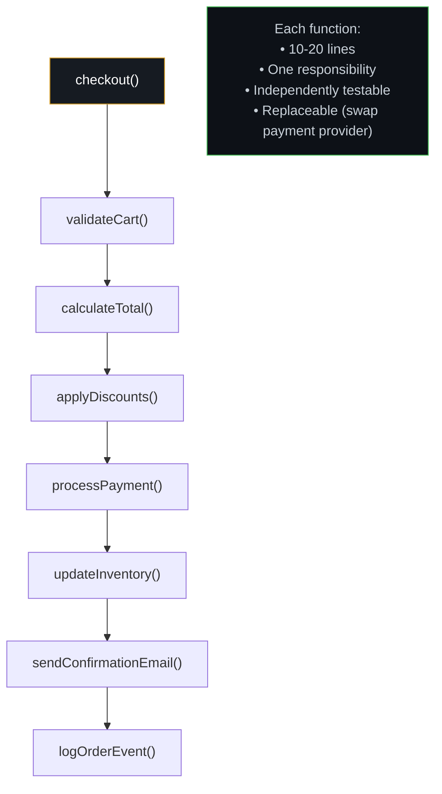

# ✨ 11. Clean, Modular & Maintainable Code

> **Clean code is like LEGO bricks vs a carved sculpture. A sculpture looks impressive, but changing one part risks cracking the whole thing. LEGO bricks can be swapped, added, or removed without affecting the rest.**

---

## 🏗️ Layered Architecture — The Foundation



### Why Layers Matter



---

## 🎯 Core Principles — Visual Guide

### Single Responsibility Principle (SRP)



### DRY (Don't Repeat Yourself)

```javascript
// ❌ REPEATED: Same validation in 3 places
// In createUser():
if (!email.includes('@') || email.length < 5) throw new Error('Invalid email');
// In updateUser():
if (!email.includes('@') || email.length < 5) throw new Error('Invalid email');
// In inviteUser():
if (!email.includes('@') || email.length < 5) throw new Error('Invalid email');

// ✅ DRY: Extract to shared function
function validateEmail(email) {
  if (!email.includes('@') || email.length < 5) {
    throw new Error('Invalid email');
  }
}
// Use everywhere:
validateEmail(email);
```

### Meaningful Naming

```javascript
// ❌ Cryptic names — what does this do?
function calc2(u, d) {
  return u.b * (1 - d) + u.b * 0.18;
}

// ✅ Self-documenting — no comments needed!
function calculateTotalWithTax(user, discountRate) {
  const discountedPrice = user.balance * (1 - discountRate);
  const tax = user.balance * 0.18;
  return discountedPrice + tax;
}
```

---

## 📁 Project Structure — Feature-Based vs Layer-Based



### Why Feature-Based Is Better for Large Projects

| Aspect | Layer-Based | Feature-Based |
|--------|------------|---------------|
| Finding code | "Where's the order logic? Check 3 folders" | "Everything about orders is in /features/orders" |
| Adding a feature | Touch multiple directories | Create one new directory |
| Team ownership | Hard to assign folder ownership | Each team owns their feature folder |
| Deleting a feature | Hunt through every layer folder | Delete one directory |

---

## 🧪 Testing — The Safety Net



### Testing Each Layer

```javascript
// 🟩 Unit Test — test calculateTotal in isolation
describe('calculateTotal', () => {
  it('should apply discount correctly', () => {
    const items = [{ price: 100, qty: 2 }, { price: 50, qty: 1 }];
    const total = calculateTotal(items, 0.1); // 10% discount
    expect(total).toBe(225); // (200 + 50) * 0.9
  });

  it('should handle empty cart', () => {
    expect(calculateTotal([], 0)).toBe(0);
  });
});

// 🔶 Integration Test — test service + repository together
describe('OrderService', () => {
  it('should create order and update inventory', async () => {
    const order = await orderService.createOrder(userId, items);
    expect(order.status).toBe('confirmed');
    const inventory = await inventoryRepo.getStock(items[0].productId);
    expect(inventory.quantity).toBe(originalQty - items[0].qty);
  });
});
```

---

## 📝 Comments — Explain WHY, Not WHAT

```javascript
// ❌ BAD: Comment restates what the code does
// Increment counter by 1
counter += 1;

// ❌ BAD: Obvious from the code
// Get user from database
const user = await userRepo.findById(userId);

// ✅ GOOD: Explains WHY a non-obvious decision was made
// We retry 3 times because the payment provider's API
// has intermittent failures during peak hours (documented in JIRA-1234)
const result = await retry(3, () => paymentApi.charge(amount));

// ✅ GOOD: Explains a business rule
// Tax is calculated on the pre-discount price per regional tax law
const tax = originalPrice * taxRate;
```

---

## 🔧 The Checkout Example — Before & After

### ❌ Before: One Giant Function

```javascript
async function checkout(req, res) {
  // Validate cart (30 lines)
  // Calculate tax (20 lines)
  // Apply discounts (25 lines)
  // Charge card (40 lines)
  // Update inventory (15 lines)
  // Send email (20 lines)
  // Log analytics (10 lines)
  // ... 160+ lines, untestable, fragile
}
```

### ✅ After: Clean, Modular, Testable



---

## ⚠️ Edge Cases & Gotchas

1. **Over-abstracting too early** — Don't create elaborate inheritance hierarchies for code you've written once. Wait for the "rule of three" — abstract after you see three similar cases, not after one.

2. **WET is sometimes OK** — "Write Everything Twice" before abstracting. Two similar-looking code blocks might evolve differently. Premature DRY creates wrong abstractions.

3. **Monster utility files** — `utils.js` with 2000 lines of unrelated functions is not "clean code." Split by domain: `dateUtils.js`, `stringUtils.js`, `validationUtils.js`.

4. **Test implementation, not behavior** — Tests that break when you refactor internals (without changing behavior) are fragile. Test inputs and outputs, not how the code works internally.

5. **Configuration as code** — Hardcoded magic numbers (`if (retries > 3)`) should be configurable. Use constants, environment variables, or config files.

---

## 🔗 Connected Topics

| Topic | Connection |
|-------|-----------|
| [Performance](12-performance-optimization.md) | Clean code is easier to profile and optimize |
| [Governance](10-governance.md) | Coding standards and review processes |
| [Architecture](02-architecture-patterns.md) | Modular code enables later extraction into services |
| [CI/CD](../Part-2-Network-Hardware-Browser-Frameworks/22-cicd-pipeline.md) | Tests run in CI pipeline before merge |
| [Security](09-security.md) | Validation and sanitization in service layer |

---

**← Previous:** [10. Governance](10-governance.md) | **Next →** [12. Performance Optimization](12-performance-optimization.md)
