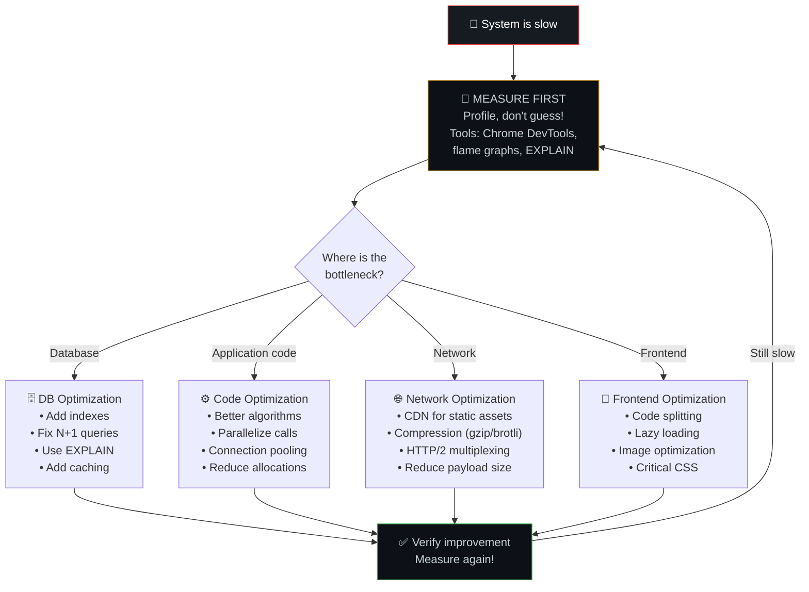
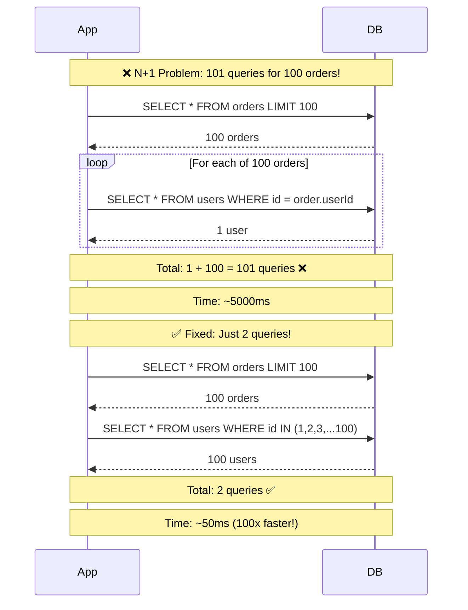
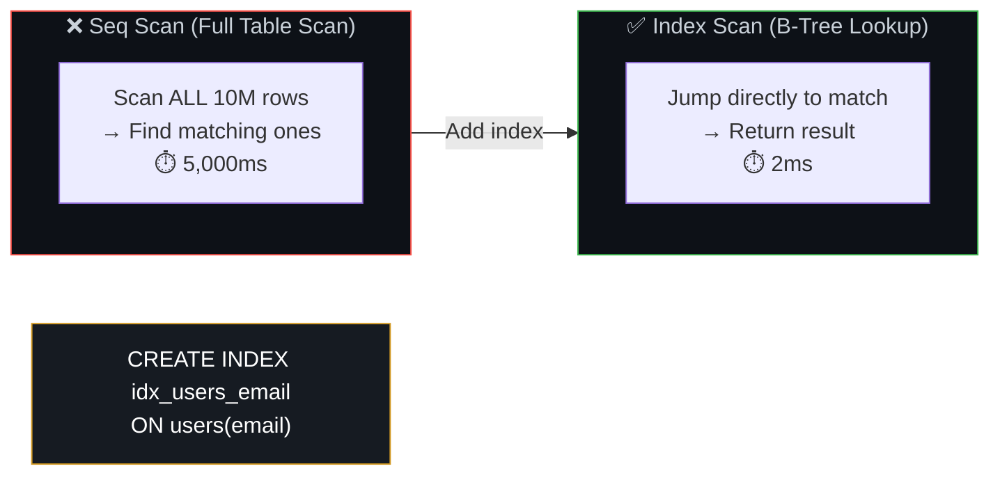
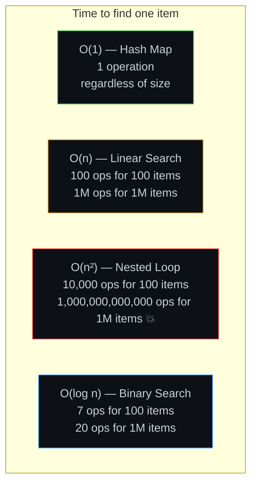
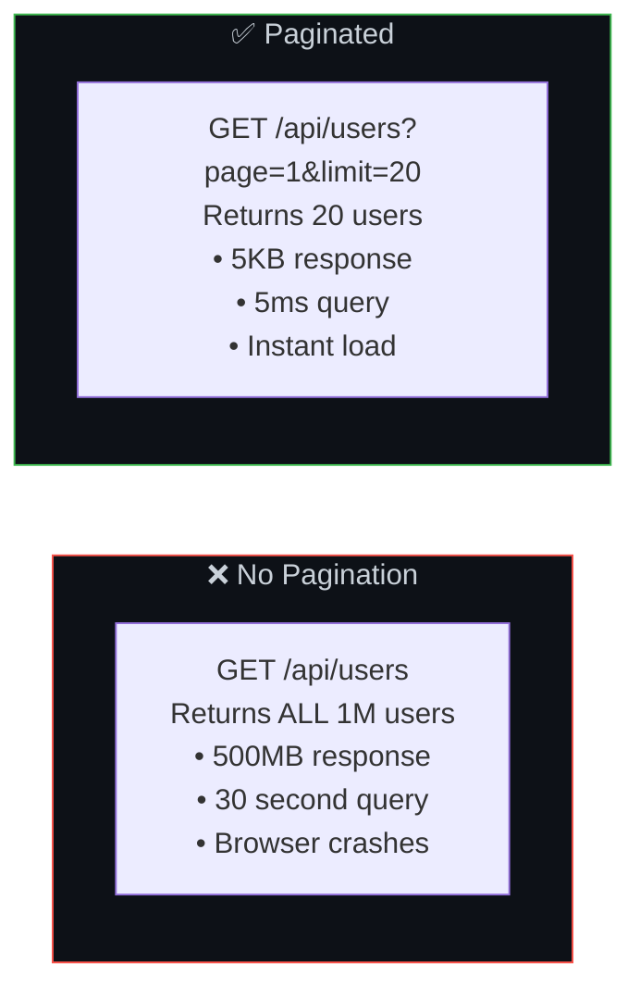
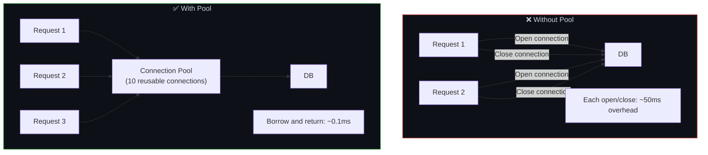
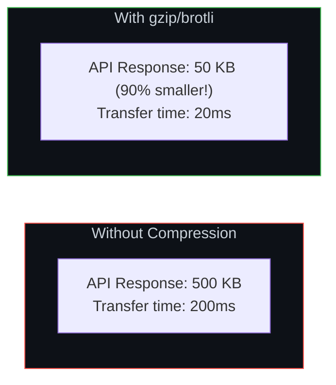
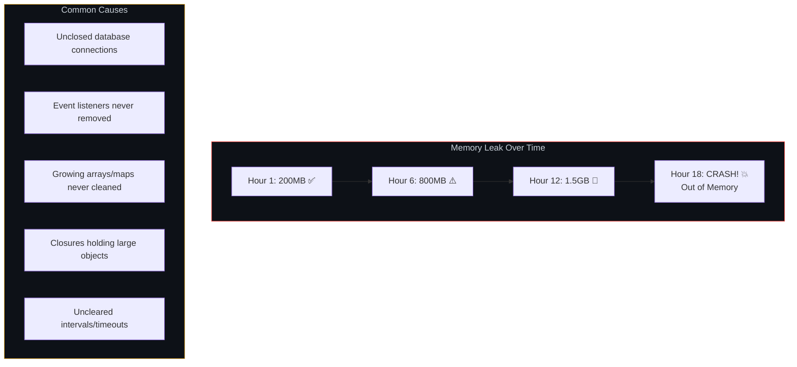

# 🚀 12. Performance Optimization — Find and Fix Bottlenecks

> **Performance optimization is like running a kitchen during a dinner rush. Profiling is watching where the queue actually builds up. Algorithmic efficiency is pre-sorting ingredients into labeled bins instead of searching a giant pile.**

---

## 🔄 The Performance Optimization Flow



---

## 🗄️ Database: The N+1 Query Problem

### The Problem Visualized



### Code Fix

```javascript
// ❌ N+1: 101 queries
const orders = await db.query('SELECT * FROM orders LIMIT 100');
for (const order of orders) {
  order.user = await db.query('SELECT * FROM users WHERE id = $1', [order.userId]);
}

// ✅ Fixed: 2 queries (or 1 with JOIN)
const orders = await db.query(`
  SELECT orders.*, users.name, users.email
  FROM orders
  JOIN users ON orders.user_id = users.id
  LIMIT 100
`);
```

---

## 📊 Using EXPLAIN to Understand Queries

```sql
-- See how the database executes your query
EXPLAIN ANALYZE SELECT * FROM users WHERE email = 'alice@example.com';

-- Output tells you:
-- ✅ "Index Scan" = fast (using index)
-- ❌ "Seq Scan" on large table = slow (scanning every row)
-- ❌ "Sort" without index = slow
```



---

## ⚡ Algorithmic Efficiency — Big O Matters at Scale



### Real Impact

| Records | O(1) Map | O(log n) Binary | O(n) Linear | O(n²) Nested |
|---------|----------|-----------------|-------------|--------------|
| 100 | 1 op | 7 ops | 100 ops | 10,000 ops |
| 10,000 | 1 op | 14 ops | 10,000 ops | 100M ops |
| 1,000,000 | 1 op | 20 ops | 1M ops | 1 trillion ops 💥 |

```javascript
// ❌ O(n²) — checking duplicates with nested loop
function hasDuplicates(arr) {
  for (let i = 0; i < arr.length; i++) {
    for (let j = i + 1; j < arr.length; j++) {
      if (arr[i] === arr[j]) return true;
    }
  }
  return false;
}

// ✅ O(n) — using a Set (hash-based)
function hasDuplicates(arr) {
  return new Set(arr).size !== arr.length;
}
```

---

## 📄 Pagination — Never Return "All Records"



### Pagination Types

| Type | How It Works | Best For |
|------|-------------|----------|
| **Offset** | `LIMIT 20 OFFSET 40` | Simple, but slow for deep pages |
| **Cursor** | `WHERE id > last_seen_id LIMIT 20` | Infinite scroll, real-time feeds |
| **Keyset** | `WHERE created_at > :cursor ORDER BY created_at` | Large datasets, consistent performance |

---

## 🔌 Connection Pooling



---

## 📦 Compression — Smaller = Faster



---

## 🔍 Memory Leaks — The Silent Killer



```javascript
// ❌ Memory leak: listeners accumulate
function handleSocket(socket) {
  socket.on('data', (data) => processData(data)); // Never removed!
}

// ✅ Fixed: Clean up on disconnect
function handleSocket(socket) {
  const handler = (data) => processData(data);
  socket.on('data', handler);
  socket.on('close', () => socket.off('data', handler)); // Clean up!
}
```

---

## ⚠️ Edge Cases & Gotchas

1. **Premature optimization** — "Make it work, make it right, make it fast" — in that order. Don't optimize a 5ms function when there's a 5s DB query.

2. **Benchmarking in dev vs prod** — Dev has no traffic, warm caches, and fast local DB. Production has concurrent users, cold caches, and network latency. Always test under realistic conditions.

3. **Optimization that hurts readability** — Saving 1ms by making code unreadable is almost never worth it. Clarity > micro-optimization in 99% of cases.

4. **Ignoring garbage collection** — In Node.js/Java, frequent large allocations trigger GC pauses. Reuse objects where possible in hot paths.

5. **Not measuring after "fixing"** — Always verify your optimization actually improved things. Sometimes "optimizations" make things worse due to unexpected side effects.

---

## 🔗 Connected Topics

| Topic | Connection |
|-------|-----------|
| [Caching](05-caching.md) | Caching is the most impactful performance optimization |
| [Latency](08-latency.md) | Performance optimization directly reduces latency |
| [Database](07-database-design.md) | Indexes, query optimization, connection pooling |
| [Monitoring](13-monitoring-observability.md) | Metrics reveal where bottlenecks are |
| [Clean Code](11-clean-modular-code.md) | Clean code is easier to profile and optimize |

---

**← Previous:** [11. Clean & Modular Code](11-clean-modular-code.md) | **Next →** [13. Monitoring & Observability](13-monitoring-observability.md)
