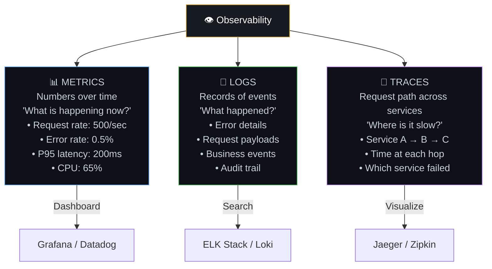
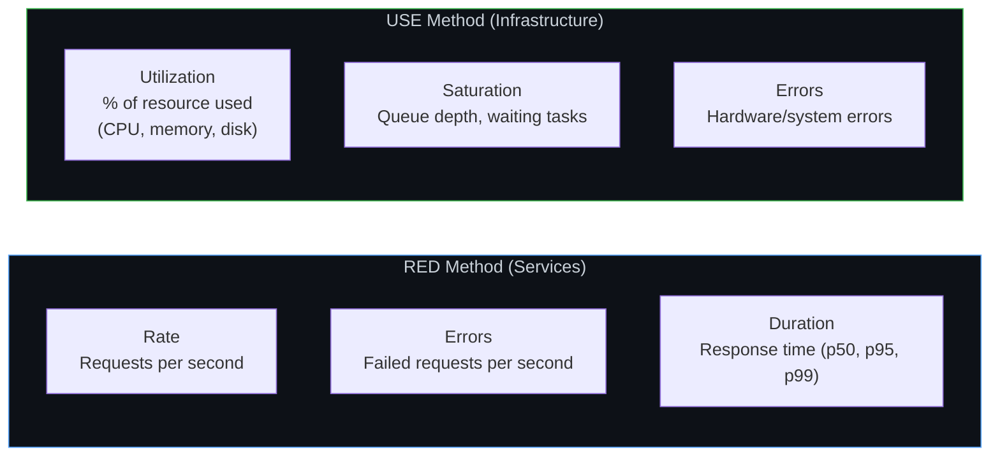
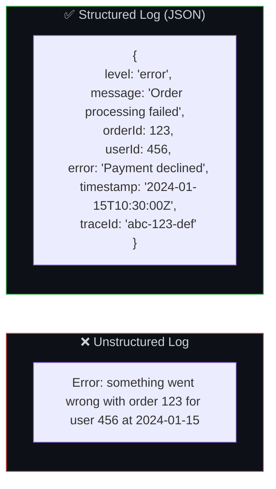
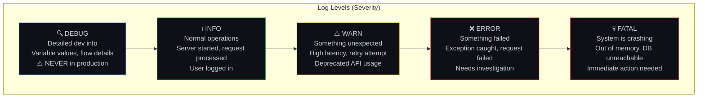
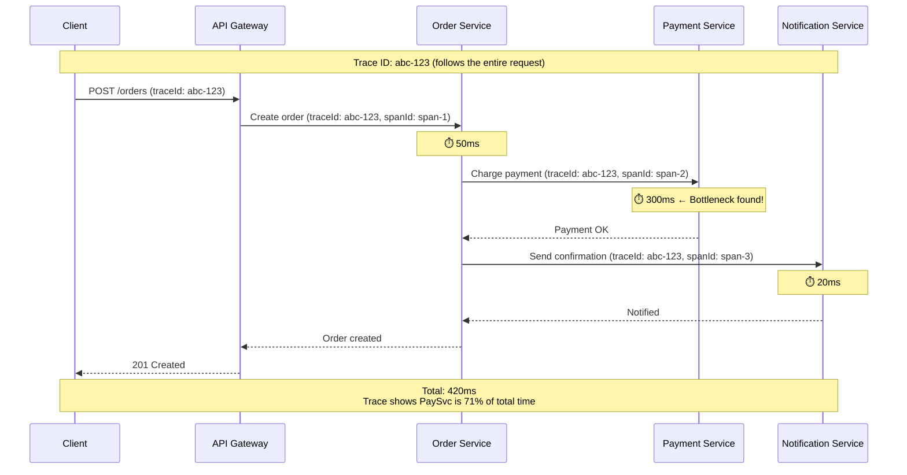
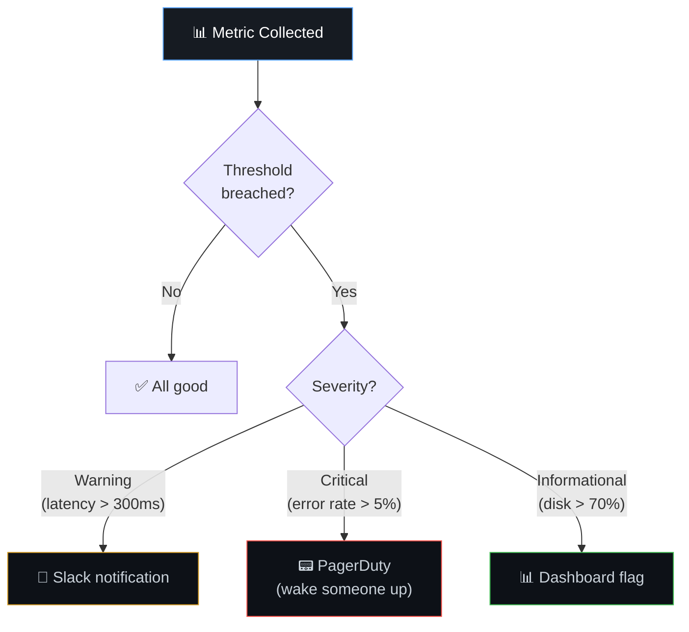

# 👁️ 13. Monitoring, Logging & Observability

> **Observability is your car's dashboard. The speedometer and fuel gauge (metrics) tell you the car's current state. The trip log (logging) records what happened. A mechanic's diagnostic tool (tracing) shows exactly which component is causing the problem.**

---

## 🏗️ The Three Pillars of Observability



---

## 📊 Metrics — The Dashboard

### Key Metrics to Track (The RED & USE Methods)



### Essential Dashboard Panels

| Panel | Metric | Alarm When |
|-------|--------|-----------|
| Request Rate | Requests/sec | Sudden drop (outage?) or spike (attack?) |
| Error Rate | 5xx errors/total | > 1% |
| Latency P95 | 95th percentile response time | > 500ms |
| CPU Usage | % across servers | > 80% sustained |
| Memory Usage | % across servers | > 85% |
| Cache Hit Rate | Hits / total lookups | < 80% |
| DB Connection Pool | Active / max connections | > 80% pool used |
| Queue Depth | Messages waiting | Growing continuously |
| Disk Usage | % full | > 85% |

---

## 📝 Logging — What Happened

### Structured vs Unstructured Logs



### Log Levels



### Logging Code Example

```javascript
const logger = require('pino')(); // Structured JSON logger

// ✅ Good logging practice
app.get('/api/orders/:id', async (req, res) => {
  const { id } = req.params;
  const requestId = req.headers['x-request-id'];

  logger.info({ requestId, orderId: id, action: 'getOrder' }, 'Fetching order');

  try {
    const order = await orderService.getOrder(id);
    logger.info({ requestId, orderId: id, duration: Date.now() - start }, 'Order fetched');
    res.json(order);
  } catch (error) {
    logger.error({ requestId, orderId: id, error: error.message, stack: error.stack },
                  'Failed to fetch order');
    res.status(500).json({ error: 'Internal error' });
  }
});
```

---

## 🔗 Distributed Tracing — Follow the Request



### What a Trace Reveals

```mermaid
gantt
    title Trace: POST /api/orders (Total: 420ms)
    dateFormat X
    axisFormat %L ms

    section API Gateway
    Route + Auth          :gateway, 0, 50

    section Order Service
    Validate order        :validate, 50, 80
    Save to DB           :save, 80, 120

    section Payment Service
    Connect to Stripe    :connect, 120, 200
    Process payment      :process, 200, 370
    Save receipt         :receipt, 370, 400

    section Notification
    Send email           :email, 400, 420
```



---

## 🚨 Alerting — Know Before Users Do



### Alert Anti-Patterns

| Anti-Pattern | Problem | Fix |
|-------------|---------|-----|
| **Alert fatigue** | Too many alerts → team ignores all | Only alert on actionable items |
| **Missing context** | "Error rate high" but no details | Include links to dashboards, logs |
| **No runbook** | Alert fires, nobody knows what to do | Attach runbook to every alert |
| **Alerting on averages** | Average hides outliers | Alert on P95/P99 percentiles |

---

## ❤️ Health Checks

```javascript
// /health — simple liveness check
app.get('/health', (req, res) => {
  res.status(200).json({ status: 'ok' });
});

// /ready — readiness check (are dependencies available?)
app.get('/ready', async (req, res) => {
  try {
    await db.query('SELECT 1');
    await redis.ping();
    res.status(200).json({
      status: 'ready',
      database: 'connected',
      cache: 'connected',
    });
  } catch (err) {
    res.status(503).json({
      status: 'not ready',
      error: err.message,
    });
  }
});
```

---

## ⚠️ Edge Cases & Gotchas

1. **Logging sensitive data** — Never log passwords, tokens, credit card numbers, or PII. Scrub sensitive fields before logging.

2. **Log volume explosion** — Debug-level logging in production can generate terabytes. Use INFO in production, DEBUG only for local development.

3. **Cardinality explosion in metrics** — Creating a metric label for every user ID creates millions of time series. Use bounded labels (status codes, endpoints, regions).

4. **Monitoring the monitoring** — If your monitoring system goes down, who monitors it? Have a simple external uptime check (e.g., Pingdom) as a last resort.

5. **Not correlating across pillars** — The real power is connecting metrics → logs → traces. When an alert fires (metric), find the relevant logs, then trace the failing request across services.

---

## 🔗 Connected Topics

| Topic | Connection |
|-------|-----------|
| [Latency](08-latency.md) | Track p50/p95/p99 latency as metrics |
| [Scalability](03-scalability.md) | Auto-scaling triggers based on metrics |
| [Load Balancers](04-load-balancers.md) | LB health checks + LB metrics |
| [Security](09-security.md) | Audit logs, intrusion detection |
| [Performance](12-performance-optimization.md) | Profiling data feeds into optimization |

---

**← Previous:** [12. Performance Optimization](12-performance-optimization.md) | **Next →** [14. Request Walkthrough](14-request-walkthrough.md)
