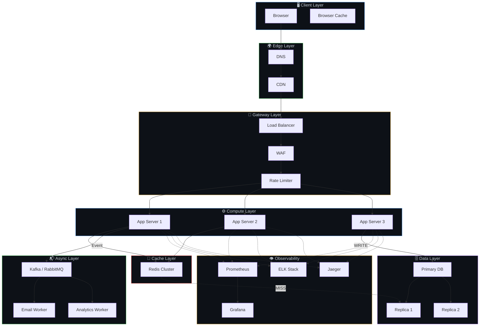

# 🔄 14. Request Walkthrough — How a Request Flows Through a Scalable System

> **This is the "hero" diagram — tracing a single user action through every layer of a production system.**

---

## 📖 Read Path: Loading a Product Page

```mermaid
sequenceDiagram
    actor User as 👤 User
    participant Browser as 🌐 Browser
    participant CDN as 🌍 CDN Edge
    participant LB as ⚖️ Load Balancer
    participant App as ⚙️ App Server 3
    participant Redis as 💾 Redis Cache
    participant Replica as 📖 Read Replica
    participant Monitor as 👁️ Monitoring

    User->>Browser: Navigate to /products/blue-shoes

    rect rgb(20, 30, 50)
        Note over Browser,CDN: Phase 1: Static Assets (parallel)
        Browser->>CDN: GET /static/app.a1b2.js
        CDN-->>Browser: ✅ Cache HIT (from Mumbai edge)
        Browser->>CDN: GET /images/blue-shoes.webp
        CDN-->>Browser: ✅ Cache HIT
    end

    rect rgb(30, 40, 60)
        Note over Browser,Replica: Phase 2: Dynamic Data
        Browser->>LB: GET /api/products/blue-shoes
        LB->>LB: Health check: Server 3 has fewest connections
        LB->>App: Forward request

        App->>Redis: GET product:blue-shoes
        alt Cache HIT ⚡
            Redis-->>App: Cached product data (1ms)
        else Cache MISS
            App->>Replica: SELECT * FROM products WHERE slug='blue-shoes'
            Replica-->>App: Product data (25ms)
            App->>Redis: SET product:blue-shoes (TTL: 5 min)
        end

        App-->>LB: JSON response
        LB-->>Browser: 200 OK
    end

    rect rgb(40, 50, 70)
        Note over Browser: Phase 3: Render
        Browser->>Browser: Parse JSON → Update Virtual DOM → Paint
    end

    App-.->Monitor: Log request + emit latency metric
```

---

## 📝 Write Path: Placing an Order

```mermaid
sequenceDiagram
    actor User as 👤 User
    participant Browser as 🌐 Browser
    participant LB as ⚖️ Load Balancer
    participant App as ⚙️ App Server
    participant Redis as 💾 Redis Cache
    participant Primary as 🟢 Primary DB
    participant Queue as 📬 Message Queue
    participant Worker1 as 📧 Email Worker
    participant Worker2 as 📊 Analytics Worker
    participant Worker3 as 📦 Inventory Worker

    User->>Browser: Click "Place Order"

    rect rgb(20, 30, 50)
        Note over Browser,Primary: Phase 1: Synchronous (user waits)
        Browser->>LB: POST /api/orders {items, address, payment}
        LB->>App: Forward (rate limiting checked ✅)

        App->>App: Validate order data
        App->>App: Check auth token (JWT)
        App->>App: Check authorization (is this user's cart?)
        App->>Redis: Check inventory (from cache)
        Redis-->>App: Stock available ✅

        App->>Primary: BEGIN TRANSACTION
        App->>Primary: INSERT INTO orders (...) VALUES (...)
        App->>Primary: UPDATE inventory SET qty = qty - 1
        App->>Primary: COMMIT ✅

        Note over App: Generate idempotency key<br/>to prevent double-charge
        App->>App: Process payment (Stripe API)

        App-->>LB: 201 Created {orderId: 'ORD-789'}
        LB-->>Browser: Response
        Browser-->>User: "Order confirmed! 🎉"
    end

    rect rgb(30, 40, 60)
        Note over App,Worker3: Phase 2: Asynchronous (user doesn't wait)
        App->>Queue: Publish event: OrderPlaced {orderId, userId, items}

        par Parallel processing
            Queue->>Worker1: Send confirmation email
            Worker1->>Worker1: Render email template + send via SES
            Queue->>Worker2: Update analytics
            Worker2->>Worker2: Track conversion, revenue
            Queue->>Worker3: Notify warehouse
            Worker3->>Worker3: Create shipping label
        end
    end

    App->>Redis: DELETE product:blue-shoes (invalidate cache)

    Note over App: All of this happens over HTTPS,<br/>with authentication, authorization,<br/>rate limiting, and audit logging
```

---

## 🔄 What Connects to What — The Full Map

---

## ⚡ Latency Budget — Where Time Goes

| Step | Time | Cumulative |
|------|------|-----------|
| DNS lookup (cached) | 2ms | 2ms |
| CDN static assets (parallel) | 20ms | 20ms |
| TLS handshake (reused) | 0ms | 20ms |
| Load balancer routing | 1ms | 21ms |
| App server processing | 5ms | 26ms |
| Redis cache hit | 1ms | 27ms |
| JSON serialization | 2ms | 29ms |
| Network response | 15ms | 44ms |
| Browser render | 30ms | 74ms |
| **Total (cache hit)** | | **~74ms** ✅ |
| **Total (cache miss + DB)** | | **~120ms** |

---

## 🔗 Connected Topics

Every chapter in Part 1 is visible in this walkthrough:

| Layer in Walkthrough | Relevant Chapter |
|---------------------|------------------|
| CDN serving static files | [Ch 5: Caching](05-caching.md), [Ch 6: CDN/SEO](06-cdn-pagespeed-seo.md) |
| Load balancer routing | [Ch 4: Load Balancers](04-load-balancers.md) |
| App server pool | [Ch 3: Scalability](03-scalability.md), [Ch 2: Architecture](02-architecture-patterns.md) |
| Redis cache check | [Ch 5: Caching](05-caching.md) |
| DB read replica | [Ch 7: Database Design](07-database-design.md) |
| Async queue processing | [Ch 2: Event-Driven](02-architecture-patterns.md), [Ch 8: Latency](08-latency.md) |
| Auth/rate limiting | [Ch 9: Security](09-security.md) |
| Metrics/logs emitted | [Ch 13: Monitoring](13-monitoring-observability.md) |
| HTTPS/TLS | [Ch 9: Security](09-security.md) |
| Clean service code | [Ch 11: Clean Code](11-clean-modular-code.md) |

---

**← Previous:** [13. Monitoring & Observability](13-monitoring-observability.md) | **Next →** [15. Checklist](15-checklist.md)
