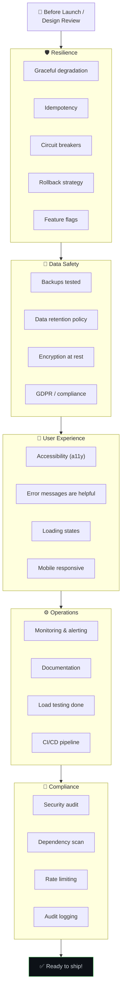
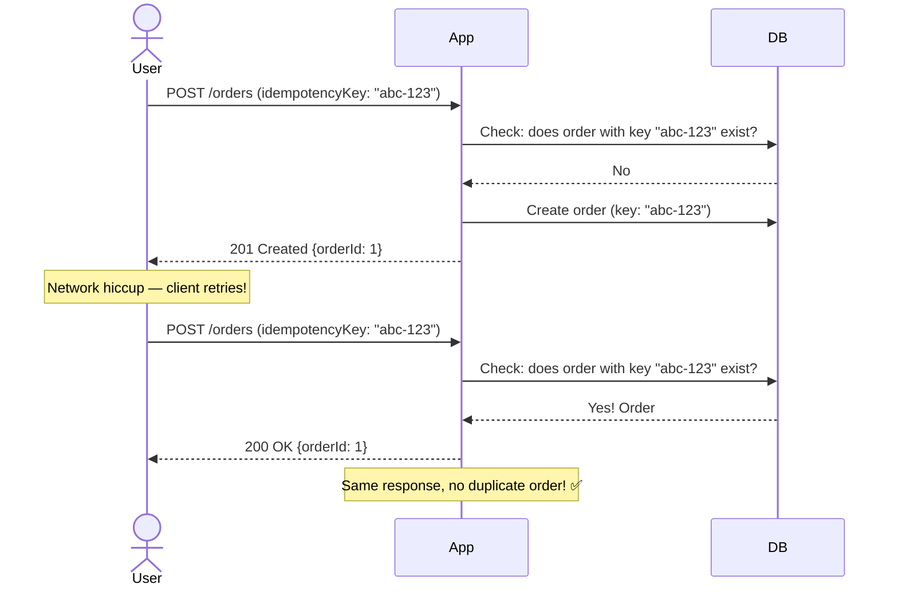
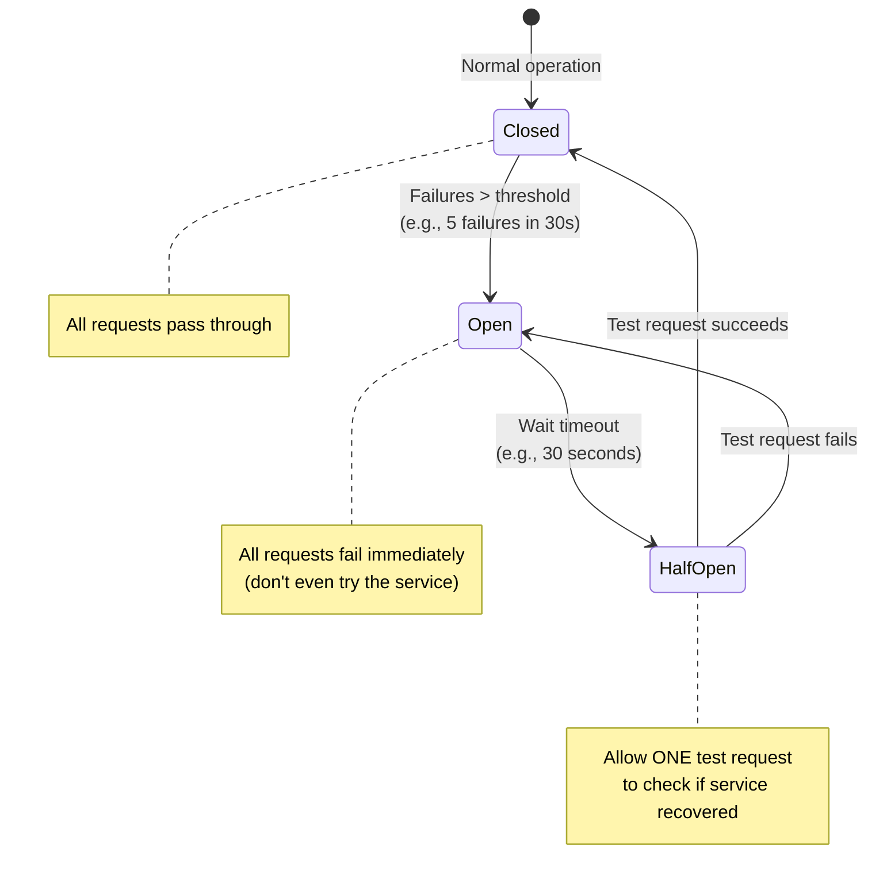

# ✅ 15. Checklist — Things That Are Often Missed

> **This is the list you review before launching, during code reviews, and when designing new features. Print it, bookmark it, come back to it.**

---

## 🔄 The Review Flow

---

## 🛡️ Resilience Checklist

| Item | Question | Why It Matters |
|------|----------|---------------|
| **Graceful degradation** | If cache/3rd-party goes down, does the site crash? | Users should see stale data or a friendly fallback, not a 500 error |
| **Idempotency** | If user double-clicks "Pay", are they charged twice? | Network retries and double-clicks must not cause duplicate actions |
| **Circuit breakers** | If a dependency is failing, does it cascade to everything? | Stop calling a failing service; fail fast instead of waiting |
| **Rollback strategy** | Can you revert a bad deployment in under 5 minutes? | Deploy → bug found → need instant rollback capability |
| **Feature flags** | Can you turn off a new feature without redeploying? | Ship features gradually; disable instantly if something breaks |
| **Retry with backoff** | Do retries use exponential backoff + jitter? | Without backoff, retries create a thundering herd on the failing service |
| **Timeout configuration** | Are timeouts set for every external call? | Without timeouts, one slow service can hang your entire system |
| **Dead letter queue** | Where do failed async messages go? | Messages that can't be processed shouldn't be lost silently |

### Idempotency Pattern

### Circuit Breaker Pattern

---

## 💾 Data Safety Checklist

| Item | Action |
|------|--------|
| ✅ Automated backups | Daily full + hourly incremental, stored in different region |
| ✅ Restore tested | Actually restore from backup at least quarterly |
| ✅ Point-in-time recovery | Enabled for primary database |
| ✅ Data retention policy | Define how long each data type is kept |
| ✅ Encryption at rest | All sensitive data encrypted in database |
| ✅ Data deletion capability | Can fully delete a user's data (GDPR) |
| ✅ No PII in logs | Sensitive data scrubbed from log output |

---

## 👤 User Experience Checklist

| Item | Action |
|------|--------|
| ✅ Loading states | Show skeletons/spinners, not blank screens |
| ✅ Error messages | "Something went wrong" → "Payment failed — check card details" |
| ✅ Offline handling | PWA or graceful "you're offline" message |
| ✅ Mobile responsive | Works on all screen sizes |
| ✅ Accessibility (a11y) | Semantic HTML, ARIA labels, keyboard navigation, contrast |
| ✅ Empty states | What does the page look like with zero data? |
| ✅ Pagination | Never show "loading all 10,000 items..." |

---

## ⚙️ Operations Checklist

| Item | Action |
|------|--------|
| ✅ Health check endpoint | `/health` and `/ready` endpoints |
| ✅ Metrics dashboard | Request rate, error rate, latency, resources |
| ✅ Alerting configured | Critical alerts page on-call, warnings to Slack |
| ✅ Structured logging | JSON logs with request IDs, shipped to central store |
| ✅ Load testing | Simulate expected peak traffic before launch |
| ✅ Documentation | README, architecture diagram, runbooks |
| ✅ CI/CD pipeline | Tests → Build → Stage → Production automated |
| ✅ Secrets management | No secrets in code, use env vars or vault |

---

## 💰 Cost Checklist

| Item | Action |
|------|--------|
| ✅ Budget alerts | Get notified before spending exceeds limit |
| ✅ Auto-scaling limits | Set max instances to prevent runaway costs |
| ✅ Log retention limits | Don't store debug logs for years |
| ✅ Resource right-sizing | Don't run a $500/month server for a $5/month workload |
| ✅ Unused resource cleanup | Delete orphaned databases, storage buckets, IPs |

---

## 🔗 Connected Topics

Every item in this checklist maps back to a specific chapter — review the relevant chapter for deep details on any item.

---

**← Previous:** [14. Request Walkthrough](14-request-walkthrough.md) | **Next →** [Part 2: 16. URL to Page Journey](../Part-2-Network-Hardware-Browser-Frameworks/16-url-to-page-journey.md)
