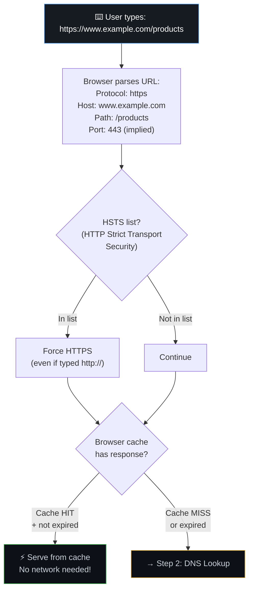
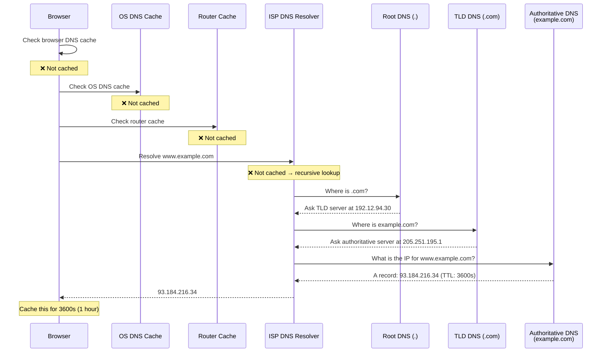
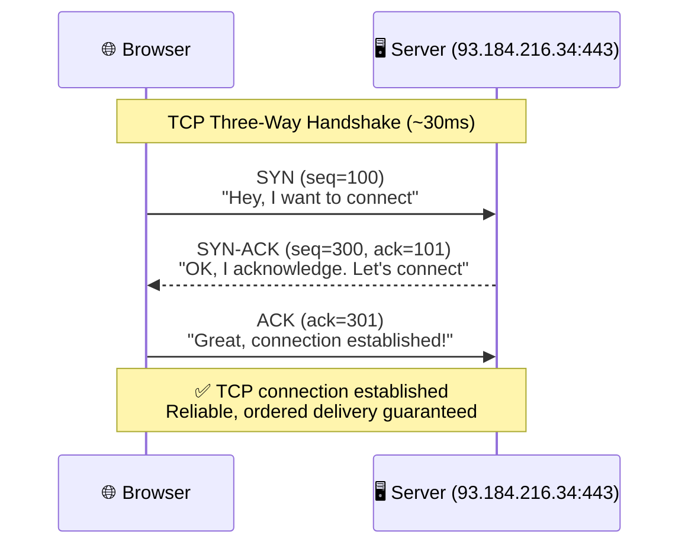
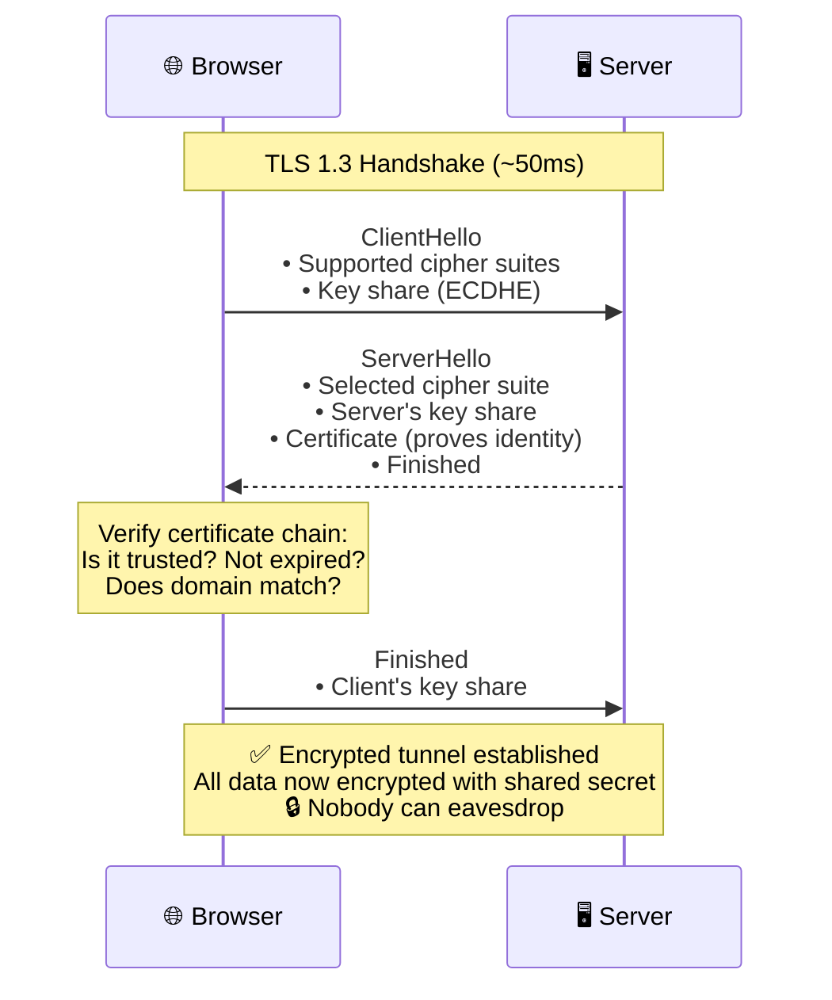
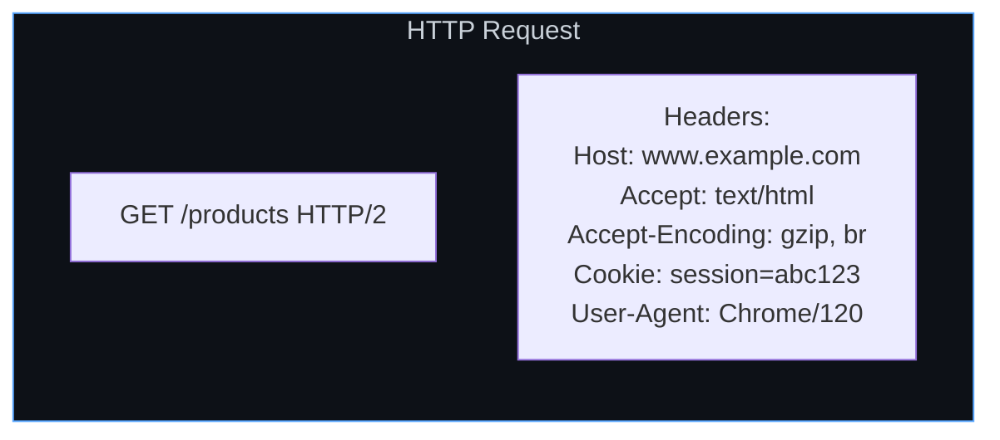
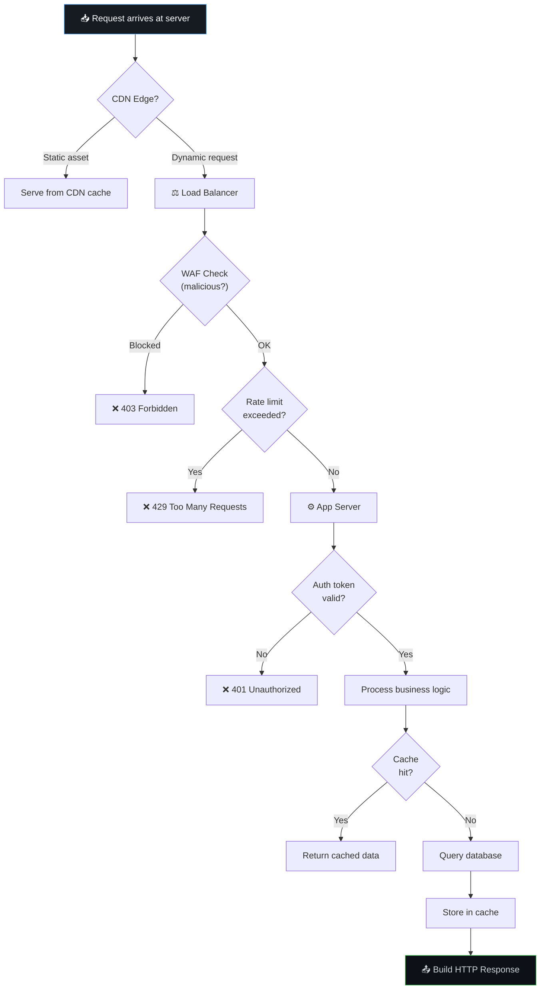
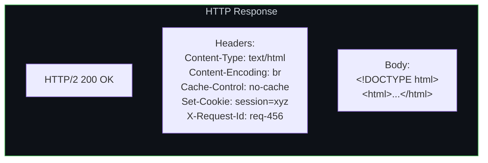
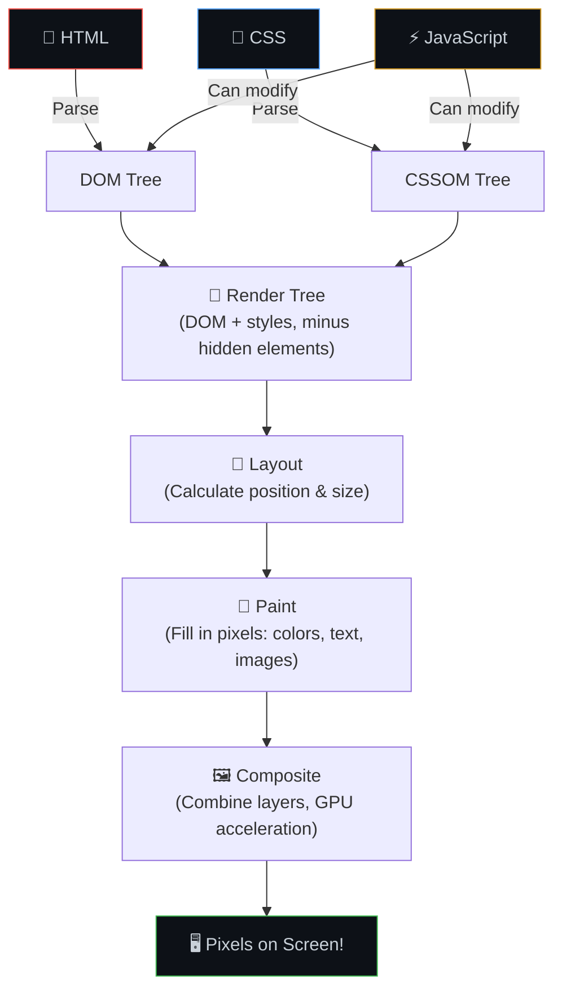

# 🌐 16. The Complete Journey — What Happens When You Type a URL and Press Enter

> **This is THE most common interview question in system design. It touches almost every concept in this guide. Master this and you demonstrate understanding of the entire stack.**

---

## 🔄 The Complete Flow — Overview

---

## Step 1: URL Parsing & Browser Cache Check

---

## Step 2: DNS Resolution — Finding the IP Address

### DNS Record Types

| Record | Purpose | Example |
|--------|---------|---------|
| **A** | Domain → IPv4 address | `example.com → 93.184.216.34` |
| **AAAA** | Domain → IPv6 address | `example.com → 2606:2800:220:1::` |
| **CNAME** | Domain → another domain | `www.example.com → example.com` |
| **MX** | Mail server | `example.com → mail.example.com` |
| **TXT** | Verification, SPF, DKIM | `example.com → "v=spf1 include:..."` |
| **NS** | Nameserver delegation | `example.com → ns1.cloudflare.com` |

---

## Step 3: TCP Three-Way Handshake

---

## Step 4: TLS Handshake (HTTPS)

---

## Step 5: HTTP Request

---

## Step 6: Server Processing

---

## Step 7: HTTP Response

---

## Step 8-9: Browser Rendering Pipeline

---

## 📊 Full Timeline — Where Time Goes

```mermaid
gantt
    title Full Journey: URL → Visible Page
    dateFormat X
    axisFormat %L ms

    section Network
    DNS Lookup (cached)        :dns, 0, 5
    TCP Handshake              :tcp, 5, 35
    TLS Handshake              :tls, 35, 85
    HTTP Request sent          :req, 85, 90

    section Server
    Load Balancer              :lb, 90, 92
    App Processing             :app, 92, 110
    Cache/DB lookup            :db, 110, 130
    Response generated         :resp, 130, 135

    section Response
    Download HTML              :html_dl, 135, 160
    Download CSS (parallel)    :css_dl, 160, 190
    Download JS (parallel)     :js_dl, 160, 220

    section Rendering
    Parse HTML → DOM           :dom, 160, 200
    Parse CSS → CSSOM          :cssom, 190, 210
    FCP                        :milestone, fcp, 210, 210
    Execute JS                 :exec, 220, 300
    Download images            :img, 210, 350
    LCP (hero image)           :milestone, lcp, 350, 350
    TTI (interactive)          :milestone, tti, 300, 300
```

---

## ⚠️ Edge Cases

1. **Service Worker intercept** — If a PWA has a service worker, it can intercept the request before it even hits the network, serving from its own cache.

2. **HTTP/2 Push (deprecated in most browsers)** — Server could push resources before browser asked for them. Now replaced by `103 Early Hints`.

3. **Prefetch/Preconnect** — `<link rel="preconnect" href="https://api.example.com">` starts the TCP+TLS handshake early for known domains.

4. **CORS preflight** — Cross-origin API calls may trigger an OPTIONS preflight request before the actual request, adding latency.

---

## 🔗 Connected Topics

| Step | Related Chapters |
|------|-----------------|
| DNS | [17. Networking Fundamentals](17-networking-fundamentals.md) |
| TCP/TLS | [17. Networking Fundamentals](17-networking-fundamentals.md) |
| CDN | [5. Caching](../Part-1-Architecture-Scalability-Operations/05-caching.md), [6. CDN](../Part-1-Architecture-Scalability-Operations/06-cdn-pagespeed-seo.md) |
| Server processing | [14. Request Walkthrough](../Part-1-Architecture-Scalability-Operations/14-request-walkthrough.md) |
| Browser rendering | [19. Browser Internals](19-browser-internals.md) |

---

**← Previous:** [15. Checklist](../Part-1-Architecture-Scalability-Operations/15-checklist.md) | **Next →** [17. Networking Fundamentals](17-networking-fundamentals.md)
