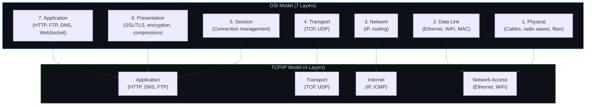
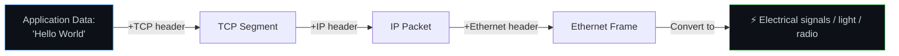
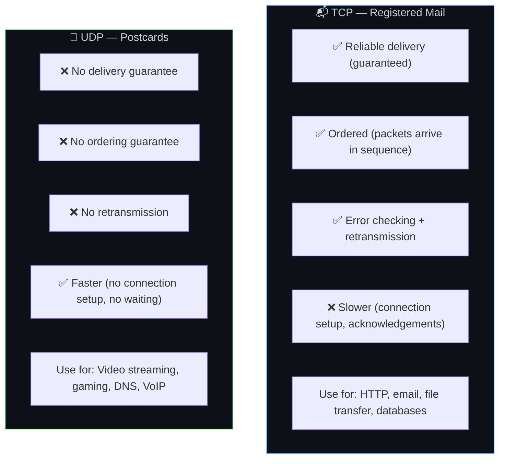
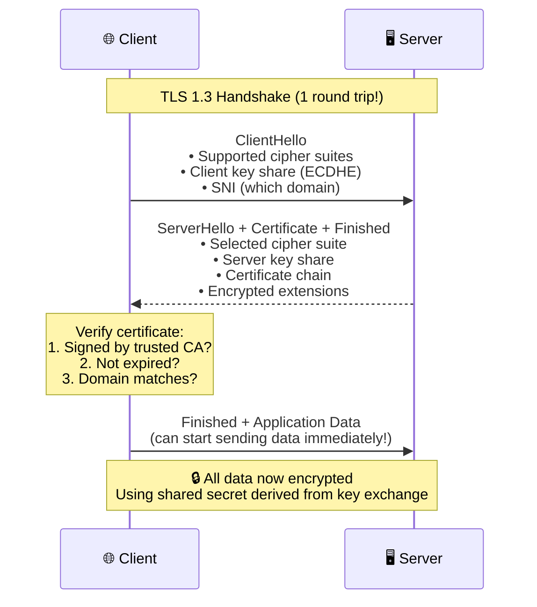
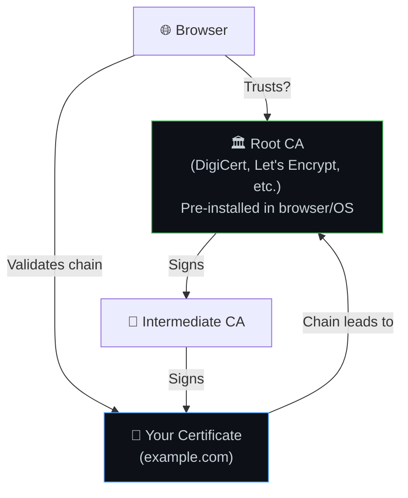
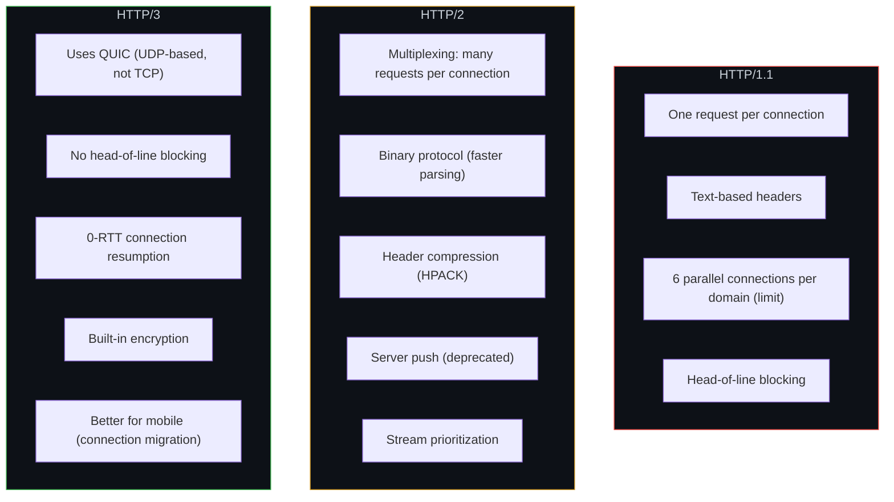
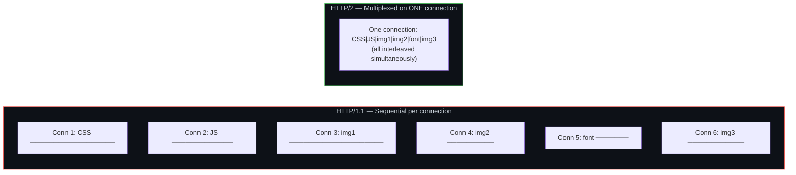
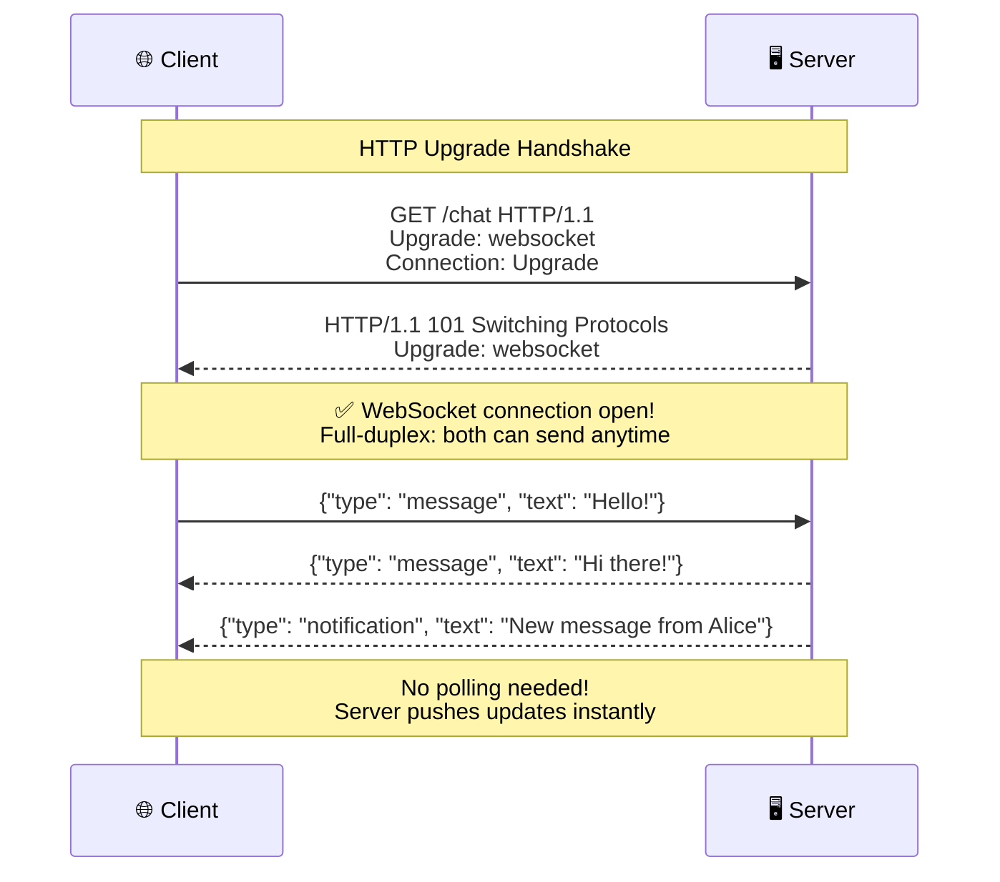
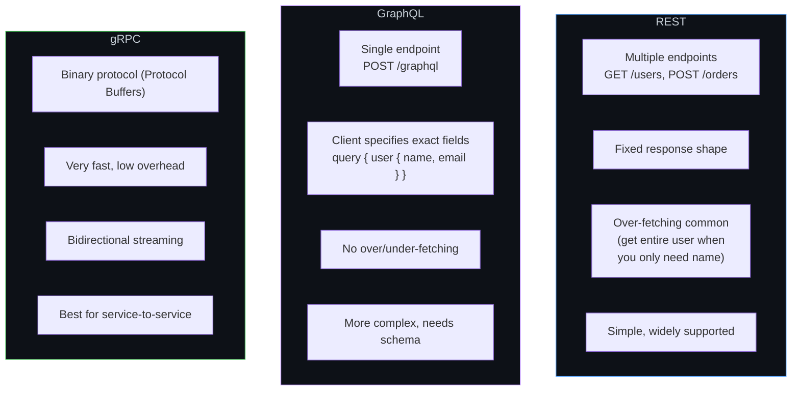

# 🌐 17. Networking Fundamentals — How Data Travels

> **The internet is like a postal system. TCP is registered mail (guaranteed delivery). UDP is postcards (fast, no guarantee). HTTP is the language written on the letters.**

---

## 🏗️ The OSI Model vs TCP/IP — Layers of Communication

### Data Encapsulation — How Data Wraps at Each Layer

---

## 📬 TCP vs UDP

---

## 🔐 TLS/SSL — Securing Communication

### Certificate Chain of Trust

---

## 📡 HTTP Versions Compared

### HTTP/2 Multiplexing vs HTTP/1.1

---

## 🔌 WebSocket — Full-Duplex Communication

### When to Use WebSocket vs HTTP

| Feature | HTTP | WebSocket |
|---------|------|-----------|
| Direction | Client → Server (request/response) | Both directions anytime |
| Connection | New per request (or keep-alive) | Persistent |
| Overhead | Headers on every request | Minimal per message |
| Best for | CRUD APIs, page loads | Chat, live updates, gaming, collaborative editing |

---

## 🏠 REST vs GraphQL vs gRPC

---

## ⚠️ Edge Cases & Gotchas

1. **DNS propagation** — When you change DNS records, it can take up to 48 hours for all caches worldwide to update. Plan DNS changes well ahead of time.

2. **Mixed content** — Loading HTTP resources on an HTTPS page is blocked by browsers. All resources must use HTTPS.

3. **CORS** — Cross-Origin Resource Sharing blocks requests from different domains by default. Your API needs to send proper CORS headers.

4. **TCP slow start** — New TCP connections start slow and ramp up speed. This is why connection reuse (HTTP/2, keep-alive) matters.

5. **MTU and fragmentation** — IP packets larger than ~1500 bytes get fragmented, adding overhead. Keep payloads reasonable.

---

## 🔗 Connected Topics

| Topic | Connection |
|-------|-----------|
| [URL Journey](16-url-to-page-journey.md) | DNS, TCP, TLS are steps in that journey |
| [Security](../Part-1-Architecture-Scalability-Operations/09-security.md) | TLS encryption, HTTPS |
| [Latency](../Part-1-Architecture-Scalability-Operations/08-latency.md) | Network protocols directly impact latency |
| [Load Balancers](../Part-1-Architecture-Scalability-Operations/04-load-balancers.md) | L4 vs L7 load balancing |
| [Hardware](18-hardware-infrastructure.md) | Physical layer that carries these protocols |

---

**← Previous:** [16. URL to Page Journey](16-url-to-page-journey.md) | **Next →** [18. Hardware & Infrastructure](18-hardware-infrastructure.md)
