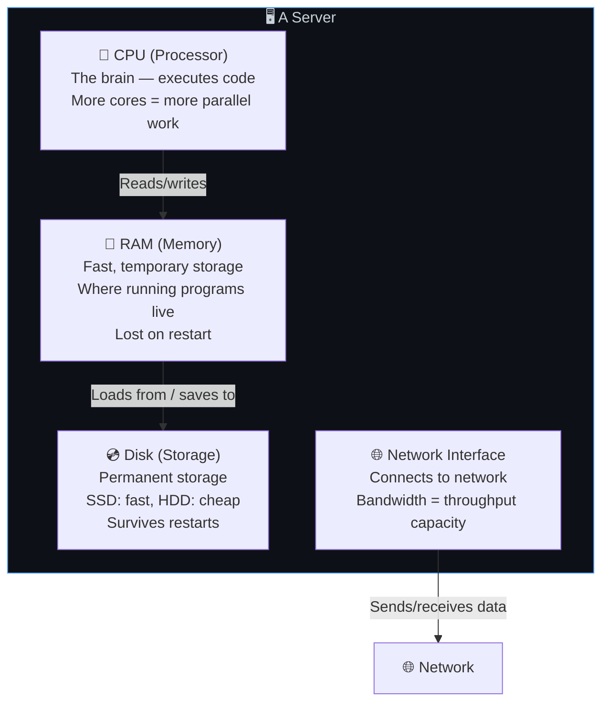
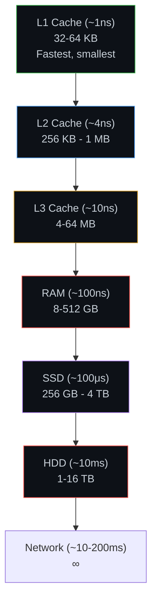
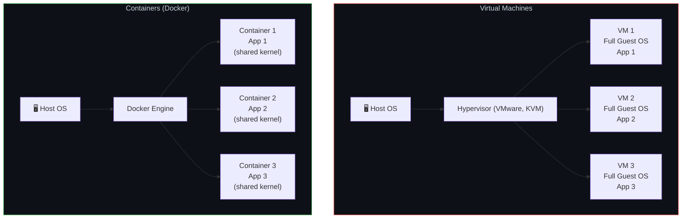
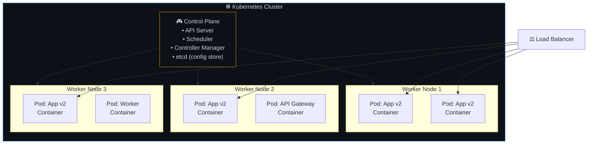
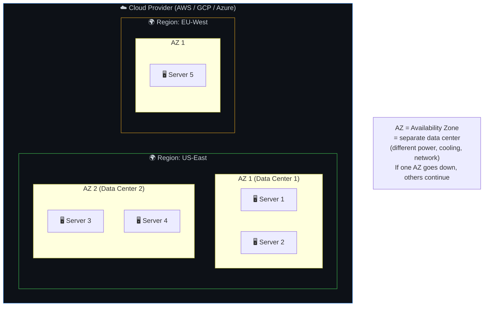
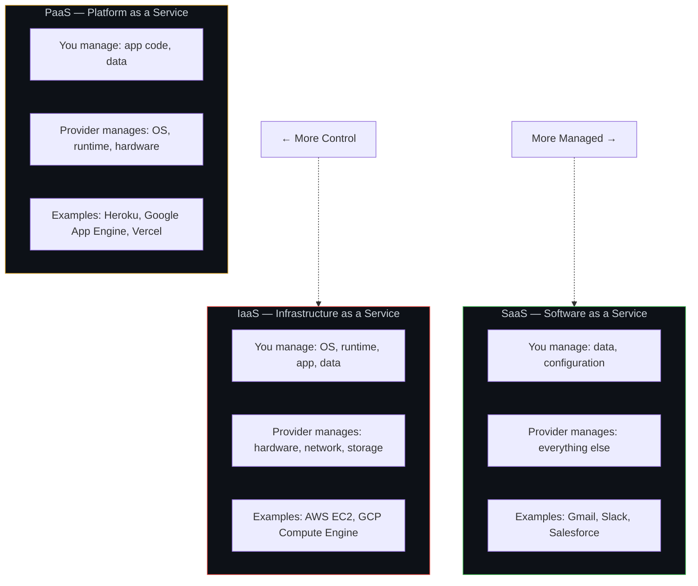

# 🖥️ 18. Hardware & Infrastructure Fundamentals

> **Understanding hardware is like understanding the engine of a car — you don't need to build one, but knowing how it works helps you drive better and diagnose problems.**

---

## 🏗️ Server Architecture — What's Inside

### The Memory Hierarchy — Speed vs Size

### Latency Numbers Every Developer Should Know

| Operation | Time | Analogy |
|-----------|------|---------|
| L1 cache reference | 1 ns | Blink of an eye |
| L2 cache reference | 4 ns | |
| RAM reference | 100 ns | Grabbing a book from your desk |
| SSD random read | 100 μs | Walking to the bookshelf |
| HDD random read | 10 ms | Driving to the library |
| Send packet SF→NYC→SF | 40 ms | Mailing a letter cross-country |
| SSD read 1 MB | 1 ms | |
| Network read 1 MB | 10 ms | |

---

## 📦 Containers vs Virtual Machines

| Aspect | Virtual Machine | Container |
|--------|----------------|-----------|
| **Size** | GBs (full OS per VM) | MBs (shared OS kernel) |
| **Start time** | Minutes | Seconds |
| **Isolation** | Strong (full OS boundary) | Good (shared kernel) |
| **Overhead** | High (each VM runs full OS) | Low (shared kernel) |
| **Use case** | Different OS needs, strong isolation | Microservices, CI/CD, dev environments |

---

## ☸️ Container Orchestration (Kubernetes)

### What Kubernetes Does For You

| Feature | Without K8s | With K8s |
|---------|------------|----------|
| **Scaling** | Manual SSH, deploy, configure LB | `kubectl scale --replicas=10` |
| **Self-healing** | Container crashes = manual restart | Auto-restart + reschedule |
| **Rolling updates** | Downtime during deploy | Zero-downtime rolling update |
| **Service discovery** | Hardcoded IPs | DNS-based service names |
| **Secret management** | Env files on servers | K8s Secrets (encrypted) |

---

## ☁️ Cloud Infrastructure

### Cloud Service Models

---

## ⚠️ Edge Cases & Gotchas

1. **"The cloud is just someone else's computer"** — True, but with massive scale, redundancy, and managed services you could never build yourself cost-effectively.

2. **Noisy neighbors** — On shared cloud hardware, another tenant's heavy workload can impact your performance. Use dedicated instances for critical workloads.

3. **Region selection matters** — Deploy close to your users for low latency. Also consider data residency laws (GDPR may require EU data in EU regions).

4. **Spot/preemptible instances** — Up to 90% cheaper but can be terminated anytime. Great for batch jobs, terrible for web servers.

5. **Vendor lock-in** — Using proprietary cloud services (AWS Lambda, DynamoDB) makes it hard to switch providers. Use containers and open-source tools where possible for portability.

---

## 🔗 Connected Topics

| Topic | Connection |
|-------|-----------|
| [Scalability](../Part-1-Architecture-Scalability-Operations/03-scalability.md) | Hardware determines scaling limits |
| [Networking](17-networking-fundamentals.md) | Network interface connects to the internet |
| [Latency](../Part-1-Architecture-Scalability-Operations/08-latency.md) | Memory hierarchy directly impacts latency |
| [CI/CD](22-cicd-pipeline.md) | Containers are deployed through CI/CD |
| [Architecture](../Part-1-Architecture-Scalability-Operations/02-architecture-patterns.md) | Serverless vs containers vs VMs |

---

**← Previous:** [17. Networking Fundamentals](17-networking-fundamentals.md) | **Next →** [19. Browser Internals](19-browser-internals.md)
