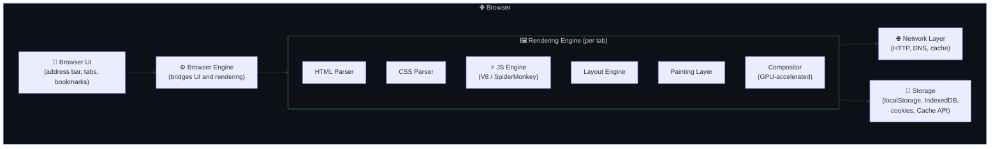
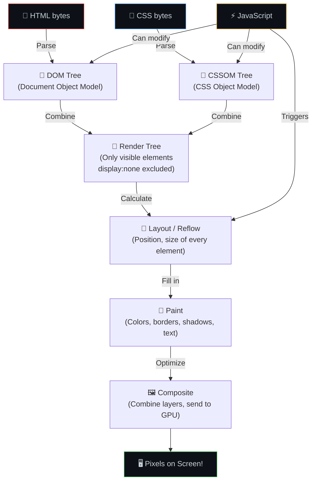
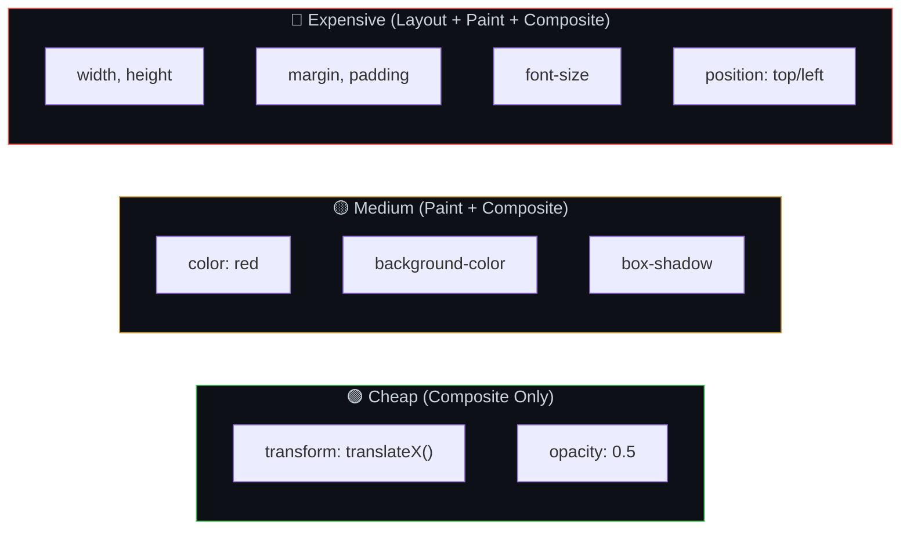
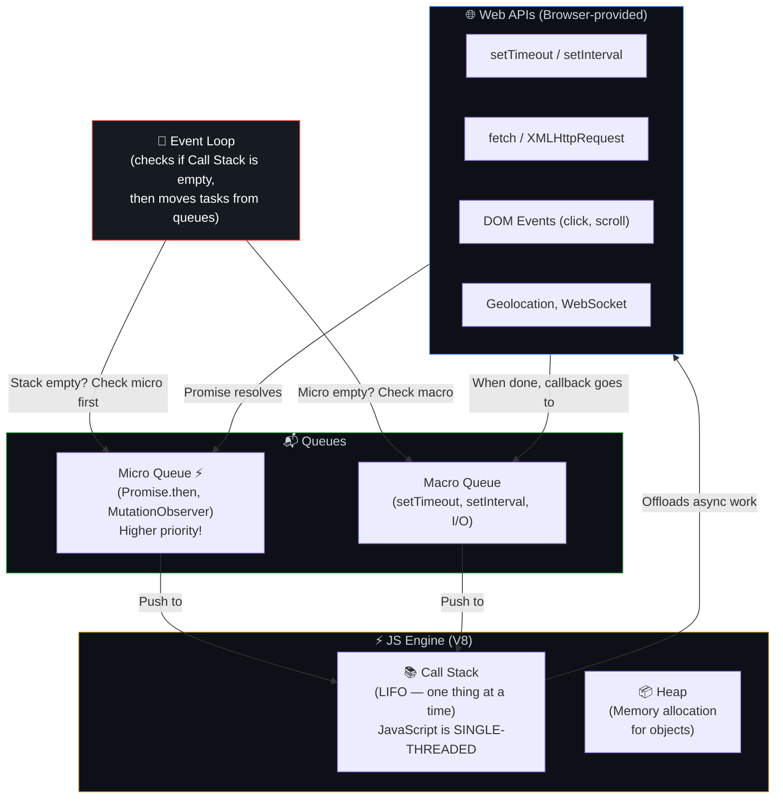
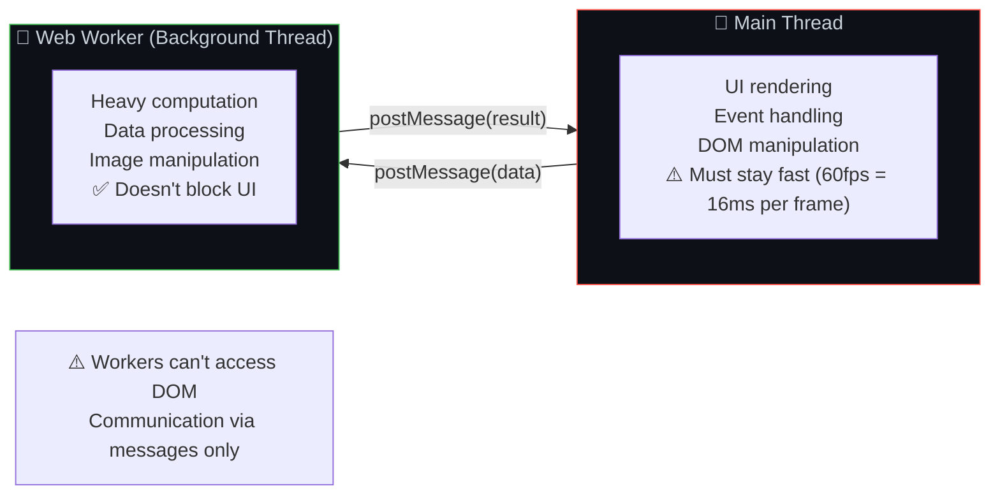
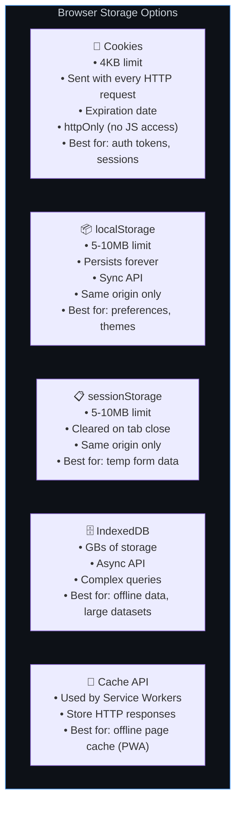

# 🌐 19. Browser Internals — From HTML to Pixels

> **The browser is the most complex piece of software most users interact with — it's an operating system within an operating system. Understanding how it works makes you a better frontend developer.**

---

## 🏗️ Browser Architecture



---

## 🎨 The Critical Rendering Path



### What Triggers What — Performance Cost



---

## ⚡ JavaScript Engine & Event Loop



### Event Loop Execution Order

```javascript
console.log('1 - Sync');                    // 1st: immediate

setTimeout(() => console.log('2 - Macro'), 0); // 4th: macro queue

Promise.resolve().then(() => {
  console.log('3 - Micro');                 // 2nd: micro queue (higher priority!)
});

console.log('4 - Sync');                    // 3rd: immediate (sync before any queue)

// Output order: 1, 4, 3, 2
// Sync first → Microtasks → Macrotasks
```

---

## 🧵 Web Workers — True Parallelism



---

## 💾 Browser Storage Options



---

## 🔒 Same-Origin Policy & CORS


---

## ⚠️ Edge Cases & Gotchas

1. **Long tasks block rendering** — If JS takes >50ms, the browser can't render frames = UI feels janky. Break long tasks into smaller chunks or use Web Workers.

2. **Layout thrashing** — Reading a layout property (offsetWidth) then immediately writing one (style.width) in a loop forces the browser to recalculate layout on each iteration. Batch reads and writes separately.

3. **Repaints are expensive** — Animating `width` triggers layout+paint+composite. Animating `transform` triggers only composite (GPU-accelerated). Always prefer `transform` and `opacity` for animations.

4. **Third-party scripts** — Each external script (analytics, ads, widgets) can block rendering and add latency. Load them `async` or `defer`.

5. **Memory leaks in SPAs** — Long-running single-page apps can leak memory through detached DOM nodes, event listeners, and closures. Clean up on component unmount.

---

## 🔗 Connected Topics

| Topic | Connection |
|-------|-----------|
| [URL Journey](16-url-to-page-journey.md) | Rendering is the final step |
| [CDN & Page Speed](../Part-1-Architecture-Scalability-Operations/06-cdn-pagespeed-seo.md) | CRP directly impacts Core Web Vitals |
| [Frontend Frameworks](20-frontend-frameworks.md) | Frameworks optimize DOM updates |
| [Performance](../Part-1-Architecture-Scalability-Operations/12-performance-optimization.md) | Layout thrashing, long tasks |
| [Caching](../Part-1-Architecture-Scalability-Operations/05-caching.md) | Browser cache, Service Worker cache |

---

**← Previous:** [18. Hardware & Infrastructure](18-hardware-infrastructure.md) | **Next →** [20. Frontend Frameworks](20-frontend-frameworks.md)
