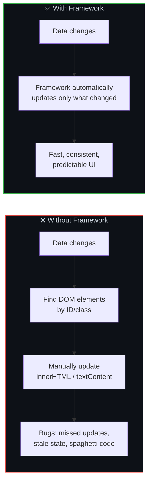
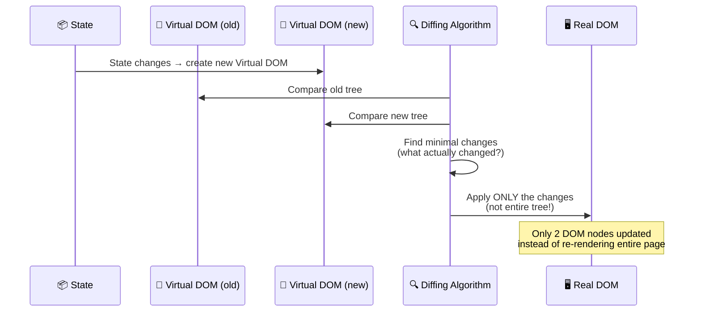
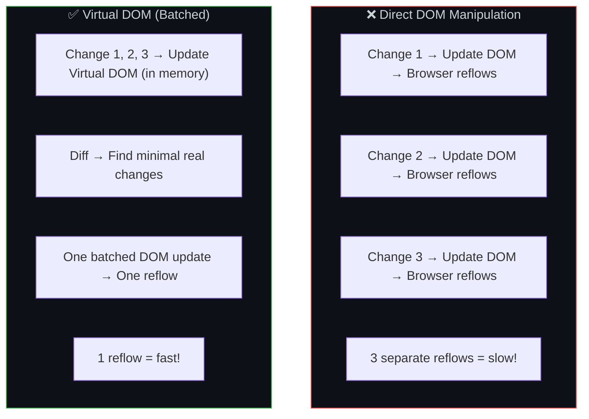
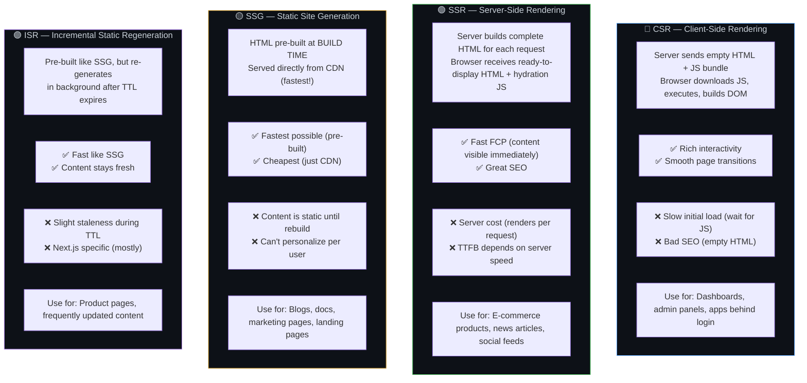
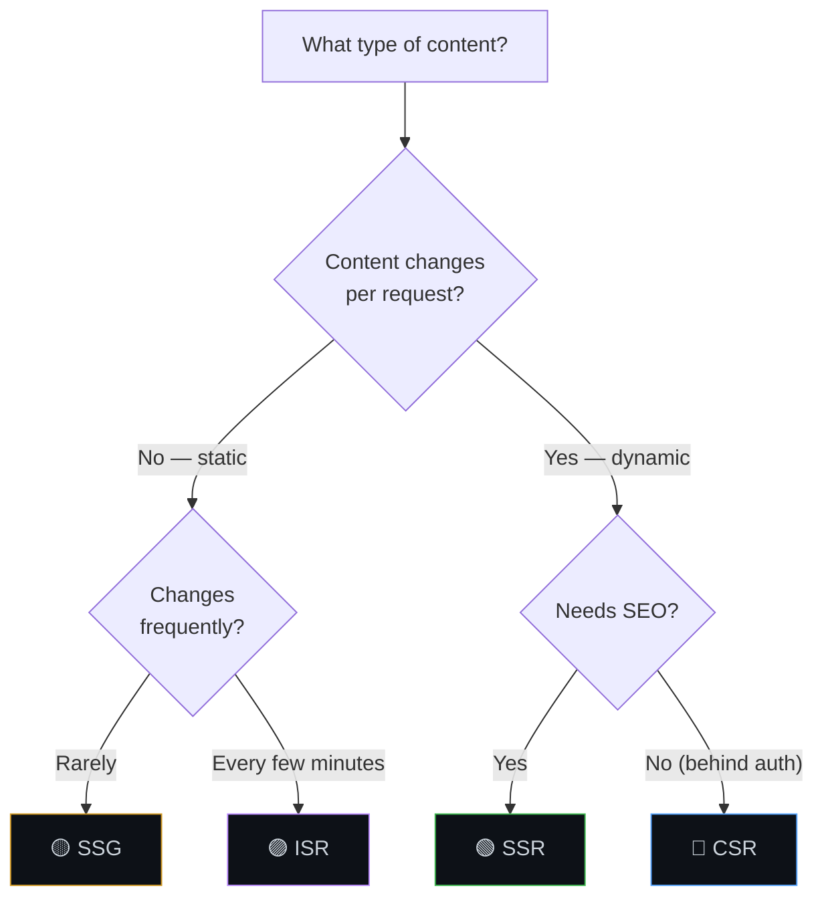
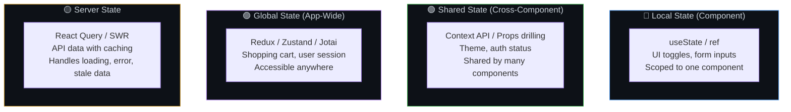
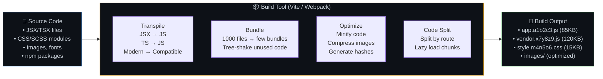

# ⚛️ 20. Frontend Frameworks & Build Tools

> **Frameworks solve the problem of keeping the UI in sync with data. Without them, you'd manually find and update DOM elements every time data changes — which becomes a nightmare at scale.**

---

## 🔄 The Core Problem Frameworks Solve

---

## ⚛️ Virtual DOM — How React Updates Efficiently

### Virtual DOM vs Direct DOM

---

## 🔄 Rendering Strategies — CSR vs SSR vs SSG vs ISR

### Rendering Decision Flow

---

## 📦 State Management

---

## 🛠️ Build Tools — What They Do

---

## ⚠️ Edge Cases & Gotchas

1. **Hydration mismatch** — When SSR HTML doesn't match what React generates client-side, you get hydration errors. Avoid rendering random values or dates differently on server vs client.

2. **Bundle size creep** — Every `npm install` adds to your bundle. Use `npm ls --prod` and tools like bundlephobia.com to check package sizes before adding.

3. **Over-rendering** — In React, parent re-rendering re-renders all children. Use `React.memo`, `useMemo`, `useCallback` to prevent unnecessary renders — but only when profiling shows it's a bottleneck.

4. **SEO with client-side routing** — SPA client-side navigation doesn't trigger new page loads. Crawlers may not follow client-side routes. Use SSR/SSG for SEO-critical pages.

5. **State in URL** — Shareable state (filters, search queries, pagination) should be in the URL, not just in component state. Use query params: `/products?category=shoes&page=2`.

---

## 🔗 Connected Topics

| Topic | Connection |
|-------|-----------|
| [Browser Internals](19-browser-internals.md) | Frameworks sit on top of the browser's DOM |
| [CDN & SEO](../Part-1-Architecture-Scalability-Operations/06-cdn-pagespeed-seo.md) | Rendering strategy impacts SEO and page speed |
| [Performance](../Part-1-Architecture-Scalability-Operations/12-performance-optimization.md) | Code splitting, lazy loading, bundle optimization |
| [Caching](../Part-1-Architecture-Scalability-Operations/05-caching.md) | ISR is a form of caching at the page level |
| [Backend Frameworks](21-backend-frameworks.md) | SSR requires server-side framework integration |

---

**← Previous:** [19. Browser Internals](19-browser-internals.md) | **Next →** [21. Backend Frameworks](21-backend-frameworks.md)
