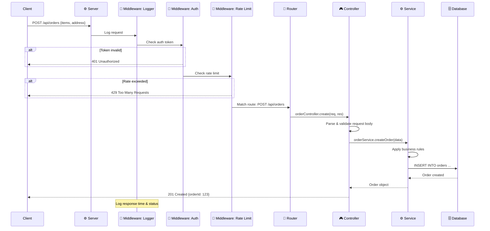
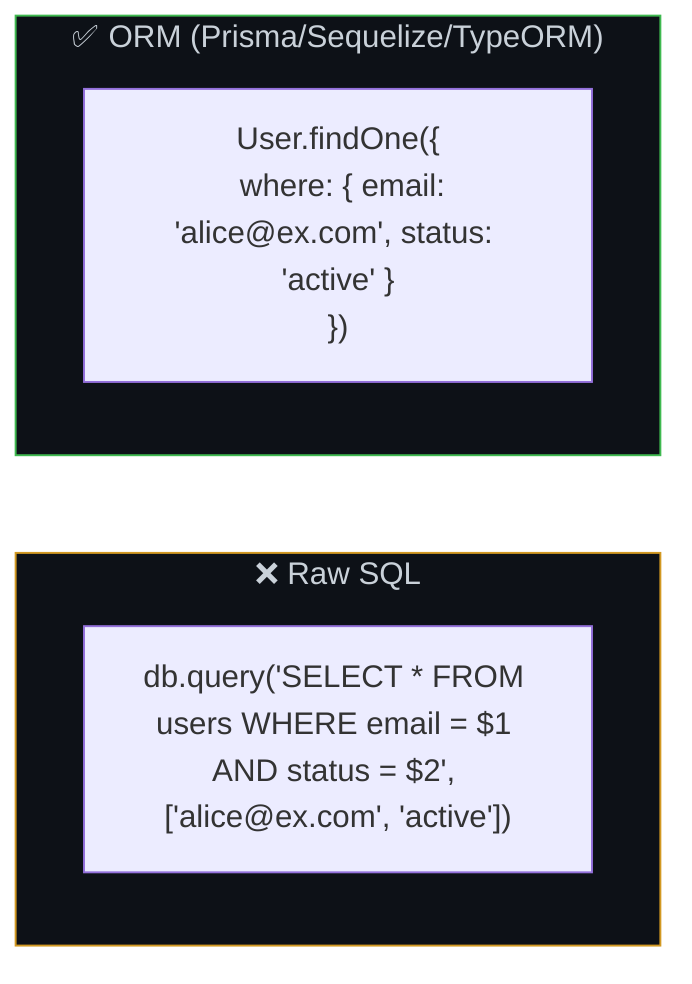
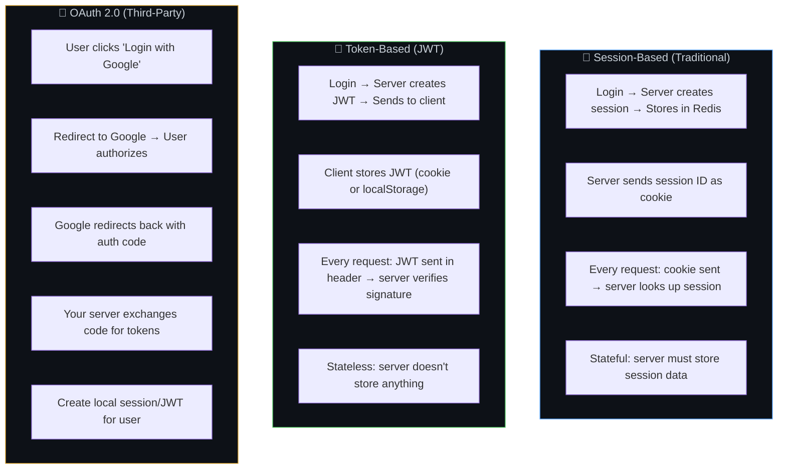
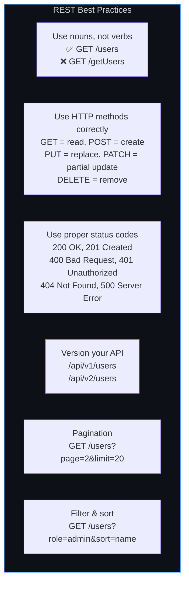
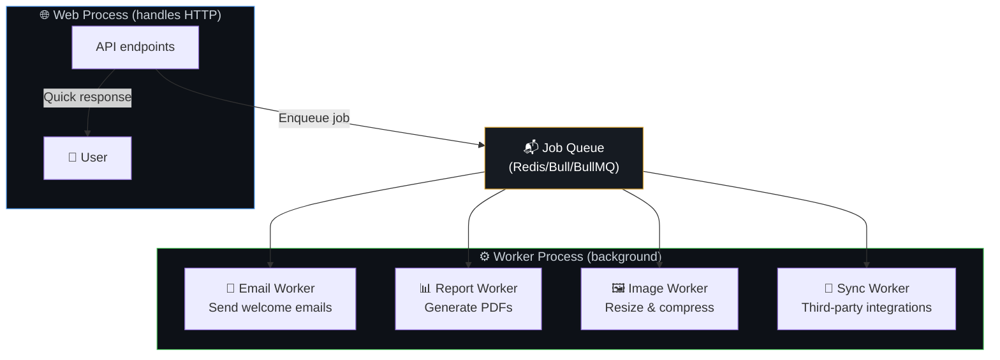

# ⚙️ 21. Backend Frameworks & Server-Side Concepts

> **A backend framework is like a well-designed kitchen — it provides the oven (routing), utensils (utilities), and recipes (patterns) so you can focus on cooking (business logic) instead of building the kitchen from scratch.**

---

## 🔄 Request Lifecycle — How a Backend Processes a Request



---

## 🔌 Middleware — The Pipeline


### Express.js Middleware Example

```javascript
// Middleware executes in ORDER
app.use(logger());         // 1. Log every request
app.use(cors());           // 2. Handle CORS
app.use(express.json());   // 3. Parse JSON bodies
app.use(authenticate);     // 4. Verify auth token
app.use(rateLimiter);      // 5. Rate limiting

// Route handler
app.post('/api/orders', validate(orderSchema), orderController.create);

// Error handler (must be last — 4 args)
app.use((err, req, res, next) => {
  logger.error({ error: err.message, stack: err.stack });
  res.status(err.status || 500).json({ error: 'Internal server error' });
});
```

---

## 🗄️ ORM — Object-Relational Mapping



### ORM Pros & Cons

| ✅ Pros | ❌ Cons |
|---------|---------|
| Type-safe queries | May generate inefficient SQL |
| Database-agnostic | Learning curve for complex queries |
| Auto-generates migrations | Hides what's actually happening |
| Prevents SQL injection | Performance overhead |
| Better developer experience | Complex joins can be awkward |

### When to Use Raw SQL vs ORM

| Scenario | Recommendation |
|----------|---------------|
| Simple CRUD operations | ORM ✅ |
| Complex reporting queries | Raw SQL ✅ |
| Rapid prototyping | ORM ✅ |
| Performance-critical queries | Raw SQL ✅ |
| Team with varying SQL skills | ORM ✅ |

---

## 🔑 Authentication Patterns



---

## 📡 API Design Patterns

### RESTful API Design



### HTTP Status Codes Cheat Sheet

| Code | Meaning | When to Use |
|------|---------|-------------|
| **200** | OK | Successful GET, PUT, PATCH |
| **201** | Created | Successful POST (resource created) |
| **204** | No Content | Successful DELETE |
| **301** | Moved Permanently | URL has permanently changed |
| **304** | Not Modified | Cache is still valid |
| **400** | Bad Request | Invalid input / validation error |
| **401** | Unauthorized | Not logged in / bad token |
| **403** | Forbidden | Logged in but not permitted |
| **404** | Not Found | Resource doesn't exist |
| **409** | Conflict | Duplicate resource / version conflict |
| **422** | Unprocessable Entity | Valid JSON but semantic errors |
| **429** | Too Many Requests | Rate limit exceeded |
| **500** | Internal Server Error | Unhandled server error |
| **502** | Bad Gateway | Upstream service unreachable |
| **503** | Service Unavailable | Server overloaded / maintenance |

---

## 🔄 Background Jobs & Workers



---

## ⚠️ Edge Cases & Gotchas

1. **Don't put business logic in controllers** — Controllers should be thin: parse request → call service → send response. Business rules belong in the service layer.

2. **Error handling middleware must be last** — In Express, error handlers must have 4 arguments `(err, req, res, next)` and be registered after all routes.

3. **Database migrations in production** — Never run destructive migrations (drop column) without a multi-step approach. See [Chapter 7](../Part-1-Architecture-Scalability-Operations/07-database-design.md).

4. **Graceful shutdown** — When a server receives SIGTERM (during deploy), finish processing current requests before shutting down. Don't kill mid-request.

5. **Environment-specific config** — Never hardcode production URLs, keys, or credentials. Use environment variables that differ per environment (dev, staging, prod).

---

## 🔗 Connected Topics

| Topic | Connection |
|-------|-----------|
| [Clean Code](../Part-1-Architecture-Scalability-Operations/11-clean-modular-code.md) | Layered architecture: controller → service → repository |
| [Security](../Part-1-Architecture-Scalability-Operations/09-security.md) | Auth middleware, input validation, rate limiting |
| [Database](../Part-1-Architecture-Scalability-Operations/07-database-design.md) | ORM, connection pooling, migrations |
| [Latency](../Part-1-Architecture-Scalability-Operations/08-latency.md) | Middleware chain adds latency per layer |
| [Frontend Frameworks](20-frontend-frameworks.md) | API consumed by frontend, SSR integration |

---

**← Previous:** [20. Frontend Frameworks](20-frontend-frameworks.md) | **Next →** [22. CI/CD Pipeline](22-cicd-pipeline.md)
