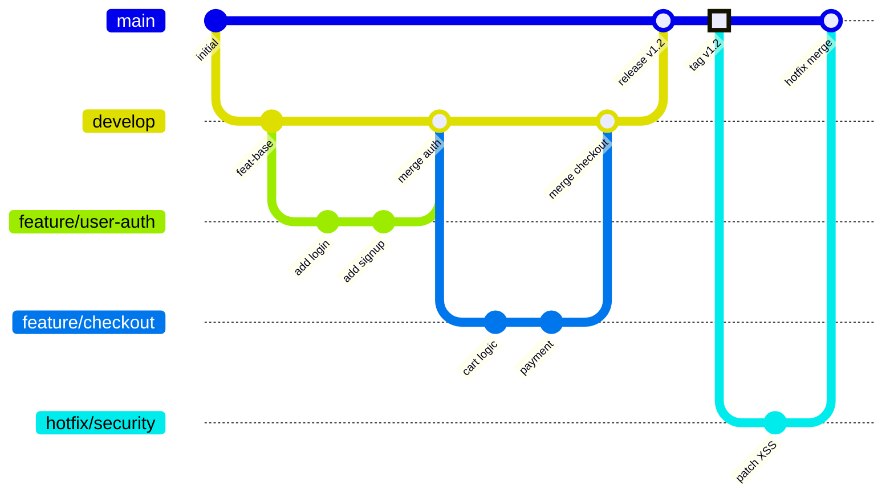
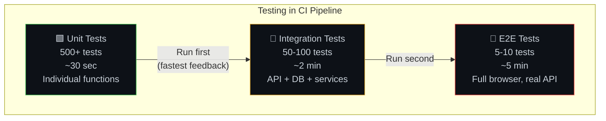
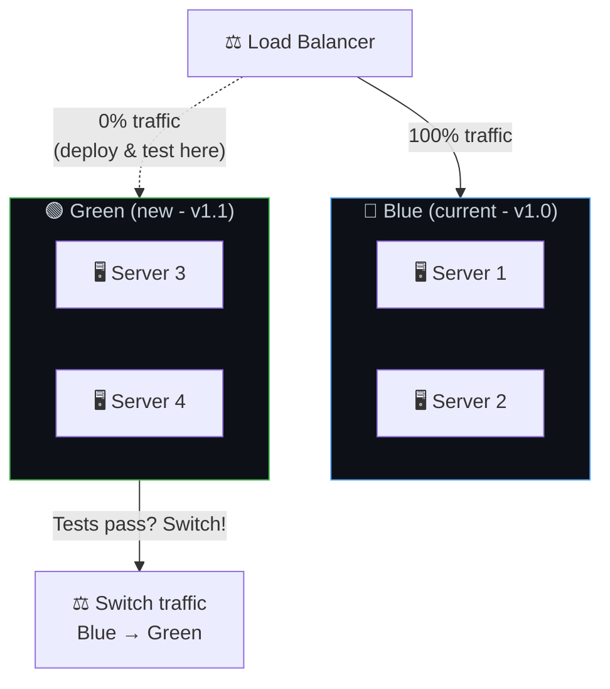
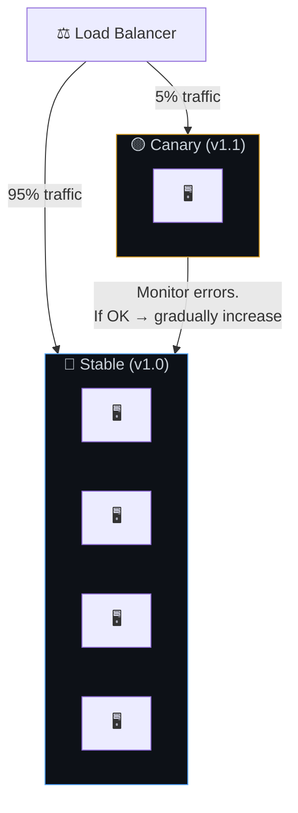

# 🚀 22. CI/CD Pipeline — From Laptop to Production

> **CI/CD is like a factory assembly line with quality inspectors at each station. Code enters raw, gets built, tested, inspected, and only perfect products reach the customer.**

---

## 🔄 The Complete CI/CD Flow


---

## 🌳 Git Branching Strategy



---

## 🧪 Testing Pyramid in CI



---

## 🚀 Deployment Strategies

### Blue-Green Deployment



### Canary Deployment



### Deployment Strategy Comparison

| Strategy | Downtime | Risk | Rollback Speed | Cost |
|----------|----------|------|---------------|------|
| **Rolling** | None | Medium | Moderate | Low (reuse servers) |
| **Blue-Green** | None | Low | Instant (switch LB) | High (double servers) |
| **Canary** | None | Lowest | Fast | Medium (1 extra) |
| **Recreate** | Yes ❌ | High | Slow | Low |

---

## 🏭 GitHub Actions Example

```yaml
# .github/workflows/ci-cd.yml
name: CI/CD Pipeline

on:
  push:
    branches: [main]
  pull_request:
    branches: [main]

jobs:
  test:
    runs-on: ubuntu-latest
    steps:
      - uses: actions/checkout@v4
      - uses: actions/setup-node@v4
        with: { node-version: '20' }
      - run: npm ci                    # Install dependencies
      - run: npm run lint              # Code style check
      - run: npm run test:unit         # Unit tests
      - run: npm run test:integration  # Integration tests
      - run: npm audit --production    # Security scan

  deploy-staging:
    needs: test
    if: github.ref == 'refs/heads/main'
    runs-on: ubuntu-latest
    steps:
      - run: echo "Deploy to staging..."
      - run: echo "Run smoke tests..."

  deploy-production:
    needs: deploy-staging
    runs-on: ubuntu-latest
    environment: production  # Requires manual approval!
    steps:
      - run: echo "Deploy to production..."
```

---

## ⚠️ Edge Cases & Gotchas

1. **"It works on my machine"** — CI ensures code is built and tested in a clean, reproducible environment. Use Docker in CI to match production.

2. **Flaky tests** — Tests that sometimes pass and sometimes fail destroy CI trust. Fix or quarantine flaky tests immediately.

3. **Long CI pipelines** — If CI takes 30 minutes, developers won't wait and will merge without checking results. Optimize: parallelize tests, cache dependencies.

4. **Database migrations in deploy** — Run migrations BEFORE deploying new code. New code expects new schema; if migration fails, old code still works.

5. **Secrets in CI** — Use CI/CD platform's secret management, not hardcoded values. Rotate secrets and audit who has access.

---

## 🔗 Connected Topics

| Topic | Connection |
|-------|-----------|
| [Clean Code](../Part-1-Architecture-Scalability-Operations/11-clean-modular-code.md) | Tests run in CI enforce code quality |
| [Monitoring](../Part-1-Architecture-Scalability-Operations/13-monitoring-observability.md) | Post-deploy monitoring catches issues |
| [Security](../Part-1-Architecture-Scalability-Operations/09-security.md) | Security scans in CI pipeline |
| [Governance](../Part-1-Architecture-Scalability-Operations/10-governance.md) | Branch protection, required reviews |
| [Hardware](18-hardware-infrastructure.md) | Containers, Kubernetes for deployment |

---

**← Previous:** [21. Backend Frameworks](21-backend-frameworks.md) | **Next →** [23. End-to-End Scenario](23-end-to-end-scenario.md)
