# 🔗 23. End-to-End Scenario — One Click Traced Through Every Layer

> **This chapter traces a single user action — "Add to Cart" — through every single layer of the system, showing exactly which chapter's concept is in play at each step.**

---

## 🛒 Scenario: User Clicks "Add to Cart" on an E-Commerce Site

```mermaid
sequenceDiagram
    actor User as 👤 User (Mumbai)
    participant Browser as 🌐 Browser
    participant SW as 🔧 Service Worker
    participant CDN as 🌍 CDN (Mumbai Edge)
    participant DNS as 📡 DNS
    participant LB as ⚖️ Load Balancer
    participant WAF as 🔥 WAF
    participant RateLimit as 🚦 Rate Limiter
    participant App as ⚙️ App Server 2
    participant Auth as 🔑 Auth (JWT)
    participant Redis as 💾 Redis Cache
    participant Primary as 🟢 Primary DB
    participant Replica as 📖 Read Replica
    participant Queue as 📬 Kafka
    participant Analytics as 📊 Analytics Worker
    participant Monitor as 👁️ Prometheus

    Note over User,Monitor: === FRONTEND ===

    rect rgb(20, 40, 60)
        Note right of User: Ch 19: Browser Internals
        User->>Browser: Click "Add to Cart" button
        Browser->>Browser: JavaScript event listener fires
        Browser->>Browser: React state update → Virtual DOM diff
        Browser->>Browser: Optimistic UI: show item in cart immediately
        Note right of Browser: Ch 20: Frontend Frameworks<br/>Virtual DOM, state management
    end

    rect rgb(30, 45, 65)
        Note over Browser,CDN: Ch 5: Browser Cache
        Browser->>Browser: Check Service Worker cache
        Note over Browser: No cached response for POST
    end

    Note over User,Monitor: === NETWORK ===

    rect rgb(25, 50, 70)
        Note over Browser,DNS: Ch 16/17: DNS + Networking
        Browser->>DNS: Resolve api.store.com (cached: ~2ms)
        DNS-->>Browser: 93.184.216.34
        Note right of Browser: TCP connection reused (HTTP/2 keep-alive)<br/>TLS session resumption (0-RTT)
    end

    rect rgb(30, 55, 75)
        Note over Browser,CDN: Ch 6: CDN
        Browser->>CDN: POST /api/cart/items<br/>Authorization: Bearer eyJ...<br/>Content-Type: application/json
        Note over CDN: POST = not cacheable at CDN<br/>Forward to origin
        CDN->>LB: Forward request
    end

    Note over User,Monitor: === GATEWAY ===

    rect rgb(35, 60, 80)
        Note over LB,RateLimit: Ch 4: Load Balancer + Ch 9: Security
        LB->>WAF: Security inspection
        WAF->>WAF: Check: SQL injection? XSS? Known bad IPs?
        WAF->>RateLimit: Request is clean ✅
        RateLimit->>RateLimit: User 456: 23/100 requests this minute ✅
        RateLimit->>LB: Allow through
        LB->>LB: Least connections → pick Server 2
        LB->>App: Forward to App Server 2
    end

    Note over User,Monitor: === APPLICATION ===

    rect rgb(40, 65, 85)
        Note over App,Redis: Ch 21: Backend + Ch 9: Security
        App->>App: Middleware: Parse JSON body
        App->>Auth: Verify JWT token
        Auth->>Auth: Check signature, expiration, claims
        Auth-->>App: userId: 456, role: "customer" ✅
        App->>App: Authorization: can customer add to cart? ✅
        App->>App: Input validation: productId valid? qty > 0? qty < 100?
    end

    rect rgb(45, 70, 90)
        Note over App,Primary: Ch 11: Clean Code + Ch 7: Database
        App->>App: cartController.addItem(req, res)
        App->>App: cartService.addItem(userId, productId, qty)

        App->>Redis: GET product:SKU-789 (check stock from cache)
        Redis-->>App: {stock: 42, price: 29.99} ✅
        Note over App: Ch 5: Cache hit! Saved 50ms DB query

        App->>Primary: BEGIN TRANSACTION
        App->>Primary: INSERT INTO cart_items (user_id, product_id, qty)
        App->>Primary: COMMIT ✅
        Note over Primary: Ch 7: ACID transaction
    end

    rect rgb(50, 75, 95)
        Note over App,Queue: Ch 8: Latency (async processing)
        App->>Queue: Publish event: CartItemAdded<br/>{userId: 456, productId: "SKU-789", qty: 1}
        Note over App: Fire-and-forget → don't wait for consumers
    end

    Note over User,Monitor: === RESPONSE ===

    rect rgb(40, 65, 85)
        App-->>LB: 201 Created {cartId: "C-789", item: {...}}
        LB-->>CDN: Response
        CDN-->>Browser: Response + headers
        Note over Browser: Ch 19: Browser renders response<br/>React reconciles with optimistic UI<br/>Cart badge updates: "3 items"
        Browser-->>User: Cart shows new item! ✅ (~150ms total)
    end

    Note over User,Monitor: === ASYNC PROCESSING ===

    rect rgb(35, 60, 80)
        Note over Queue,Analytics: Ch 2: Event-Driven Architecture
        Queue->>Analytics: Process CartItemAdded event
        Analytics->>Analytics: Track: conversion funnel, popular items
        Analytics->>Replica: Read product category for segmentation
    end

    Note over User,Monitor: === OBSERVABILITY ===

    rect rgb(30, 55, 75)
        Note over App,Monitor: Ch 13: Monitoring
        App-.->Monitor: Emit metrics:<br/>• cart.item.added (counter)<br/>• request.duration: 150ms (histogram)<br/>• http.status: 201
        App-.->Monitor: Structured log:<br/>{action: "cart_add", userId: 456,<br/>productId: "SKU-789", duration: 150}
    end
```

---

## 📊 Chapter Mapping — Where Each Concept Appears

| Step in Journey | Chapter | What's Happening |
|----------------|---------|-----------------|
| Click button → JS event | [19. Browser Internals](19-browser-internals.md) | Event loop, call stack |
| React state update | [20. Frontend Frameworks](20-frontend-frameworks.md) | Virtual DOM diff, optimistic UI |
| DNS lookup | [16. URL Journey](16-url-to-page-journey.md), [17. Networking](17-networking-fundamentals.md) | DNS caching, resolution |
| HTTPS request | [17. Networking](17-networking-fundamentals.md) | TLS, HTTP/2 multiplexing |
| CDN forwards | [6. CDN](../Part-1-Architecture-Scalability-Operations/06-cdn-pagespeed-seo.md) | POST not cacheable |
| WAF inspection | [9. Security](../Part-1-Architecture-Scalability-Operations/09-security.md) | Input filtering |
| Rate limiting | [9. Security](../Part-1-Architecture-Scalability-Operations/09-security.md) | Abuse prevention |
| Load balancer routes | [4. Load Balancers](../Part-1-Architecture-Scalability-Operations/04-load-balancers.md) | Least connections |
| JWT verification | [9. Security](../Part-1-Architecture-Scalability-Operations/09-security.md) | Authentication |
| Controller → Service | [11. Clean Code](../Part-1-Architecture-Scalability-Operations/11-clean-modular-code.md) | Separation of concerns |
| Redis cache check | [5. Caching](../Part-1-Architecture-Scalability-Operations/05-caching.md) | Cache-aside pattern |
| DB transaction | [7. Database](../Part-1-Architecture-Scalability-Operations/07-database-design.md) | ACID, primary writes |
| Event to Kafka | [2. Event-Driven](../Part-1-Architecture-Scalability-Operations/02-architecture-patterns.md) | Async processing |
| Analytics worker | [8. Latency](../Part-1-Architecture-Scalability-Operations/08-latency.md) | Don't make user wait |
| Metrics emitted | [13. Monitoring](../Part-1-Architecture-Scalability-Operations/13-monitoring-observability.md) | Observability |
| Servers auto-scaled | [3. Scalability](../Part-1-Architecture-Scalability-Operations/03-scalability.md) | Horizontal scaling |
| Running on cloud | [18. Hardware](18-hardware-infrastructure.md) | Containers, K8s |
| Deployed via CI/CD | [22. CI/CD](22-cicd-pipeline.md) | Automated pipeline |

---

## 💡 Key Takeaway

**Every chapter in this knowledge base is a piece of this puzzle.** No concept exists in isolation — they all work together. When you can trace a single click through every layer and explain what's happening at each step, you truly understand system design.

---

**← Previous:** [22. CI/CD Pipeline](22-cicd-pipeline.md) | **Next →** [24. Role-Based Roadmap](24-role-based-roadmap.md)
