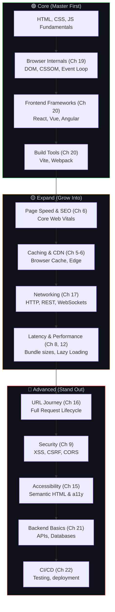
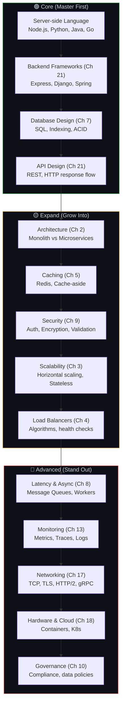
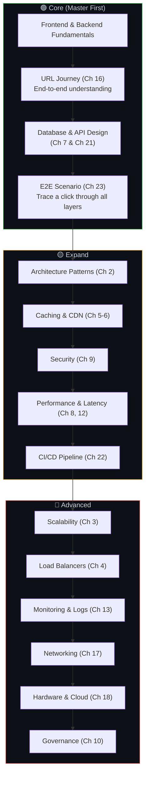
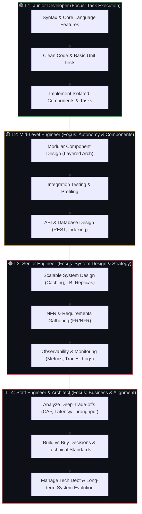
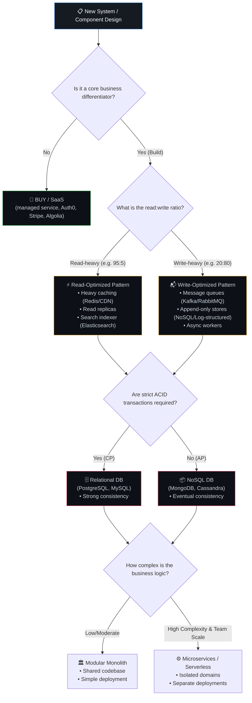
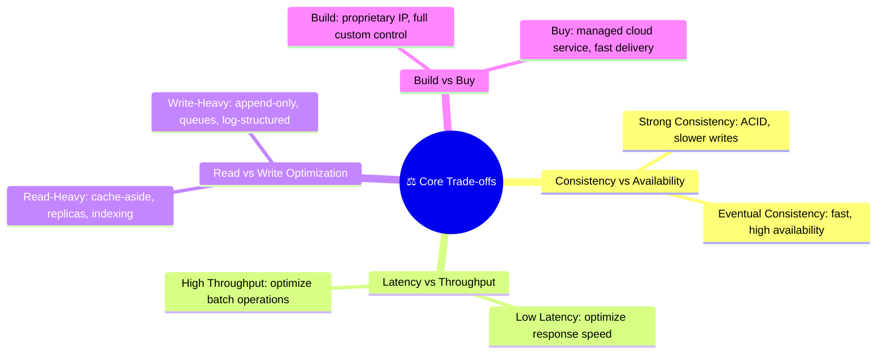
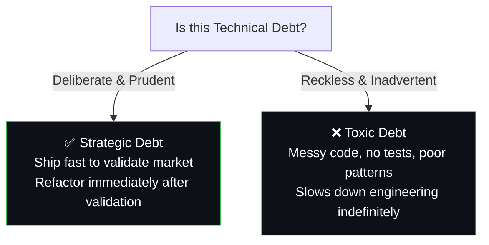

# 🎯 24. Role-Based Roadmap — What to Focus On

> **You don't need to learn everything at once. Focus on your role first, then expand outward.**

---

## 🎨 Frontend Developer Roadmap

---

## ⚙️ Backend Developer Roadmap

---

## 🔄 Fullstack Developer Roadmap

---

## 📊 Skills Matrix — What Each Role Should Know

| Topic | 🎨 Frontend | ⚙️ Backend | 🔄 Fullstack |
|-------|:-----------:|:----------:|:------------:|
| Requirements (Ch 1) | 🟡 | 🟢 | 🟢 |
| Architecture (Ch 2) | 🟡 | 🟢 | 🟢 |
| Scalability (Ch 3) | ⚪ | 🟢 | 🟡 |
| Load Balancers (Ch 4) | ⚪ | 🟢 | 🟡 |
| Caching (Ch 5) | 🟢 | 🟢 | 🟢 |
| CDN & SEO (Ch 6) | 🟢 | 🟡 | 🟢 |
| Database (Ch 7) | 🟡 | 🟢 | 🟢 |
| Latency (Ch 8) | 🟢 | 🟢 | 🟢 |
| Security (Ch 9) | 🟡 | 🟢 | 🟢 |
| Governance (Ch 10) | ⚪ | 🟡 | 🟡 |
| Clean Code (Ch 11) | 🟢 | 🟢 | 🟢 |
| Performance (Ch 12) | 🟢 | 🟢 | 🟢 |
| Monitoring (Ch 13) | 🟡 | 🟢 | 🟢 |
| URL Journey (Ch 16) | 🟢 | 🟡 | 🟢 |
| Networking (Ch 17) | 🟡 | 🟢 | 🟢 |
| Hardware (Ch 18) | ⚪ | 🟡 | 🟡 |
| Browser Internals (Ch 19) | 🟢 | ⚪ | 🟡 |
| Frontend Frameworks (Ch 20) | 🟢 | ⚪ | 🟢 |
| Backend Frameworks (Ch 21) | ⚪ | 🟢 | 🟢 |
| CI/CD (Ch 22) | 🟡 | 🟢 | 🟢 |

🟢 Must know | 🟡 Should know | ⚪ Nice to know

---

## 🧠 Senior & Staff Engineer Decision-Making Framework

> **A junior developer focuses on how to write code. A senior developer focuses on how to design components. A staff engineer or architect focuses on the trade-offs, business constraints, and system evolution.**

To make sound technical decisions and guide other engineers, you must master the fundamental trade-offs and rules of software architecture.

### 📈 Software Engineer Career & Competency Leveling Flowchart

---

### 🗺️ Architectural Decision-Making Flowchart

---

### ⚖️ The 4 Fundamental Trade-offs

Every system design choice is a trade-off. There is no single "best" architecture, only the "right" trade-off for your specific requirements.

| Trade-off | Option A | Option B | When to Choose A | When to Choose B |
|-----------|----------|----------|------------------|------------------|
| **CAP Theorem** | Strong Consistency (CP) | High Availability (AP) | Financial ledgers, checkouts | Social feeds, catalog views |
| **Optimization** | Low Latency | High Throughput | Live chat apps, trading platforms | Analytical reports, logging systems |
| **Operations** | Read-Optimized | Write-Optimized | Storefronts, catalog searches | IoT telemetry, clickstream logs |
| **Implementation**| Build Custom System | Buy Managed Service | Core business IP, custom limits | Standard utilities, quick release |

---

### 🏛️ The 3 Golden Rules of System Architecture

#### 1. YAGNI (You Aren't Gonna Need It)
*   **Rule**: Never design for scale you don't have and won't have in the near future.
*   **Reasoning**: Over-engineering adds complexity, operational costs, and latency. Build a modular monolith first; split into microservices only when team scale or traffic limits demand it.

#### 2. Design for Failure (Fault Tolerance)
*   **Rule**: Assume everything that *can* fail, *will* fail.
*   **Reasoning**: Implement circuit breakers, retries with exponential backoff and jitter, fallbacks (graceful degradation), and dead-letter queues to isolate failures.

#### 3. Single Source of Truth (SSOT)
*   **Rule**: For every piece of business data, there must be exactly one primary system of record.
*   **Reasoning**: Avoid dual-writes. Use message-driven event streams (e.g., Change Data Capture) to synchronize replicas and caches from the single source of truth.

---

### 🛠️ Technical Debt Management Guide

As a senior/staff engineer, you must teach teams how to borrow tech debt responsibly:

*   **How to manage it**: Maintain a **Tech Debt Backlog**. Allocate 15-20% of every sprint/cycle to refactoring and paying down high-risk debt (e.g., code bottlenecks, security vulnerabilities, stale packages).

---

**← Previous:** [23. End-to-End Scenario](23-end-to-end-scenario.md) | **Next →** [25. Master Checklist](25-master-checklist.md)
