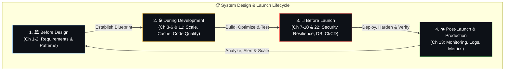

# ✅ 25. Master Checklist v2 — The Ultimate System Design Review

> **Use this before any system design discussion, architecture review, or production launch.**

---

## 🔄 The Review & Launch Lifecycle

---

## 📋 The 8-Layer Checklist

### 1. 📋 Foundation (Requirements)
- [ ] Functional requirements documented
- [ ] Non-functional requirements defined (users, traffic, latency, availability)
- [ ] Read:write ratio estimated
- [ ] Growth projections (6 months, 1 year, 3 years)
- [ ] Budget and team constraints documented
- [ ] Compliance requirements identified (GDPR, HIPAA, PCI-DSS)

### 2. 🏛️ Structure (Architecture)
- [ ] Architecture pattern chosen with justification (monolith/microservices/serverless)
- [ ] Service boundaries defined (if microservices)
- [ ] Communication patterns chosen (sync REST/gRPC, async events/queues)
- [ ] API versioning strategy defined
- [ ] Database per service (if microservices)
- [ ] API Gateway configured (if microservices)

### 3. ✨ Code Quality
- [ ] Layered architecture (controller → service → repository)
- [ ] Coding standards documented and enforced (linter)
- [ ] Code review required for all changes
- [ ] Meaningful naming conventions
- [ ] Test coverage adequate (unit + integration + critical E2E)
- [ ] Documentation: README, architecture diagram, key decisions

### 4. ⚡ Speed (Performance)
- [ ] Caching strategy at every layer (browser, CDN, Redis, DB)
- [ ] Cache invalidation strategy defined
- [ ] CDN configured for static assets
- [ ] Images optimized (WebP/AVIF, responsive, lazy-loaded)
- [ ] JavaScript code-split by route
- [ ] Critical CSS inlined, non-critical async
- [ ] Database queries optimized (indexes, no N+1)
- [ ] Pagination on all list endpoints
- [ ] Compression enabled (gzip/brotli)
- [ ] Connection pooling configured
- [ ] Async processing for non-blocking tasks
- [ ] Core Web Vitals: LCP < 2.5s, INP < 200ms, CLS < 0.1

### 5. 📈 Scale
- [ ] Application is stateless (can scale horizontally)
- [ ] Load balancer configured with health checks
- [ ] Auto-scaling rules defined (and tested)
- [ ] Database read replicas for read-heavy workloads
- [ ] Sharding plan (if needed for future)
- [ ] Queue-based architecture for decoupling
- [ ] Connection pooling for database and Redis

### 6. 🔒 Trust (Security)
- [ ] HTTPS everywhere (no mixed content)
- [ ] Authentication implemented (OAuth/JWT/sessions)
- [ ] Authorization enforced at API level (RBAC)
- [ ] Input validation on server side (never trust client)
- [ ] Parameterized queries (no SQL injection)
- [ ] Output escaping (no XSS)
- [ ] Rate limiting on all public endpoints
- [ ] Secrets in vault/env vars, NOT in code or git
- [ ] Dependencies scanned for vulnerabilities (npm audit)
- [ ] CORS configured correctly
- [ ] Encryption at rest for sensitive data
- [ ] Audit logging for sensitive actions
- [ ] CSRF protection (if using cookies)
- [ ] Password hashing (bcrypt/Argon2)

### 7. 👁️ Visibility (Observability)
- [ ] Health check endpoints (/health, /ready)
- [ ] Metrics dashboard (request rate, error rate, latency p50/p95/p99)
- [ ] Structured JSON logging (centralized)
- [ ] Distributed tracing (if multiple services)
- [ ] Alerting configured (critical → pager, warning → Slack)
- [ ] Alert runbooks documented
- [ ] Error tracking (Sentry or equivalent)
- [ ] Uptime monitoring (external)

### 8. 🔍 Discoverability (SEO & UX)
- [ ] Semantic HTML (h1, nav, article, section)
- [ ] Title and meta description per page
- [ ] Open Graph tags for social sharing
- [ ] sitemap.xml and robots.txt
- [ ] SSR/SSG for SEO-critical pages
- [ ] Structured data (Schema.org) where applicable
- [ ] Mobile responsive
- [ ] Accessibility: keyboard nav, ARIA labels, contrast
- [ ] Loading states (skeletons, spinners)
- [ ] Meaningful error messages

---

## 🛡️ Resilience Checklist
- [ ] Graceful degradation (cache down? 3rd party down?)
- [ ] Idempotency for critical operations (payments, orders)
- [ ] Circuit breakers for external dependencies
- [ ] Retry with exponential backoff + jitter
- [ ] Timeouts on all external calls
- [ ] Dead letter queue for failed messages
- [ ] Feature flags for gradual rollouts

## 💾 Data Safety Checklist
- [ ] Automated backups (daily + incremental)
- [ ] Backup restore tested (quarterly)
- [ ] Point-in-time recovery enabled
- [ ] Data retention policies defined
- [ ] GDPR: can fully delete a user's data
- [ ] No PII in logs

## 🚀 Deployment Checklist
- [ ] CI/CD pipeline automated (test → build → deploy)
- [ ] Deployment strategy chosen (blue-green, canary, rolling)
- [ ] Rollback possible in < 5 minutes
- [ ] Database migrations are backward-compatible
- [ ] Load testing done before launch
- [ ] Staging environment mirrors production

## 💰 Cost Checklist
- [ ] Budget alerts configured
- [ ] Auto-scaling has maximum limits
- [ ] Log retention limits set
- [ ] Unused resources cleaned up
- [ ] Right-sized instances (not over-provisioned)

---

## 📖 How to Use This Checklist

1. **Before designing**: Review sections 1-2 (Foundation + Structure)
2. **During development**: Reference sections 3-6 (Quality, Speed, Scale, Trust)
3. **Before launch**: Review ALL sections, especially 7-8 + Resilience + Data Safety
4. **Post-launch**: Continuously monitor section 7 (Visibility)
5. **For interviews**: Be able to explain WHY for each item, not just WHAT

---

**← Previous:** [24. Role-Based Roadmap](24-role-based-roadmap.md) | **Next →** [Connecting All Dots](../flows/connecting-all-dots.md)
