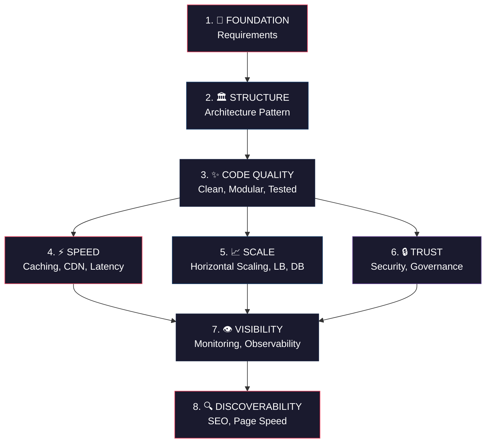
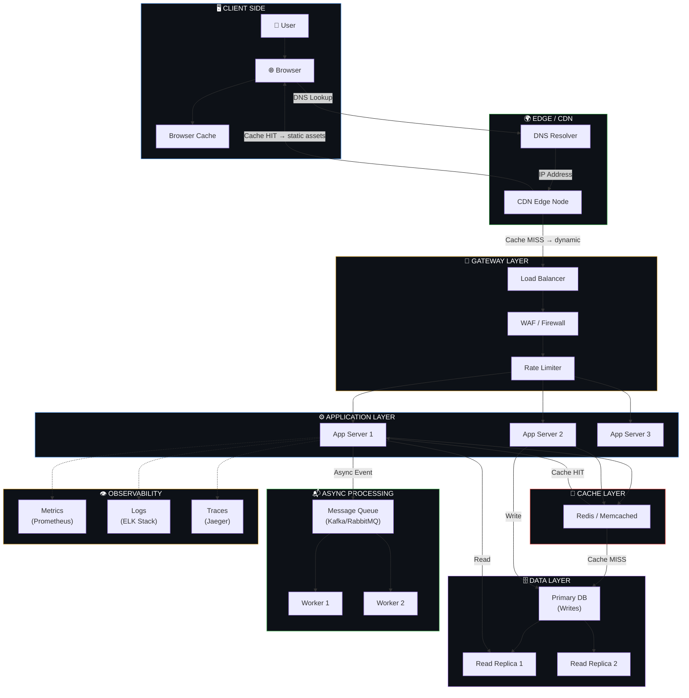

# 🏗️ System Design & Architecture — A Complete Knowledge Base

> **Think of this as building a city, not just a house.** A house needs four walls and a roof. A city needs roads, power grids, water systems, zoning laws, traffic signals, security, and a master plan that lets new districts be added without tearing down old ones.

This knowledge base covers **every major concept** in software engineering system design — from requirements gathering to browser rendering, from database internals to CI/CD pipelines. Whether you're a **frontend**, **backend**, or **fullstack** developer, this will deepen your understanding of how the entire system works together.

---

## 🧠 The 8-Layer Mental Model

Every concept in this guide answers one of these eight fundamental needs:

---

## 🗺️ Master Architecture — How Everything Connects

---

## 📚 Table of Contents

### Part 1 — Architecture, Scalability & Operations

| # | Topic | Key Question It Answers |
|---|-------|------------------------|
| 1 | [Requirements](Part-1-Architecture-Scalability-Operations/01-requirements.md) | What are we building and for how many users? |
| 2 | [Architecture Patterns](Part-1-Architecture-Scalability-Operations/02-architecture-patterns.md) | Monolith, microservices, serverless, or event-driven? |
| 3 | [Scalability](Part-1-Architecture-Scalability-Operations/03-scalability.md) | How do we handle more traffic? |
| 4 | [Load Balancers](Part-1-Architecture-Scalability-Operations/04-load-balancers.md) | How do we distribute traffic across servers? |
| 5 | [Caching](Part-1-Architecture-Scalability-Operations/05-caching.md) | How do we avoid repeating expensive work? |
| 6 | [CDN, Page Speed & SEO](Part-1-Architecture-Scalability-Operations/06-cdn-pagespeed-seo.md) | How do we make things fast and discoverable? |
| 7 | [Database Design](Part-1-Architecture-Scalability-Operations/07-database-design.md) | How do we store, replicate, and protect data? |
| 8 | [Latency](Part-1-Architecture-Scalability-Operations/08-latency.md) | Where does slowness come from and how to fix it? |
| 9 | [Security](Part-1-Architecture-Scalability-Operations/09-security.md) | How do we protect the system at every layer? |
| 10 | [Governance](Part-1-Architecture-Scalability-Operations/10-governance.md) | Who can do what, and how do we stay compliant? |
| 11 | [Clean & Modular Code](Part-1-Architecture-Scalability-Operations/11-clean-modular-code.md) | How do we write code that scales with the team? |
| 12 | [Performance Optimization](Part-1-Architecture-Scalability-Operations/12-performance-optimization.md) | How do we find and fix bottlenecks? |
| 13 | [Monitoring & Observability](Part-1-Architecture-Scalability-Operations/13-monitoring-observability.md) | How do we see what's happening inside? |
| 14 | [Request Walkthrough](Part-1-Architecture-Scalability-Operations/14-request-walkthrough.md) | What happens when a user loads a page? |
| 15 | [Checklist](Part-1-Architecture-Scalability-Operations/15-checklist.md) | What do developers commonly miss? |

### Part 2 — Network, Hardware, Browser & Framework Internals

| # | Topic | Key Question It Answers |
|---|-------|------------------------|
| 16 | [URL to Page Journey](Part-2-Network-Hardware-Browser-Frameworks/16-url-to-page-journey.md) | What happens when you type a URL and press Enter? |
| 17 | [Networking Fundamentals](Part-2-Network-Hardware-Browser-Frameworks/17-networking-fundamentals.md) | How does data travel across the internet? |
| 18 | [Hardware & Infrastructure](Part-2-Network-Hardware-Browser-Frameworks/18-hardware-infrastructure.md) | What physical resources power our code? |
| 19 | [Browser Internals](Part-2-Network-Hardware-Browser-Frameworks/19-browser-internals.md) | How does the browser turn HTML/CSS/JS into pixels? |
| 20 | [Frontend Frameworks](Part-2-Network-Hardware-Browser-Frameworks/20-frontend-frameworks.md) | How do React, Vue, Angular actually work under the hood? |
| 21 | [Backend Frameworks](Part-2-Network-Hardware-Browser-Frameworks/21-backend-frameworks.md) | How do Express, Django, Spring process requests? |
| 22 | [CI/CD Pipeline](Part-2-Network-Hardware-Browser-Frameworks/22-cicd-pipeline.md) | How does code go from laptop to production? |
| 23 | [End-to-End Scenario](Part-2-Network-Hardware-Browser-Frameworks/23-end-to-end-scenario.md) | One click traced through every single layer |
| 24 | [Role-Based Roadmap](Part-2-Network-Hardware-Browser-Frameworks/24-role-based-roadmap.md) | What should I focus on for my role? |
| 25 | [Master Checklist](Part-2-Network-Hardware-Browser-Frameworks/25-master-checklist.md) | The ultimate system design review checklist |

### Cross-Cutting Flows

| Topic | What It Shows |
|-------|--------------|
| [Connecting All Dots](flows/connecting-all-dots.md) | How all 25 topics flow together — read vs write paths, failure paths, scale evolution |

---

## 🎯 Reading Paths by Role

### 🎨 Frontend Developer
Start → [19. Browser Internals](Part-2-Network-Hardware-Browser-Frameworks/19-browser-internals.md) → [20. Frontend Frameworks](Part-2-Network-Hardware-Browser-Frameworks/20-frontend-frameworks.md) → [5. Caching](Part-1-Architecture-Scalability-Operations/05-caching.md) → [6. CDN & SEO](Part-1-Architecture-Scalability-Operations/06-cdn-pagespeed-seo.md) → [8. Latency](Part-1-Architecture-Scalability-Operations/08-latency.md) → [16. URL Journey](Part-2-Network-Hardware-Browser-Frameworks/16-url-to-page-journey.md) → [12. Performance](Part-1-Architecture-Scalability-Operations/12-performance-optimization.md) → everything else

### ⚙️ Backend Developer
Start → [1. Requirements](Part-1-Architecture-Scalability-Operations/01-requirements.md) → [2. Architecture](Part-1-Architecture-Scalability-Operations/02-architecture-patterns.md) → [7. Database](Part-1-Architecture-Scalability-Operations/07-database-design.md) → [3. Scalability](Part-1-Architecture-Scalability-Operations/03-scalability.md) → [4. Load Balancers](Part-1-Architecture-Scalability-Operations/04-load-balancers.md) → [9. Security](Part-1-Architecture-Scalability-Operations/09-security.md) → [17. Networking](Part-2-Network-Hardware-Browser-Frameworks/17-networking-fundamentals.md) → everything else

### 🔄 Fullstack Developer
Start → [16. URL Journey](Part-2-Network-Hardware-Browser-Frameworks/16-url-to-page-journey.md) → [23. End-to-End](Part-2-Network-Hardware-Browser-Frameworks/23-end-to-end-scenario.md) → then read all topics 1-25 in order

---

## 📖 How to Use This Knowledge Base

1. **Start with the overview** — understand the 8-layer mental model
2. **Follow your role's reading path** — or read sequentially
3. **Use the diagrams** — they show flows, not just concepts
4. **Read "Connecting All Dots"** last — it ties everything together
5. **Use as reference** — come back to specific topics when designing real systems

---

*Created as a comprehensive learning resource for software engineers at all levels.*
