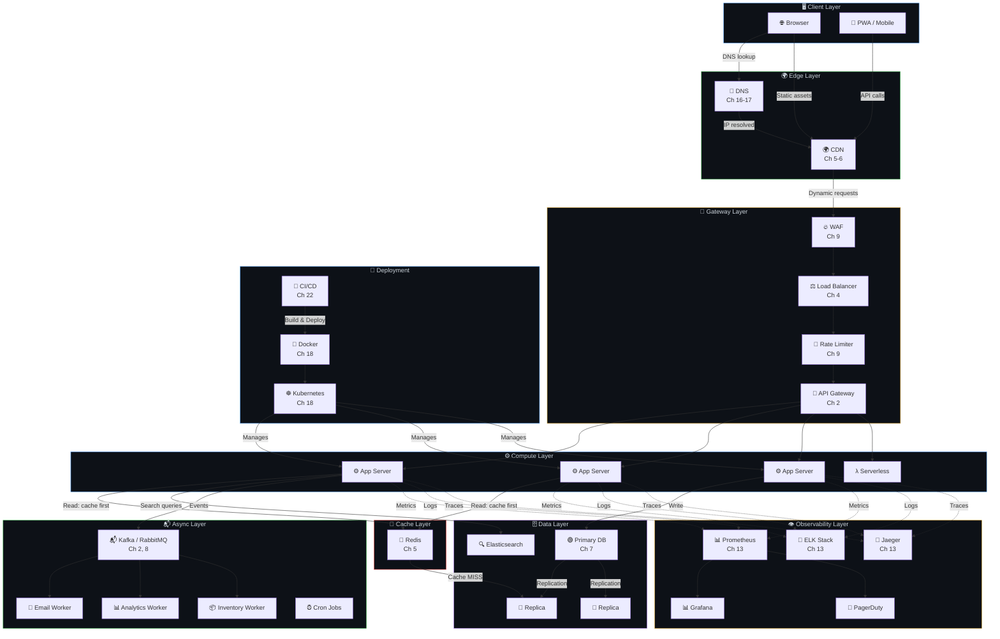
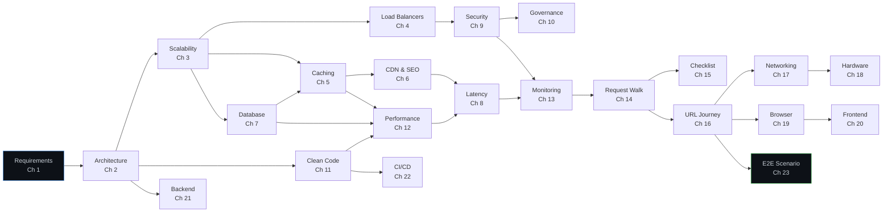

# 🔗 Connecting All Dots — The Complete System Map

> **This is the "god view" — a single page that shows how EVERY concept connects to every other concept. Save this, print it, and refer to it constantly.**

---

## 🌐 The Complete System Flow

---

## 🔄 Concept Dependency Graph — What Depends on What

---

## 🧩 The 8 Fundamental Needs — Every System Must Address

```mermaid
graph TB
    System["🏗️ Your System"] --> N1["📋 1. FOUNDATION<br/>Requirements, constraints<br/>Ch 1"]
    System --> N2["🏛️ 2. STRUCTURE<br/>Architecture, patterns<br/>Ch 2"]
    System --> N3["✨ 3. CODE QUALITY<br/>Clean, modular, tested<br/>Ch 11"]
    System --> N4["⚡ 4. SPEED<br/>Caching, CDN, optimization<br/>Ch 5, 6, 8, 12"]
    System --> N5["📈 5. SCALE<br/>LB, replicas, sharding<br/>Ch 3, 4, 7"]
    System --> N6["🔒 6. TRUST<br/>Security, compliance<br/>Ch 9, 10"]
    System --> N7["👁️ 7. VISIBILITY<br/>Monitoring, logging<br/>Ch 13"]
    System --> N8["🔍 8. DISCOVERABILITY<br/>SEO, accessibility<br/>Ch 6"]

    style System fill:#161b22,stroke:#d29922,color:#fff
    style N1 fill:#0d1117,stroke:#58a6ff,color:#c9d1d9
    style N2 fill:#0d1117,stroke:#3fb950,color:#c9d1d9
    style N3 fill:#0d1117,stroke:#d29922,color:#c9d1d9
    style N4 fill:#0d1117,stroke:#f85149,color:#c9d1d9
    style N5 fill:#0d1117,stroke:#bc8cff,color:#c9d1d9
    style N6 fill:#0d1117,stroke:#58a6ff,color:#c9d1d9
    style N7 fill:#0d1117,stroke:#3fb950,color:#c9d1d9
    style N8 fill:#0d1117,stroke:#d29922,color:#c9d1d9
```

---

## 📚 Complete Chapter Index

### Part 1: Architecture, Scalability & Operations

| # | Chapter | Core Question |
|---|---------|---------------|
| 00 | [Overview](../00-overview/system-design-overview.md) | What is system design? |
| 01 | [Requirements](../Part-1-Architecture-Scalability-Operations/01-requirements.md) | What are we building? |
| 02 | [Architecture](../Part-1-Architecture-Scalability-Operations/02-architecture-patterns.md) | How do we structure it? |
| 03 | [Scalability](../Part-1-Architecture-Scalability-Operations/03-scalability.md) | How does it grow? |
| 04 | [Load Balancers](../Part-1-Architecture-Scalability-Operations/04-load-balancers.md) | How do we distribute traffic? |
| 05 | [Caching](../Part-1-Architecture-Scalability-Operations/05-caching.md) | How do we avoid repeated work? |
| 06 | [CDN & SEO](../Part-1-Architecture-Scalability-Operations/06-cdn-pagespeed-seo.md) | How do we serve content globally? |
| 07 | [Database](../Part-1-Architecture-Scalability-Operations/07-database-design.md) | How do we store and access data? |
| 08 | [Latency](../Part-1-Architecture-Scalability-Operations/08-latency.md) | Why is it slow? |
| 09 | [Security](../Part-1-Architecture-Scalability-Operations/09-security.md) | How do we protect it? |
| 10 | [Governance](../Part-1-Architecture-Scalability-Operations/10-governance.md) | How do we govern it? |
| 11 | [Clean Code](../Part-1-Architecture-Scalability-Operations/11-clean-modular-code.md) | How do we keep code maintainable? |
| 12 | [Performance](../Part-1-Architecture-Scalability-Operations/12-performance-optimization.md) | How do we make it faster? |
| 13 | [Monitoring](../Part-1-Architecture-Scalability-Operations/13-monitoring-observability.md) | How do we know it's working? |
| 14 | [Request Walk](../Part-1-Architecture-Scalability-Operations/14-request-walkthrough.md) | How does a request flow through it? |
| 15 | [Checklist](../Part-1-Architecture-Scalability-Operations/15-checklist.md) | What do we often miss? |

### Part 2: Network, Hardware, Browser & Frameworks

| # | Chapter | Core Question |
|---|---------|---------------|
| 16 | [URL Journey](../Part-2-Network-Hardware-Browser-Frameworks/16-url-to-page-journey.md) | What happens when you type a URL? |
| 17 | [Networking](../Part-2-Network-Hardware-Browser-Frameworks/17-networking-fundamentals.md) | How does data travel? |
| 18 | [Hardware](../Part-2-Network-Hardware-Browser-Frameworks/18-hardware-infrastructure.md) | What runs our code? |
| 19 | [Browser](../Part-2-Network-Hardware-Browser-Frameworks/19-browser-internals.md) | How does the browser render? |
| 20 | [Frontend](../Part-2-Network-Hardware-Browser-Frameworks/20-frontend-frameworks.md) | How do we build UIs? |
| 21 | [Backend](../Part-2-Network-Hardware-Browser-Frameworks/21-backend-frameworks.md) | How do we build APIs? |
| 22 | [CI/CD](../Part-2-Network-Hardware-Browser-Frameworks/22-cicd-pipeline.md) | How do we deploy safely? |
| 23 | [E2E Scenario](../Part-2-Network-Hardware-Browser-Frameworks/23-end-to-end-scenario.md) | How does one click trace through everything? |
| 24 | [Roadmap](../Part-2-Network-Hardware-Browser-Frameworks/24-role-based-roadmap.md) | What should I learn first? |
| 25 | [Master Checklist](../Part-2-Network-Hardware-Browser-Frameworks/25-master-checklist.md) | What's the complete review? |

---

## 💡 The Key Insight

> Every system — from a simple CRUD app to a global platform serving billions — is made of the **same building blocks** arranged with different levels of complexity. Master the building blocks, and you can design anything.

---

**You've completed the entire System Design Knowledge Base. Go build great things! 🚀**
